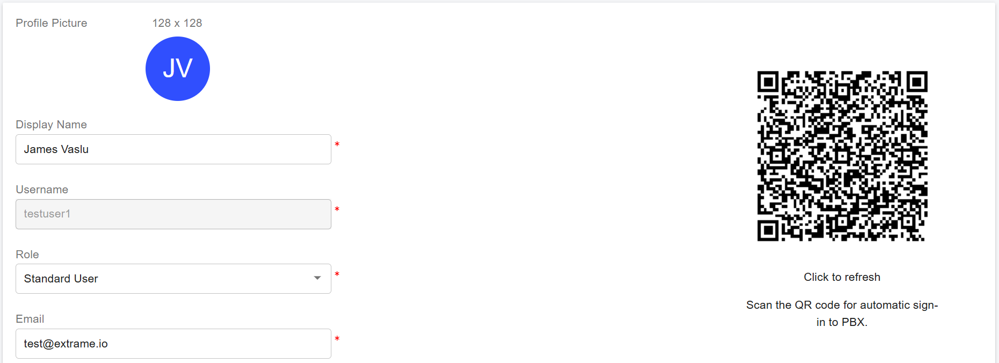

# PortSIP ONE Desktop App


The PortSIP ONE app is compatible only with PortSIP PBX version 22.0 or higher. It does **not** support PortSIP PBX version 16.x.


To download the latest version of PortSIP ONE for Windows desktop, visit the [PortSIP website](https://www.portsip.com/download-portsip-one/). The application is provided as an MSI installer. Simply double-click the downloaded file to start the installation process.

This guide applies to both **PortSIP ONE for Windows** and **PortSIP ONE WebRTC**.

## Logging into the PortSIP ONE app via QR code

The PortSIP ONE app makes logging in effortless by using a QR code. Please follow the below steps to process.

### 1. Obtaining a QR code

If the SMTP server has been configured in PortSIP PBX by the tenant manager, the PBX will automatically email the account information and QR code to the extension user upon successful extension creation.

As a tenant manager, you can also manually access and manage QR codes by following these steps:

1. Sign in to the PBX web portal as the tenant manager.
2. Navigate to **Call Manager > Users** to list all users.
3. Select a user by either clicking **Edit** or double-clicking their name.
4. The user’s QR code will be displayed. To refresh the QR code, click on it.

<figure><figcaption></figcaption></figure>

Within the **Extension** tab of a user’s settings, there are two QR code configuration options:

1. **Preferred transport for QR code:**
   * This dropdown menu lets you specify the preferred transport protocol (e.g., TCP, UDP) for the QR code. When scanning the QR code to register with the PBX, the PortSIP ONE app will prioritize this setting.
2. **Generate a QR Code with the network interface below:**
   * Use this option to designate the Outbound Proxy Server for the PortSIP ONE app when scanning the QR code to log in to the PBX.

**Important Note:** If you modify the PBX IP address or adjust either of the above options, you must refresh the QR code by clicking on it to ensure the updated configuration is applied.

### 2. Logging into the PortSIP ONE app

The PortSIP ONE app makes logging in effortless by using a QR code. On the PortSIP ONE login window, click the QR code icon located at the bottom-right corner. Select the QR code option, and then scan the QR code provided by the PBX. The app will log in automatically.

<figure><figcaption></figcaption></figure>

## Logging into the PortSIP ONE app manually

You can manually input user details in the PortSIP ONE app to log in to the PortSIP PBX. In this example, we assume the following configurations:

* The PortSIP PBX and SBC are installed on a server with:
  * **Public IP:** `66.175.221.120`
  * **Private IP:** `192.168.1.72`
* The PBX web domain **`uc.portsip.cc`** resolves to the PBX server’s public IP: `66.175.221.120`.
* The PBX is configured with the following transport protocols in the SBC:
  * UDP on port `5060`
  * TLS on port `5061`
  * TCP on port `5063`
  * WSS on port `5065`
* A tenant has been created with the SIP domain set as **`test.io`**.

Based on these configurations, after signing in to the PBX as the system administrator, you will see a page similar to the screenshot below.

<figure><figcaption></figcaption></figure>

### 1. Entering the server information

At the PortSIP ONE login window, provide the following details:

* **SIP Domain**: Enter the tenant's SIP domain. For this example, the SIP domain is **`test.io`**.
* **Server Address**: Enter the PBX server's IP address or web domain:
  * If logging in from the internet, use the public IP (**`66.175.221.12`**`0`).
  * If logging in from a LAN, use the private IP (**`192.168.1.72`**).
  * Alternatively, you can enter the web domain (**`uc.portsip.cc`**) instead of the IP address.

<figure><figcaption></figcaption></figure>

Click **Next** after entering this information. If the details are correct, the next window will prompt you to enter user credentials.

### Entering user information

In the user information window, provide the following:

* **Username**: Enter the username of the extension user. Note that this is **not the extension number**, but the designated username.
* **Password**: Enter the password for the extension user. This is **not the extension password**, but the user’s account password.

<figure><figcaption></figcaption></figure>

Click the **Sign In** button to complete the login process. The PortSIP ONE app will successfully log in to the PortSIP PBX.

## How to place calls 

Upon signing in, click the **Calls** tab to navigate to the Calls page. The page is divided into two distinct sections:

1. **Call Log Window**: This section displays all incoming, outgoing, and missed calls.
2. **Caller Information Section**: This section shows detailed information for the selected caller. The data displayed will update based on the caller you choose.

<figure><figcaption></figcaption></figure>

### **Placing a call from the calls page**

1. Click the **New Call** button. The dial pad will appear.
2. Enter a valid extension or a phone number.
3. Click the **Call** button. The call will be initiated and displayed at the top of the dashboard screen.

<figure><figcaption></figcaption></figure>

### **Placing a call from contacts**

1. Click the **New Call** button to open the dial pad window.
2. Next, click the **Contacts** icon. The dial pad will disappear and be replaced by your contact list.
3. You can either search for a contact using the search field or scroll through the list.
4. Once you locate the contact, hover over their name and click the blue phone icon to initiate the call.

<figure><figcaption></figcaption></figure>

### **Placing a Call from the Contacts Menu:**

1. Click **Contacts** in the left menu.
2. You can filter contacts by **Users**, **Company Contacts**, or **Personal Contacts**.
3. On the user/contact information page, you can easily place a call by selecting the extension or phone number.

<figure><figcaption></figcaption></figure>

