# PortSIP ONE Desktop App


The PortSIP ONE app is compatible only with PortSIP PBX version 22.0 or higher. It does **not** support PortSIP PBX version 16.x.


To download the latest version of PortSIP ONE for Windows desktop, visit the [PortSIP website](https://www.portsip.com/download-portsip-one/). The application is provided as an MSI installer. Simply double-click the downloaded file to start the installation process.

This guide applies to both **PortSIP ONE for Windows** and **PortSIP ONE WebRTC**.

## Logging into the PortSIP ONE app via QR code

The PortSIP ONE app makes logging in effortless by using a QR code. Please follow the below steps to process.

### 1. Obtaining a QR code

If the SMTP server has been configured in PortSIP PBX by the tenant manager, the PBX will automatically email the account information and QR code to the extension user upon successful extension creation.

As a tenant manager, you can also manually access and manage QR codes by following these steps:

1. Sign in to the PBX web portal as the tenant manager.
2. Navigate to **Call Manager > Users** to list all users.
3. Select a user by either clicking **Edit** or double-clicking their name.
4. The user’s QR code will be displayed. To refresh the QR code, click on it.

<figure><figcaption></figcaption></figure>

Within the **Extension** tab of a user’s settings, there are two QR code configuration options:

1. **Preferred transport for QR code:**
   * This dropdown menu lets you specify the preferred transport protocol (e.g., TCP, UDP) for the QR code. When scanning the QR code to register with the PBX, the PortSIP ONE app will prioritize this setting.
2. **Generate a QR Code with the network interface below:**
   * Use this option to designate the Outbound Proxy Server for the PortSIP ONE app when scanning the QR code to log in to the PBX.

**Important Note:** If you modify the PBX IP address or adjust either of the above options, you must refresh the QR code by clicking on it to ensure the updated configuration is applied.

### 2. Logging into the PortSIP ONE app

The PortSIP ONE app makes logging in effortless by using a QR code. On the PortSIP ONE login window, click the QR code icon located at the bottom-right corner. Select the QR code option, and then scan the QR code provided by the PBX. The app will log in automatically.

<figure><figcaption></figcaption></figure>

## Logging into the PortSIP ONE app manually

You can manually input user details in the PortSIP ONE app to log in to the PortSIP PBX. In this example, we assume the following configurations:

* The PortSIP PBX and SBC are installed on a server with:
  * **Public IP:** `66.175.221.120`
  * **Private IP:** `192.168.1.72`
* The PBX web domain **`uc.portsip.cc`** resolves to the PBX server’s public IP: `66.175.221.120`.
* The PBX is configured with the following transport protocols in the SBC:
  * UDP on port `5060`
  * TLS on port `5061`
  * TCP on port `5063`
  * WSS on port `5065`
* A tenant has been created with the SIP domain set as **`test.io`**.

Based on these configurations, after signing in to the PBX as the system administrator, you will see a page similar to the screenshot below.

<figure><figcaption></figcaption></figure>

### 1. Entering the server information

At the PortSIP ONE login window, provide the following details:

* **SIP Domain**: Enter the tenant's SIP domain. For this example, the SIP domain is **`test.io`**.
* **Server Address**: Enter the PBX server's IP address or web domain:
  * If logging in from the internet, use the public IP (**`66.175.221.12`**`0`).
  * If logging in from a LAN, use the private IP (**`192.168.1.72`**).
  * Alternatively, you can enter the web domain (**`uc.portsip.cc`**) instead of the IP address.

<figure><figcaption></figcaption></figure>

Click **Next** after entering this information. If the details are correct, the next window will prompt you to enter user credentials.

### Entering user information

In the user information window, provide the following:

* **Username**: Enter the username of the extension user. Note that this is **not the extension number**, but the designated username.
* **Password**: Enter the password for the extension user. This is **not the extension password**, but the user’s account password.

<figure><figcaption></figcaption></figure>

Click the **Sign In** button to complete the login process. The PortSIP ONE app will successfully log in to the PortSIP PBX.

## How to place calls 

Upon signing in, click the **Calls** tab to navigate to the Calls page. The page is divided into two distinct sections:

1. **Call Log Window**: This section displays all incoming, outgoing, and missed calls.
2. **Caller Information Section**: This section shows detailed information for the selected caller. The data displayed will update based on the caller you choose.

<figure><figcaption></figcaption></figure>

### **Placing a call from the calls page**

1. Click the **New Call** button. The dial pad will appear.
2. Enter a valid extension or a phone number.
3. Click the **Call** button. The call will be initiated and displayed at the top of the dashboard screen.

<figure><figcaption></figcaption></figure>

### **Placing a call from contacts**

1. Click the **New Call** button to open the dial pad window.
2. Next, click the **Contacts** icon. The dial pad will disappear and be replaced by your contact list.
3. You can either search for a contact using the search field or scroll through the list.
4. Once you locate the contact, hover over their name and click the blue phone icon to initiate the call.

<figure><figcaption></figcaption></figure>

### **Placing a call from the Contacts menu**

1. Click **Contacts** in the left menu.
2. You can filter contacts by **Users**, **Company Contacts**, or **Personal Contacts**.
3. On the user/contact information page, you can easily place a call by selecting the extension or phone number.

<figure><figcaption></figcaption></figure>

### **Ending a call**

* Press the **Leave** button located at the bottom-right corner to end the current call.
* Alternatively, press the **End** button located at the top-right corner to terminate the active call.

<figure>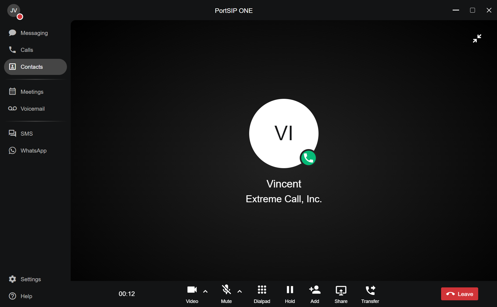<figcaption></figcaption></figure>

<figure>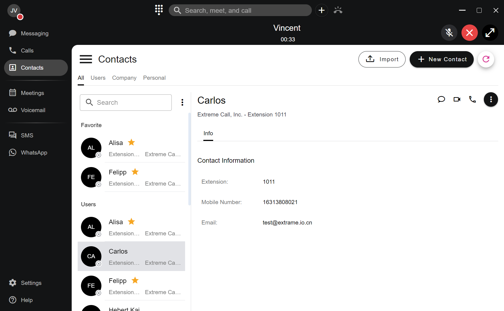<figcaption></figcaption></figure>

### **Blind transferring a call**

A **Blind Transfer** occurs when you transfer a call to another person without announcing it first. To perform a blind transfer while on an active call:

1. Click the **Transfer** button.
2. Select **Blind Transfer**.

<figure><figcaption></figcaption></figure>

3. From the **Contact Panel**, select the recipient to whom you wish to transfer the call.
4. Click the extension. The call will be successfully transferred

<figure>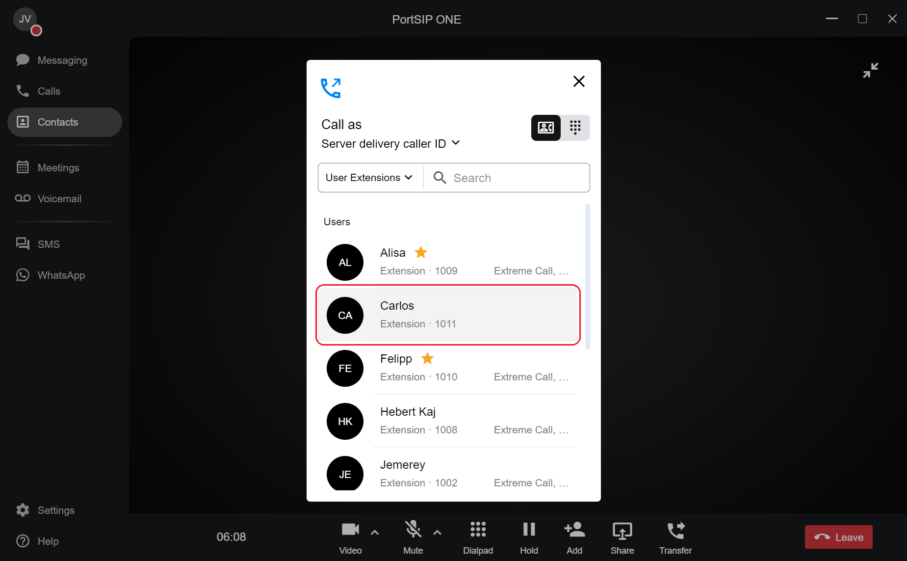<figcaption></figcaption></figure>

You can also transfer the call to a receptionist by the number via the **Dial Pad**. From the **Contact Panel** window:

1. Click the **Dial Pad** icon.
2. Enter a valid extension or phone number.
3. Click the **Dial** button. The transfer will be completed.

### **Attended transferring a call**

An **Attended Transfer** occurs when you announce the call to the recipient before transferring it. To perform an attended transfer while on a call:

1. Click the **Transfer** button.
2. Select **Attended Transfer**.

<figure>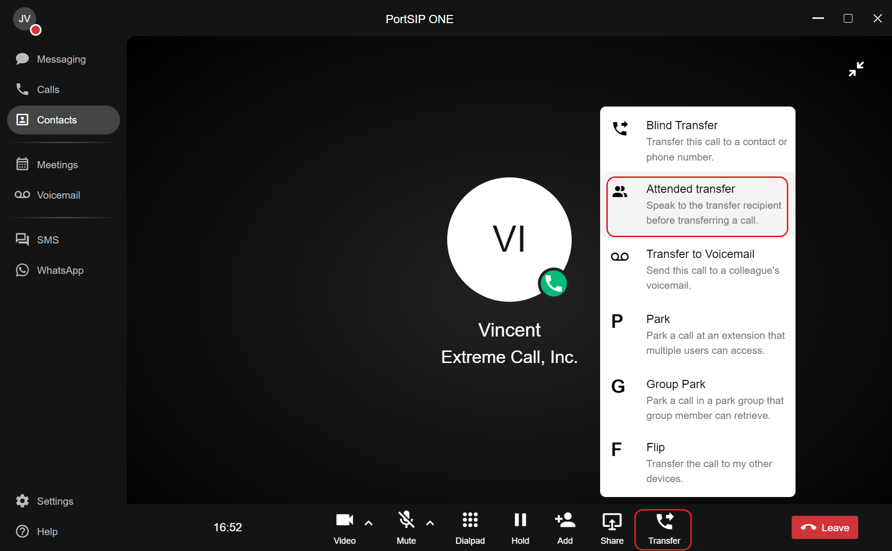<figcaption></figcaption></figure>

3. From the **Contact Panel**, select the recipient to whom you wish to transfer the call.
4. Click on that recipient.
5. Once the party answers, announce the call and click the blinking **Transfer Now** button. The call will then be transferred.

<figure>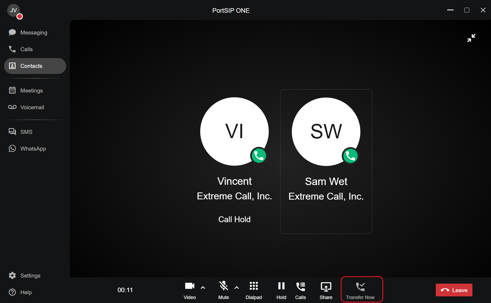<figcaption></figcaption></figure>

### **Transferring a call to voicemail**

A **Direct-to-Voicemail Transfer** is used when you wish to transfer a call directly to another user’s voicemail. To perform a transfer to voicemail while on an active call:

1. Click the **Transfer** button.
2. Select **Transfer to Voicemail**.
3. From the **Contact Panel**, select the recipient to whom you wish to transfer the call to click on it.
4. The call will be transferred directly to their voicemail.

<figure><figcaption></figcaption></figure>

### **Direct parking a call**

To park a call to an extension while on an active call:

1. Click the **Transfer** button.
2. Select **Park**.
3. From the **Contact Panel**, select the recipient to whom you wish to park the call and click on their name.

The call will be parked on that extension.

### **Group parking a call**

If the user is a member of a park group, they can park a call to the group, allowing group members to retrieve the parked call.

To park a call to the group while on an active call:

1. Click the **Transfer** button.
2. Select **Group Park**.

The call will be parked to the group if the user is a member of a park group.

### **Retrieving a parked call**

Once a call is parked to an extension user or a park group, the extension user or group members will receive a notification. As shown in the screenshot below, the **Call HUB** icon on the top title bar will start blinking.

1. Click the **HUD** icon. The parked call will appear in the list.
2. Click the **Retrieve** button to easily retrieve the call.

<figure>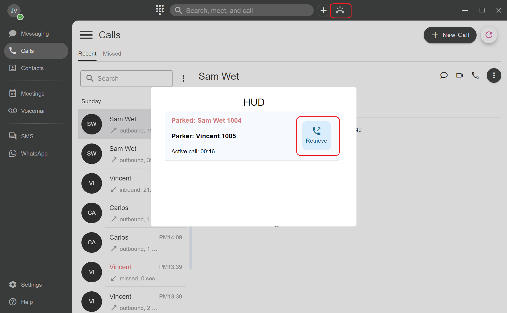<figcaption></figcaption></figure>

### **Call Flip**

**Call Flip** allows you to quickly transfer an active call from PortSIP ONE to another endpoint, such as PortSIP ONE mobile or an IP phone. To perform a Call Flip while on an active call:

1. Click the **Transfer** button.
2. Select **Flip**.
3. Your other devices (e.g., PortSIP ONE mobile or IP phone) will ring. Simply answer the call on the other device.

<figure><figcaption></figcaption></figure>

## How to access your voicemail

To access your voicemails, click on the **Voicemails** tab. The page is divided into two sections:

1. **Voicemail Window**: This area displays your voicemails, typically organized in chronological order (by date).
2. **Voicemail Details**: Located to the right of the voicemail window, this section provides detailed information about each voicemail.

<figure>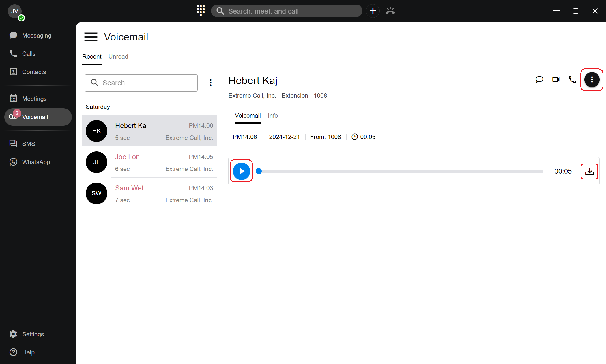<figcaption></figcaption></figure>

### **Listening to a voicemail**

1. **Select the Voicemail Message**: In the **Voicemail Window**, click on the desired message. The message details will appear on the right side of the screen.
2. **Play the Voicemail**: Click the **Play** button to listen to the selected message.

### **Downloading a voicemail message**

1. **Download the Message**: In the **Voicemail Details** section, click the **Download** icon button.
2. **Save the File**: Choose the desired location on your computer to save the `.wav` file and confirm the download.

### **Deleting a voicemail message**

1. In the **Voicemail Window**, locate the voicemail message you wish to delete.
2. Click on the **...** (ellipsis) button located at the upper right corner of the message to open the options menu.
3. From the dropdown menu, select **Delete**.
4. **Confirm Deletion**: A confirmation prompt will appear to verify your intention to delete the selected voicemail.
5. Click **Delete** to confirm. The message will be permanently removed from your voicemail section.

## **Accessing Your Contacts**

To access your contact directory, follow these steps:

1. **Navigate to the Contacts Tab**: Click on the **Contacts** tab located in the main navigation menu.
2. **Understand the Contacts Page Layout**:
   * **Contact List Window**:
     * Located on the left side of the page.
     * Provides access to both your **Company Extension Users**, **Company Contacts List**, and **Personal Contact.**
     * Allows you to browse, search, and manage your contacts efficiently.
   * **Contact Information Area**:
     * Situated to the right of the Contact List Window.
     * Displays detailed information about the selected contact.
     * Updates dynamically based on the contact you choose, showing relevant details and available actions.
   * **Synchronous:** The PortSIP ONE app synchronizes your contacts—including extension users, company contacts, and personal contacts—periodically. When you make changes to an extension user or contact, these updates are automatically propagated to all instances of the app. Please note that synchronization is not instantaneous; it may take a short while for the updated information to appear across all devices.

<figure>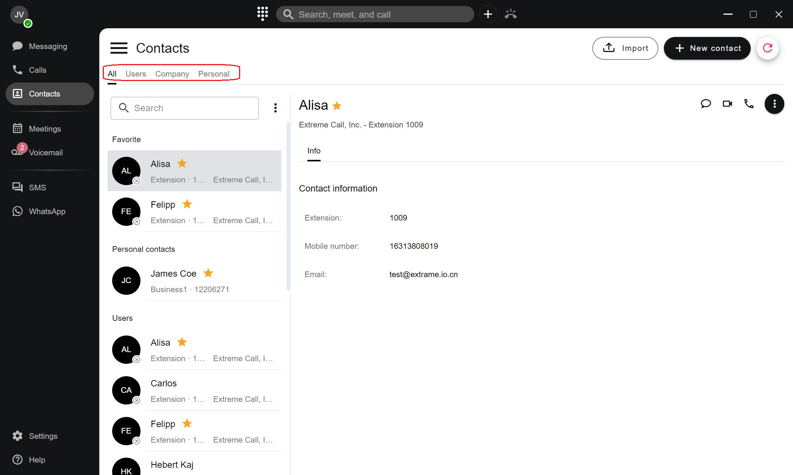<figcaption></figcaption></figure>

### **Adding a New Contact**

To add a new contact to your directory, follow these steps:

1. Navigate to the **Contacts** tab. Click on the **New Contact** button to open the contact creation window.
2. **Enter Contact Information:** In the **Add Contact** window, fill in the necessary details in the appropriate fields.
3. If you are a tenant administrator with the necessary permissions to access Company Contacts, you have the option to save a new contact to either **Company Contacts** or **Personal Contacts**. This allows you to manage contacts effectively based on their intended usage and accessibility.
4. **Save the Contact:** After entering all required information, click the **Save** button.

Your new contact will now appear in the **My Contacts** table.

<figure>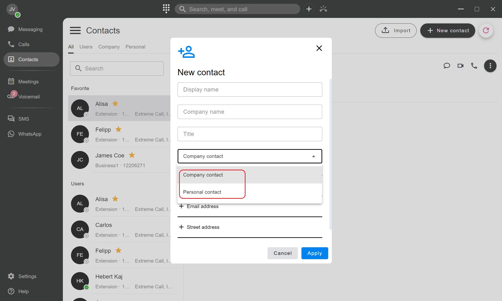<figcaption></figcaption></figure>

### **Deleting a Contact**

To delete a contact, follow these steps:

1. Click on the **Contacts** tab located in the main navigation menu.
   * Select the **Company Contacts** or **Personal Contact** sub-tab to view your contact list.
2. **Select the Contact to Delete:** Locate the contact you wish to remove, and click on the contact to highlight it.
3. **Initiate Deletion:** Click on the **...** (ellipsis) button once the mouse over the contact, or click on the **...** (ellipsis) button located at the upper right corner of the contact information.
4. From the dropdown menu, select **Delete**.
5. **Confirm Deletion**
   * A verification prompt will appear to confirm your intention to delete the contact.
   * Click **Delete** to permanently remove the contact.

<figure>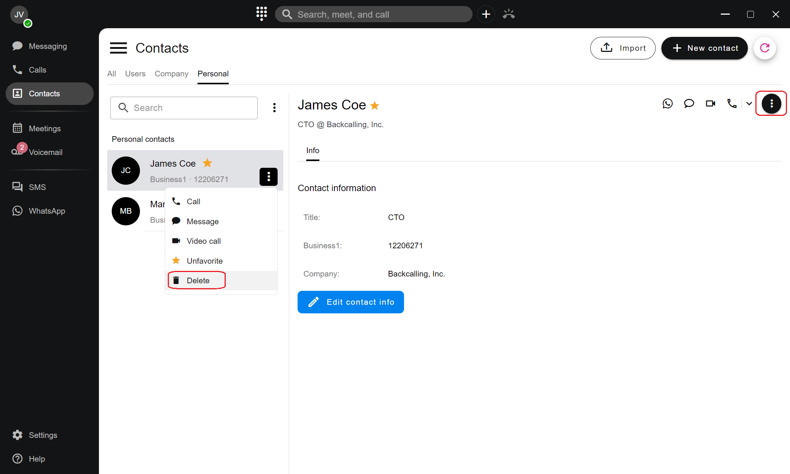<figcaption></figcaption></figure>

### **Bulk Deleting Contacts**

To efficiently remove multiple contacts at once, follow these steps:

1. **Access the Contacts Sub-Tab**
   * Navigate to the **Contacts** tab in the main navigation menu.
   * Select either the **Company Contacts** or **Personal Contacts** sub-tab, depending on where the contacts you wish to delete are located.
2. **Initiate Bulk Deletion**
   * Locate the **...** (ellipsis) button situated next to the search box within the selected sub-tab.
   * Click on the **Ellipsis** button to open additional options.

<figure>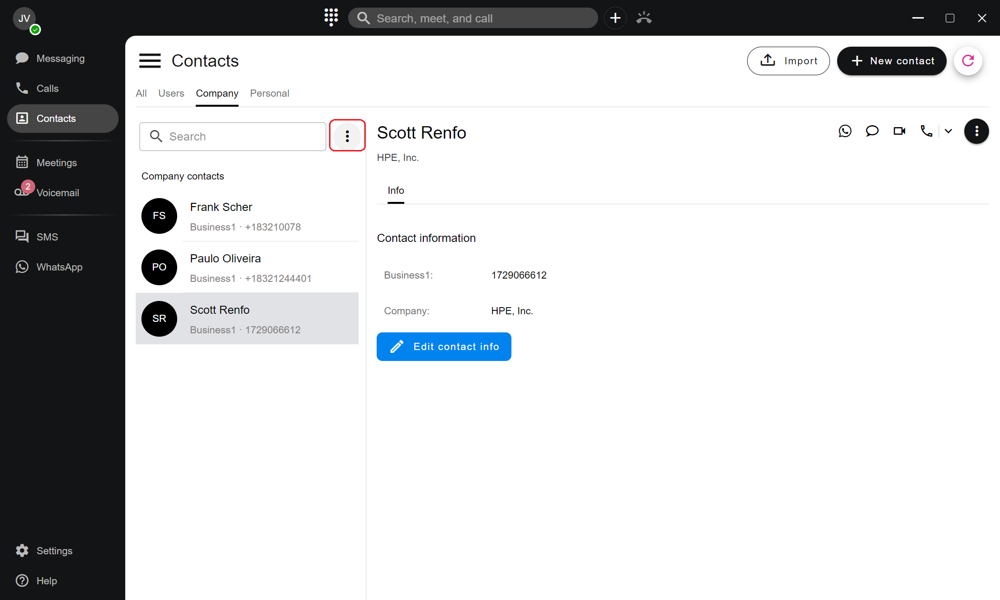<figcaption></figcaption></figure>

3. **Select Contacts to Delete**
   1. **Delete All Contacts**:
      1. To remove all contacts within the selected sub-tab, check the **Select All** checkbox.
   2. **Delete All Contacts:**
      1. To delete specific contacts, individually click on each contact you wish to remove to select them.
4. **Confirm Deletion**
   * Click on the **Trash** icon button to initiate the deletion process.
   * A verification prompt will appear to confirm your intention to delete the selected contacts.
   * Click **Delete** to permanently remove the chosen contacts from your directory.

<figure>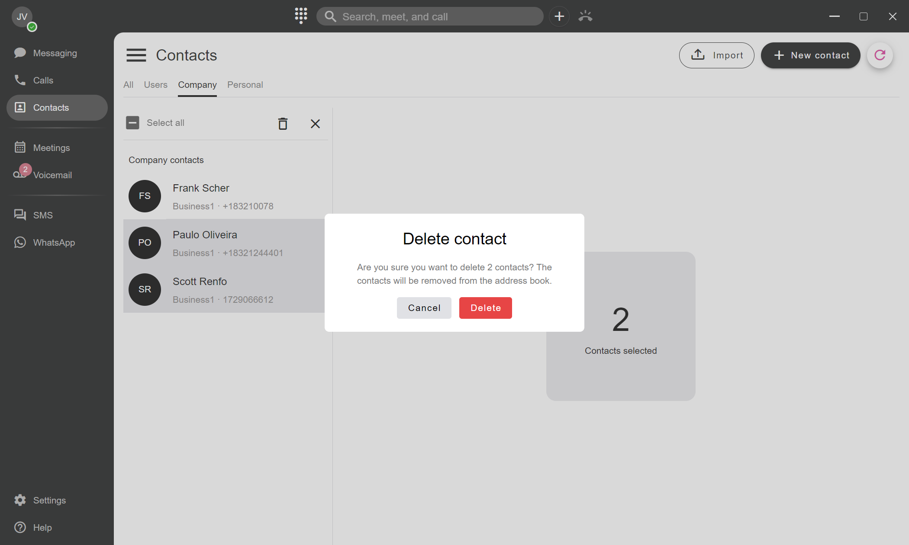<figcaption></figcaption></figure>

### **Adding a User/Contact to Favorites**

To quickly access your most frequently used contacts, you can mark them as favorites. Follow these steps to add a contact to your **Favorites** list:

1. Click on the **Contacts** tab located in the main navigation menu.
   * Select the **Users** or **Company Contacts** or **Personal Contact** sub-tab to view your contact list.
2. **Select the Contact:** Locate the contact you wish to favor, and click on the contact to highlight it.
3. Click on the **...** (ellipsis) button once the mouse over the contact, or click on the **...** (ellipsis) button located at the upper right corner of the contact information.
4. From the dropdown menu, select **Favorites**.
5. Once clicked, a **solid yellow star (⭐)** will appear next to the contact to confirm that the contact has been successfully added to your **Favorites** list.
6. **Unfavorite a Contact:** To remove a contact from your **Favorites**, follow the same steps. The yellow star will disappear, indicating that the contact is no longer in your favorites.

<figure>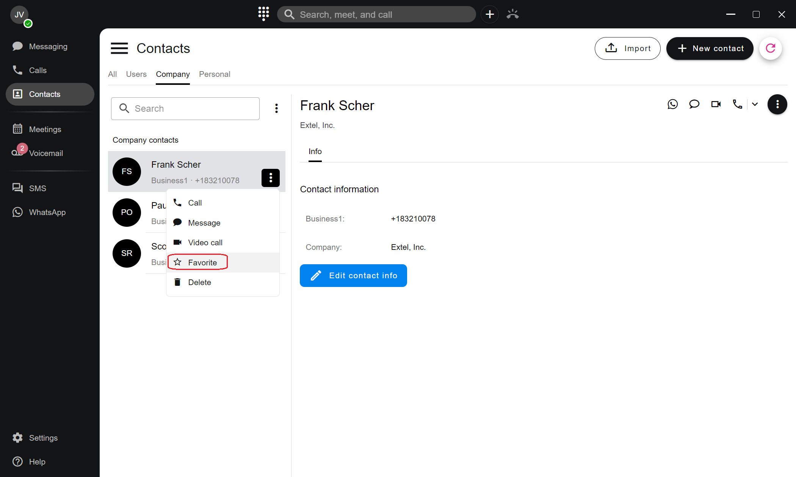<figcaption></figcaption></figure>


Both the extension users and contacts can be favored.


## How to access team messages: 

PortSIP allows seamless communication within your team through internal extension user chat. If the contact you're messaging isn't an extension user, messages will be sent via SMS, MMS, or a WhatsApp channel, ensuring you're always connected.

To access your team messages, follow these steps:

1. **Navigate to the Messaging Tab:** Click on the **Messaging** tab in the main navigation menu.
2. **Understand the Messaging Interface:** The page is divided into two sections:
   * **Messaging List Window**: This is where your team messages are displayed. Messages are usually sorted by date and recipient in chronological order.
   * **Message Details Area**: On the right, you’ll find the message details section, which updates based on the selected team message. Here, you can view more information about the selected message.

