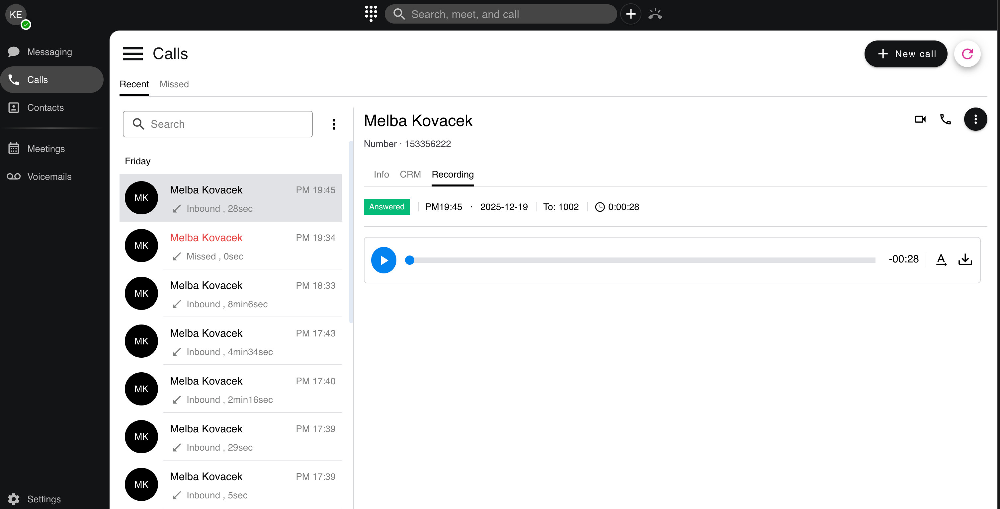
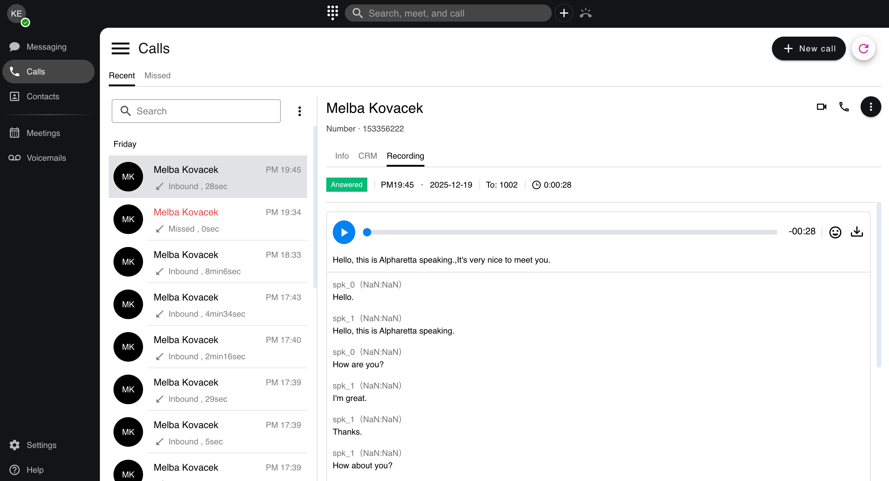
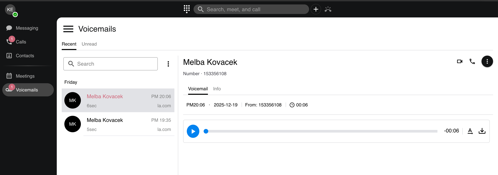
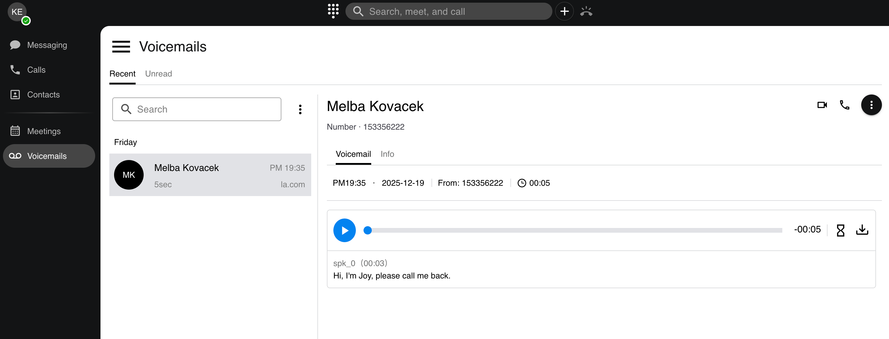

# AI Transcription

PortSIP ONE provides **native call recording and AI transcription** capabilities that operate automatically once enabled at the **tenant level**.

Key characteristics of the solution include:

* **No client-side configuration required**
* All call recordings, voicemails, and AI transcription processing are handled by **PortSIP PBX**
* The PortSIP ONE client is used solely to **view, play back, and review transcription results**

To use PortSIP ONE with AI Transcription features, ensure that your tenant administrator has completed the AI Transcription configuration as described in the [AI Transcription](../../portsip-communications-solution/portsip-pbx-administration-guide/34-ai-transcription/) guide.

Once the tenant administrator enables **Call Recording** and **AI Transcription**, PortSIP ONE will automatically record eligible calls and support AI transcription for both call recordings and voicemails.

***

### Call Recording with AI Transcription

> **Important**\
> The PortSIP ONE client does **not** perform call recording locally.\
> All call recordings and voicemails are generated, processed, and stored on the **PortSIP PBX**.\
> The client functions as a secure interface for playback and transcription review.

#### Viewing and Playing Call Recordings

When a call includes a recording:

1. A **Recording** tab appears in the call history.
2. Tap the **Recording** tab to play back the audio file.

<figure><figcaption></figcaption></figure>

This centralized recording model ensures compliance, consistency, and high audio quality across devices.

***

#### AI Transcription for Call Recordings

* If AI Transcription is enabled but the recording has not yet been transcribed:
  * An AI transcription icon appears next to the call record.
  * Tap the icon to manually trigger transcription.
  * While transcription is in progress, the icon changes to an hourglass indicator.
  * After completion, the icon updates to display the call sentiment.
* If an AI transcription result already exists:
  * The transcription text is displayed directly within the call record.
  * Users can review the complete transcription at any time.

<figure><figcaption></figcaption></figure>

This approach gives users control over when transcription is generated while ensuring results are centrally managed and securely stored.

***

### Voicemail with AI Transcription

PortSIP ONE also supports **AI transcription for voicemail messages**, enabling users to quickly understand voicemail content without listening to the audio.

<figure><figcaption></figcaption></figure>

#### AI Transcription for Voicemail Messages

1. If AI Transcription is enabled but the voicemail has not yet been transcribed:
   * An AI transcription icon appears next to the voicemail entry.
   * Tap the icon to start AI transcription.
2. If an AI transcription result already exists:
   * The transcription text is displayed directly in the voicemail record.
   * Users can read the voicemail content instantly, without playing the audio.

<figure><figcaption></figcaption></figure>

This feature is particularly valuable for mobile users and busy professionals who need fast access to message content.

***

### Summary

* Call recording and AI transcription are **tenant-level features**
* No configuration is required on the PortSIP ONE client
* All recording and transcription processing is handled by **PortSIP PBX**
* The PortSIP ONE client provides:
  * Secure recording playback
  * Manual AI transcription triggering
  * Full transcription text display
  * Call sentiment visualization

Together, these capabilities deliver a seamless, enterprise-grade experience for reviewing calls and voicemails, enhancing productivity while leveraging powerful AI-driven insights.

