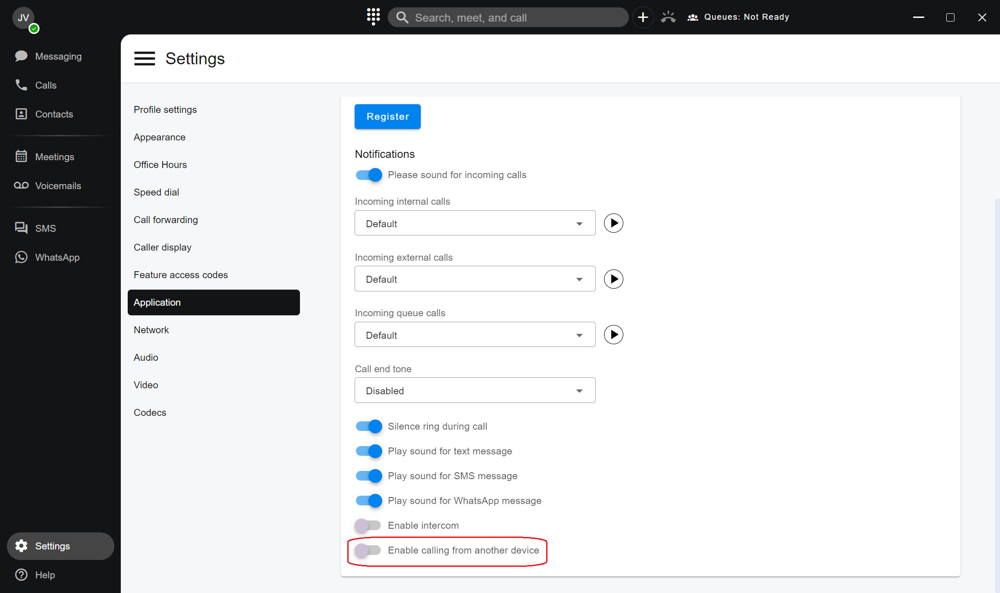
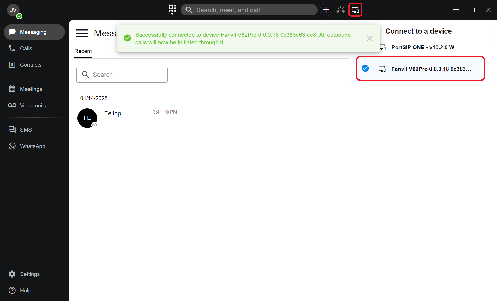

# Calling from Another Device

### Calling from another device using PortSIP ONE app

You can manage all your contact details in the **PortSIP ONE** desktop app, but take calls on your mobile phone or desk phone with ease. For example, if you prefer to make calls using your desk phone, you can easily push all outgoing calls to that device with just a few clicks, allowing you to make calls the way you prefer.

### To Enable Calling from Another Device

1. Click on the Setting icon on the left-hand menu, select the **Application** option, then turn on the **Enable calling from another device,** and click **Apply** button to save changes.

<figure><figcaption></figcaption></figure>

2. Click the **Connect to a device** icon on the **PortSIP ONE** title bar.
3. A list of currently available devices will be displayed.
4. Select your desired device. A prompt message will appear, notifying you that all outbound calls will now be initiated by the selected device.

<figure><figcaption></figcaption></figure>

After successfully selecting a device, all future outgoing calls made within the app will automatically be initiated by that device.

If the selected device is offline, you will receive an error when attempting to place a call through it. In this case, click the **Connect to a device** icon again to choose a different device.

You can uncheck a device to disconnect from it.

