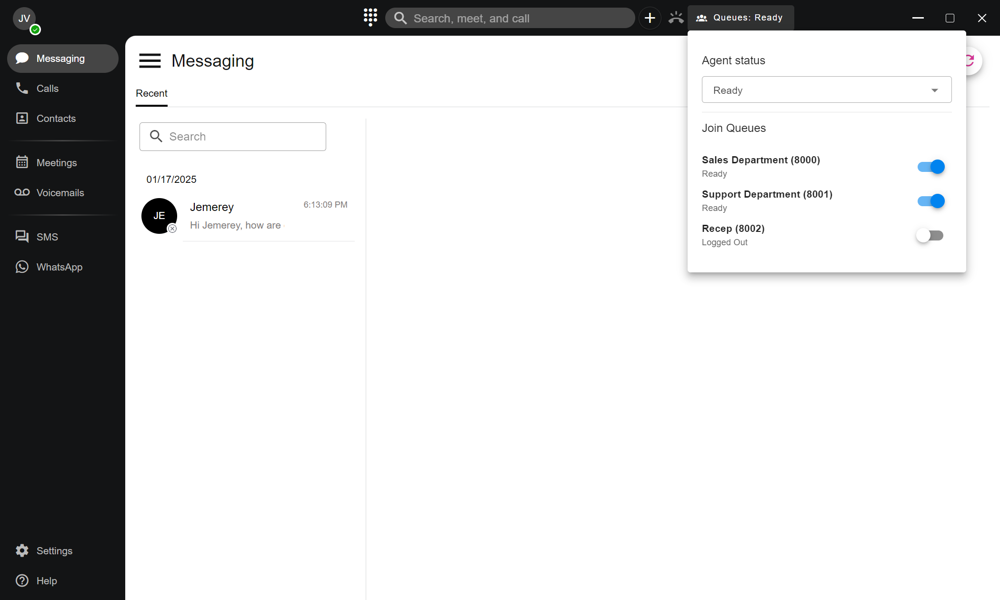

# Change Your Call Queue Status

### Managing Call Queue Status

When your administrator assigns you as an **agent** to a call queue, you can manage your **call queue status** directly within the **PortSIP ONE** app.

When a call enters a queue you are assigned to and your status is set to **Ready**, you will receive an in-app notification and can answer the call directly from PortSIP ONE.

***

### Changing Your Call Queue Status

Follow the steps below to manage your agent status and queue participation.

#### 1. Locate the Queue Status Icon

In the app’s **title bar**, locate the **Queue Status** icon.\
This icon displays your current agent status and provides access to the list of call queues you are assigned to.

***

#### 2. Open the Status Menu

Click the **Queue Status** icon.\
A menu will appear showing:

* Your current **agent status**
* The list of call queues you are logged into
* Available options to update your status

***

#### 3. Select an Agent Status

From the **Agent Status** drop-down list, select the desired status (for example, _Ready_ or _Not Ready_).

> **Important**\
> The selected agent status applies to **all call queues** you are currently logged into.

***

#### 4. Log In or Log Out of Individual Queues

In the queue list, each queue includes an **ON/OFF toggle**:

* Toggle **ON** to log in to a queue
* Toggle **OFF** to log out of a queue

Changes take effect immediately.

<figure><figcaption></figcaption></figure>

***

### Expected Behavior

* When your status is **Ready** and you are logged into a queue, incoming queue calls will be delivered to you.
* When your status is **Not Ready**, queue calls will not be routed to you, even if you are logged into the queue.
* Logging out of a specific queue prevents calls from that queue only.

***

> **Note**\
> Available agent statuses and queue access are controlled by administrator-defined policies.

