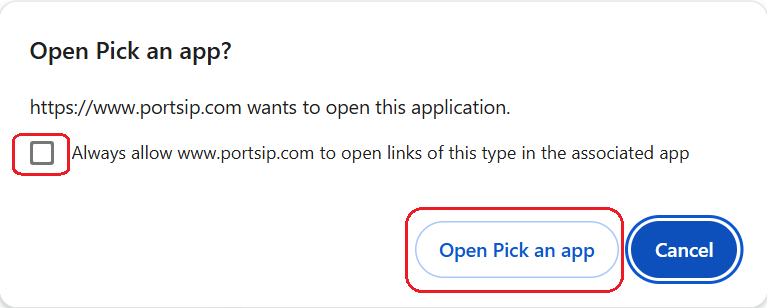
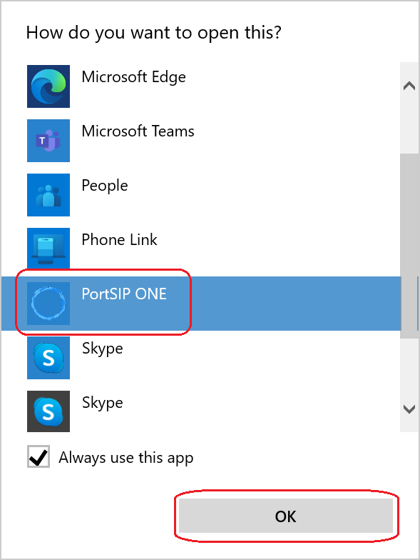
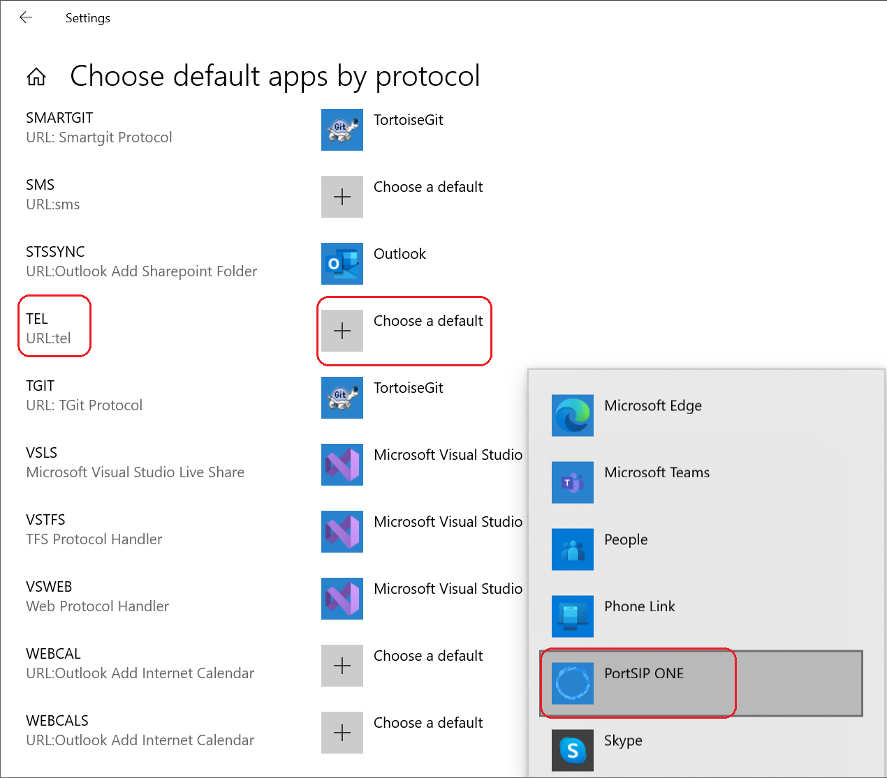

# Click to Call

## What is Click-to-Call?

Click-to-call is a feature that allows users to initiate phone calls with a single click, leveraging Voice over Internet Protocol (VoIP) technology to establish the connection between two parties. This feature is also referred to as "click-to-dial" or "one-click calling."

Originally developed for call centers, the click-to-call functionality aimed to streamline outbound calling, minimize dialing errors, and enhance efficiency. Over time, it has evolved to incorporate technologies like WebRTC and browser plugins, making it even more accessible.

## How to set up click to call

### Desktop-based calling

* Download and install the PortSIP ONE app on your desktop.&#x20;
* Sign in to the PortSIP ONE app.

When you click on telephone numbers while browsing the web (e.g., in Google Chrome, Edge, or Firefox), you will be prompted to select an application to place the call.

For instance, as shown in the screenshot below, you can check the option **"Always allow** [**www.portsip.com**](http://www.portsip.com) **to open links of this type in the associated app"** to automatically open phone links from that website in your designated calling app (where "[www.portsip.com](http://www.portsip.com)" is the website you clicked the phone number on).&#x20;

<figure><figcaption></figcaption></figure>

After clicking the **Open** **Pick an app button** in the above step, the **Windows Default Apps** settings window will appear, as shown below.

To set the PortSIP ONE app as your default for telephone numbers, follow these steps:

1. Select the **PortSIP ONE app** from the list of available apps.
2. Check the box labeled **"Always use this app"** to make it the default.
3. Click **OK** to confirm your selection.

Once completed, Windows will set the PortSIP ONE app as the default application for dialing telephone numbers.

<figure><figcaption></figcaption></figure>

Now, the PortSIP ONE app will automatically dial the phone number.&#x20;

In the future, if you click a phone number on a web page and the PortSIP ONE app is already signed in, it will automatically dial the number for you.

If the PortSIP ONE app is not running, it will be launched, and after signing in, the phone number will be dialed automatically.

## Set Up Windows Default App for Phone Numbers

If your default phone app is not set to **PortSIP ONE**, follow the steps below to configure it:

1. Click the **Start** menu and select **Settings**.
2. Click **Apps**, then choose **Default apps**.
3. Scroll down and select **Default apps by protocol**.
4. Locate **TEL** (URL:Tel Protocol) and click the button labeled **"Choose a default"**.
5. Select **PortSIP ONE** from the list of available phone apps.

<figure><figcaption></figcaption></figure>

