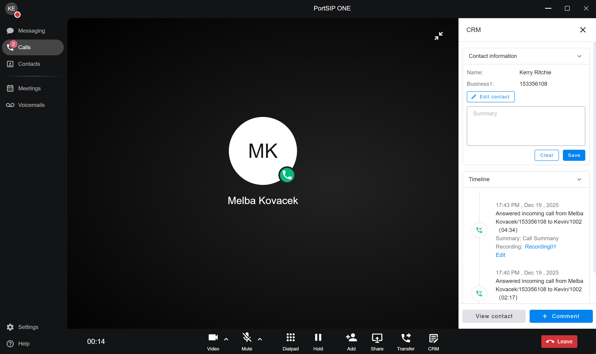
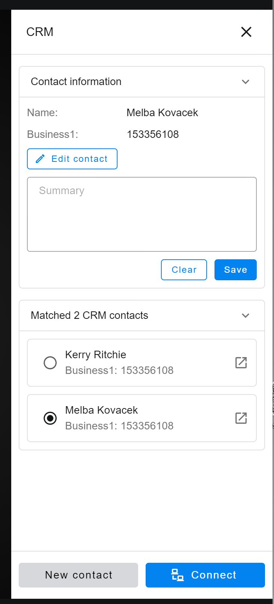
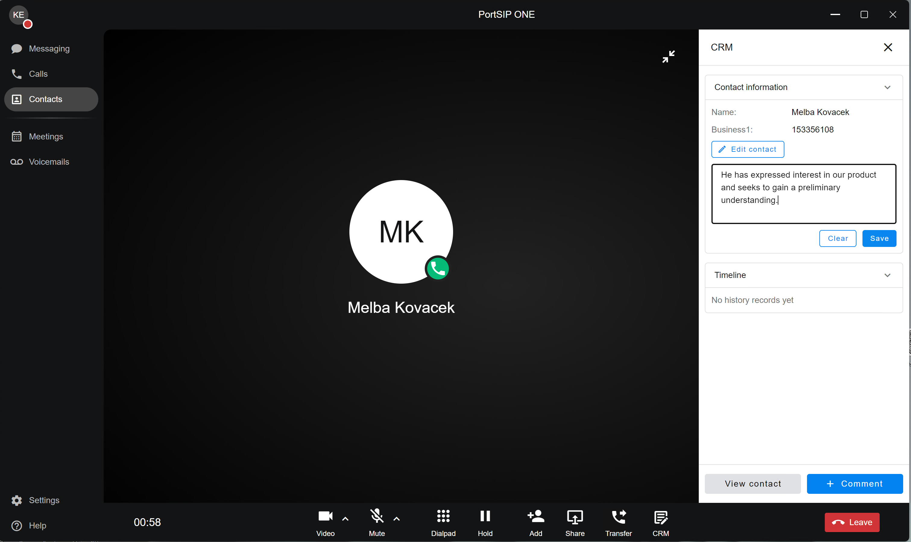
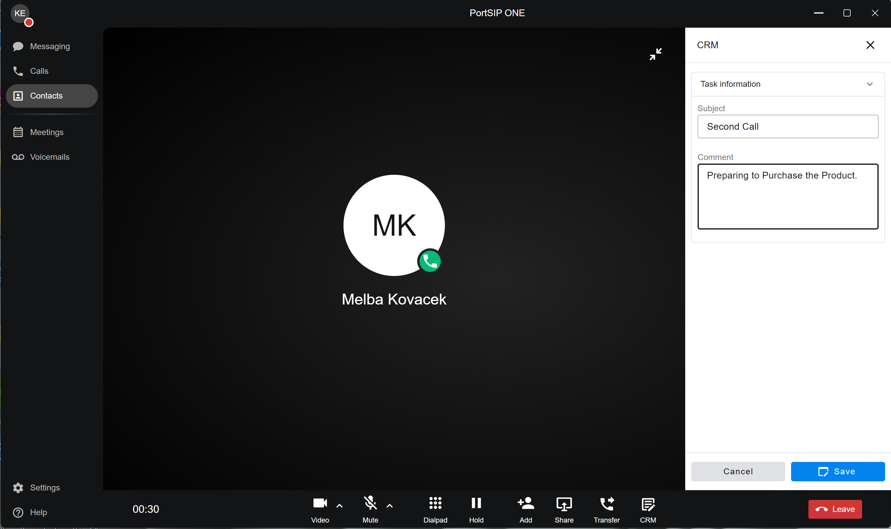
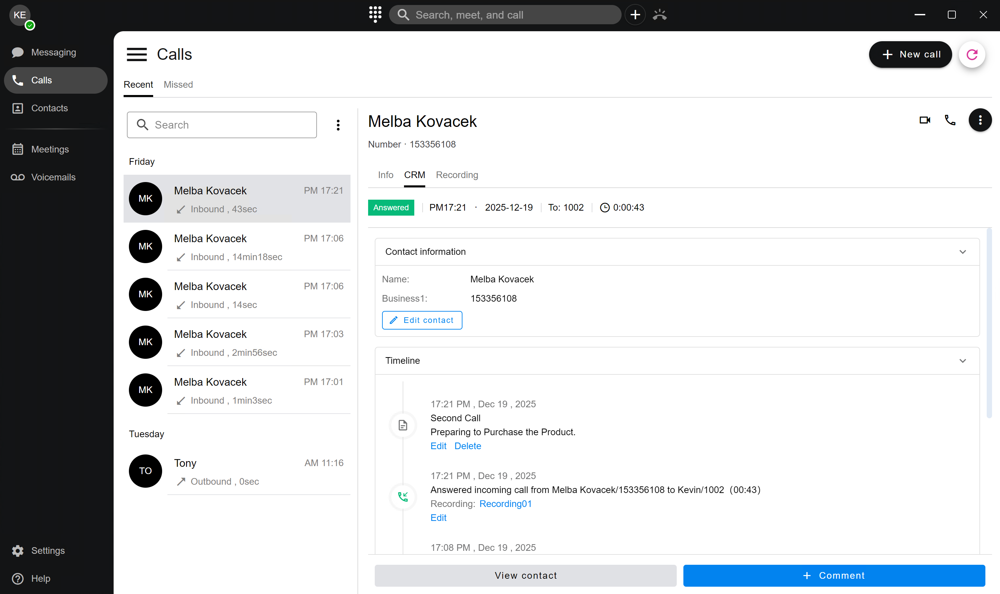

# CRM Integrations

PortSIP ONE includes **native CRM integration** that works seamlessly with PortSIP PBX.

Once CRM integration is enabled at the **tenant level**, PortSIP ONE automatically connects to the configured CRM system—**no client-side setup is required**.

After activation, CRM functionality is applied automatically during inbound and outbound calls, ensuring consistent customer context across the communication lifecycle.

To use PortSIP ONE with CRM integration features, ensure that your tenant administrator has completed the [CRM configuration as described in the CRM Integrations](../../portsip-communications-solution/portsip-pbx-administration-guide/33-crm-integrations/) guide.

***

### How CRM Integration Works in PortSIP ONE

#### 1. Automatic Caller Identification

When an incoming call is received, PortSIP ONE automatically attempts to match the caller’s phone number against existing customer records in the connected CRM system.

This real-time lookup ensures that agents have immediate visibility into caller context.

***

#### 2. Caller Information on Incoming Calls

If a matching CRM contact is found, the caller’s CRM information is automatically displayed on the **incoming call screen**, allowing agents to identify the customer before answering.

<figure><figcaption></figcaption></figure>

***

#### 3. CRM Contact Page During an Active Call

Once the call is answered:

* If the caller matches a CRM contact, PortSIP ONE automatically opens the **CRM contact details page**.
* Agents can review customer information in real time while speaking with the caller.

<figure><figcaption></figcaption></figure>

This design aligns with industry best practices for **context-aware communications**, minimizing call handling time and improving customer experience.

***

#### 4. Creating a New CRM Contact During a Call

If the caller’s number does **not** match any existing CRM contact:

* Tap the **CRM** button at the bottom of the call screen to open the CRM interface.
* From this page, you can create a **new CRM contact** directly during the call.

<figure><figcaption></figcaption></figure>

> ⚠️ **Important**\
> Call records are synchronized to the CRM **only after a contact is matched or created**.\
> If no contact is associated with the call, the call will **not** be logged in the CRM system.

***

#### 5. Resolving Multiple CRM Matches

If a phone number matches **multiple CRM contacts**, PortSIP ONE prompts you to select the correct record.

<figure><figcaption></figcaption></figure>

To resolve the match:

1. Tap **View Contact** to review the matched entries.
2. Select the correct CRM contact.
3. Tap **Connect** to associate the call with that contact.

This ensures accurate CRM data and prevents duplicate or incorrect call associations.

***

#### 6. Adding a Call Summary

During or after the call, agents can enter notes in the **Summary** section:

* Enter relevant call details.
* Tap **Save** to store the summary.

<figure><figcaption></figcaption></figure>

📌 The summary is saved as part of the **call record** under the associated CRM contact, supporting post-call reporting and follow-up workflows.

***

#### 7. Adding Comments (Notes) to a CRM Contact

Agents can also add general comments to a CRM contact that are **not tied to a specific call**.

To add a comment:

1. Tap **Comment**.
2. Enter a **Subject** and **Comment**.
3. Tap **Save**.

<figure><figcaption></figcaption></figure>

📌 These comments are stored in the CRM contact’s **Notes** section and are independent of call records.

***

#### 8. Automatic Call Record Synchronization

After a CRM contact is matched or created:

* When the call ends, PortSIP PBX automatically synchronizes the **call record** to the CRM.
* If available, the following assets are also attached:
  * **Call recordings**
  * **AI-generated transcriptions**

This ensures a complete interaction history is preserved within the CRM system.

***

#### 9. Tenant-Level CRM Permissions

CRM capabilities are controlled by the **tenant administrator**, including permissions to:

* Create CRM contacts
* Submit call records
* Upload call recordings

📌 If certain actions are restricted by the tenant’s CRM configuration, they will not be available in PortSIP ONE.

This centralized control aligns with enterprise security and compliance best practices.

***

#### 10. CRM Data in Call History

Within the **Call History** section of PortSIP ONE:

* CRM customer information is displayed in the **CRM tab** for each call.
* Agents can quickly review customer context even after the call has ended.

<figure><figcaption></figcaption></figure>

***

### Summary

PortSIP ONE’s CRM integration delivers a **frictionless, context-aware calling experience** by tightly coupling real-time communications with customer data.\
With automatic caller matching, in-call CRM access, and post-call synchronization, it enables agents to work more efficiently while maintaining accurate and complete CRM records—without adding operational complexity.

