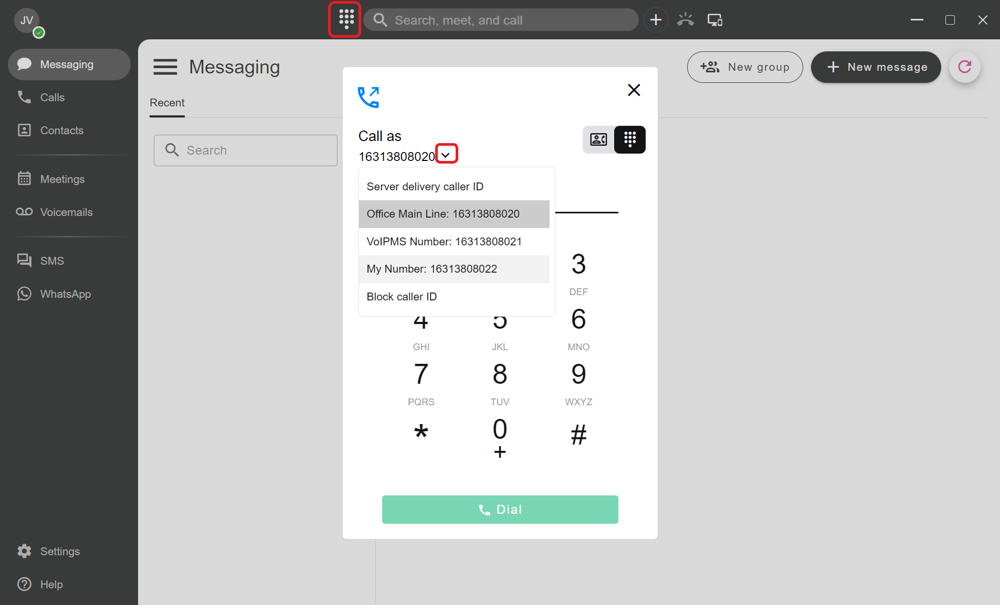
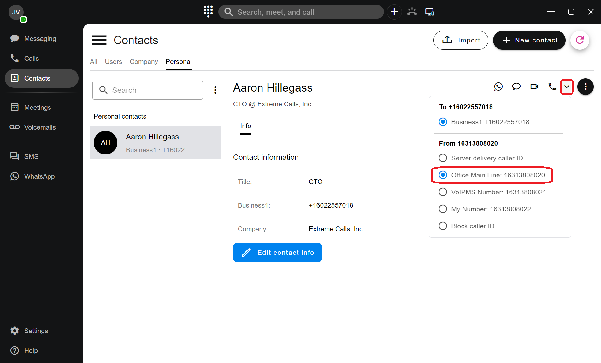
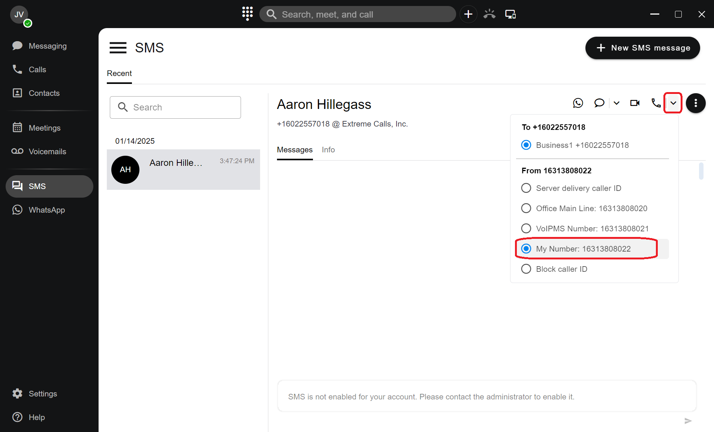
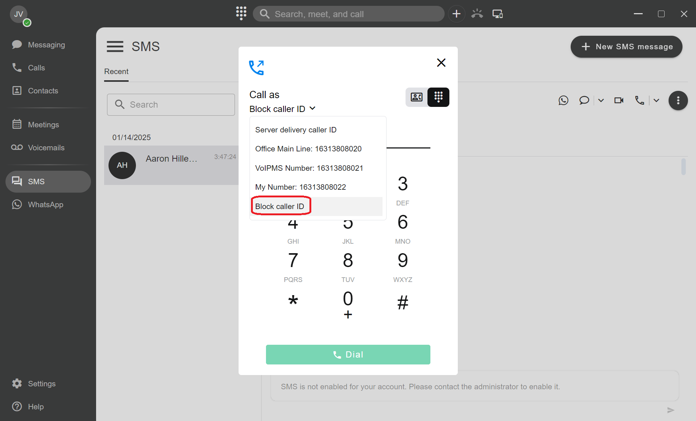
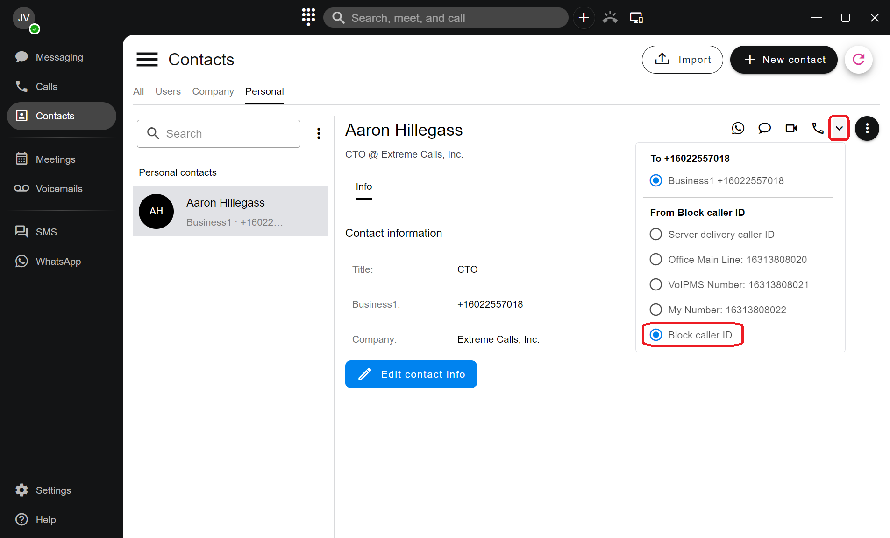
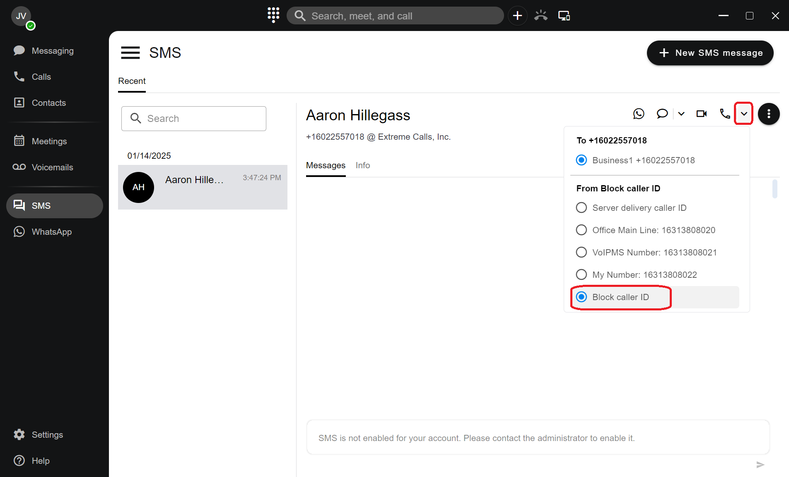
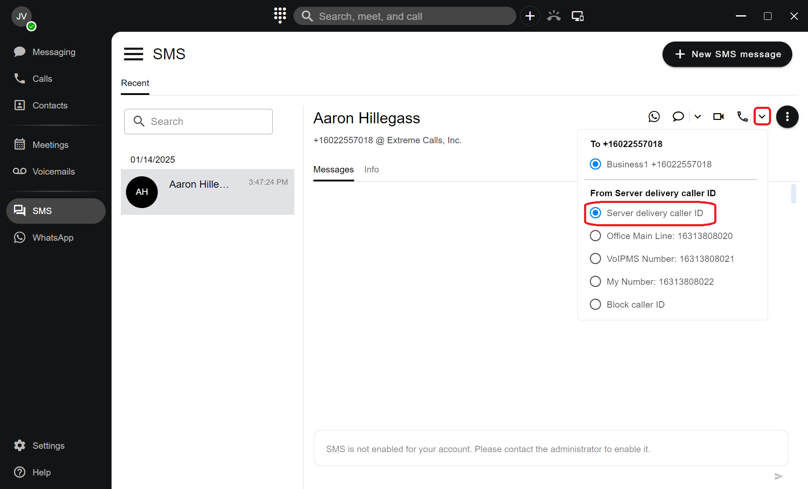

# Customize Your Caller ID

**Caller ID** allows call recipients to see who is calling before they answer. A properly configured Caller ID improves call recognition, professionalism, and trust, especially for outbound business calls.

### Default Caller ID Behavior

By default, PortSIP PBX automatically determines the outbound Caller ID based on the system configuration.\
This ensures that outbound calls present consistent, accurate, and policy-compliant caller information to recipients.

***

### Customizing Caller ID

While the default Caller ID configuration meets most requirements, there are situations where you may want to customize it—either for specific calls or across the organization.

PortSIP PBX provides flexible Caller ID controls that allow customization:

* **Globally**, at the company level
* **Per group**, for departments or teams
* **Per user**, for individual extensions
* **Per call**, when placing a call from supported clients

> ❗**Note**\
> System administrators can restrict which Caller ID values are allowed. This helps prevent misuse, spoofing, or non-compliant outbound calling, and ensures alignment with company security and regulatory policies.

***

### Caller ID Configuration Priority

A user’s outbound Caller ID can be configured in multiple locations. When multiple settings exist, **PortSIP PBX applies them using the following priority order (highest to lowest):**

#### 1. Extension-Level Settings

Caller ID can be defined individually for each extension.\
This allows personalized outbound Caller ID values for specific users.

#### 2. User Group Settings

Caller ID can be configured at the **User Group** level.\
If a user belongs to a group with a defined Caller ID, the group setting takes precedence over the extension-level setting (unless explicitly overridden).

#### 3. Company-Level Settings

Caller ID can be defined globally in the PortSIP PBX web portal under: **Company > Outbound Caller ID**

This setting applies to all users who do not have a specific Caller ID configured at the extension or group level.

***

### Adjusting Caller ID When Placing a Call

In addition to administrative configuration, users can adjust the Caller ID **at the time of dialing**, depending on the client being used.

Caller ID can be adjusted from:

* The **Keypad**
* The **Conversation Thread**
* **PortSIP mobile apps**  ([iOS ](https://www.portsip.com/portsip-one/)and [Android](https://www.portsip.com/portsip-one/)).

> ❗**Limitation**\
> Caller ID selection is **not currently supported on desk IP phones**.

***

### Adjust Caller ID from the Keypad

Use the following steps to select a Caller ID before making a call:

1. Click the **Keypad** icon in the application title bar. The dialing keypad opens.
2. Click the **arrow icon** next to **Call as**. A drop-down list of available Caller ID options appears.
3. Select the desired **Caller ID number** from the list. The selected Caller ID is applied to the call.
4. Enter the destination number or select a contact, then press **Enter** to start dialing. Then the call is placed using the selected Caller ID.

<figure><figcaption></figcaption></figure>

***

### Adjust Caller ID from the Contact Details View

Caller ID can also be selected directly from a contact’s details view before placing a call. This allows you to choose the most appropriate outbound Caller ID for the specific contact you are calling.

#### To adjust Caller ID from the contact details view:

1. Open the **Contact Details** view in the **PortSIP ONE** app. The contact’s information and available actions are displayed.
2. Click the **drop-down arrow** next to the **Phone** icon. Additional calling options are shown.
3. In the **From** section, select the desired **Outbound Caller ID**. The selected Caller ID is applied to the call.
4. Click the **Phone** icon to place the call. The call is initiated using the selected Caller ID.

> ❗**Note**\
> The available Caller ID options depend on your administrator’s configuration and any company-wide restrictions applied to outbound calling.

<figure><figcaption></figcaption></figure>

***

### Adjust Caller ID from a Conversation Thread

Caller ID can also be selected directly from an **SMS or WhatsApp conversation thread** before placing a call. This allows users to maintain context and present the appropriate outbound identity when transitioning from messaging to voice.

#### To adjust Caller ID from a conversation thread:

1. Open the **SMS or WhatsApp conversation thread** in the **PortSIP ONE** app. The conversation history and call options are displayed.
2. Click the **drop-down arrow** next to the **Phone** icon. Additional calling options become available.
3. In the **From** section, select the desired **Outbound Caller ID**. The selected Caller ID is applied to the call.
4. Click the **Phone** icon to place the call. The call is initiated using the selected Caller ID.

> ❗**Note**\
> Available Caller ID options are controlled by administrator-defined policies. If a Caller ID is not selectable, it may be restricted at the extension, group, or company level.

<figure><figcaption></figcaption></figure>

***

### Blocking Your Caller ID

In some situations, you may want to hide your caller ID when placing a call. PortSIP ONE allows you to block your caller ID from multiple call entry points.

***

#### Block Caller ID from the Keypad

1. Open the **Keypad** in the PortSIP ONE app.
2. Click the **drop-down icon** next to **Call as**.
3. Select **Block Caller ID**.

<figure><figcaption></figcaption></figure>

#### Block Caller ID from the Contact Details View

1. Open the desired **contact**.
2. Click the **drop-down arrow** next to the **Phone** icon.
3. Navigate to the **From** section.
4. Select **Block Caller ID**.

<figure><figcaption></figcaption></figure>

#### Block Caller ID from a Conversation Thread

1. Open the **SMS or WhatsApp conversation**.
2. Click the **drop-down arrow** next to the **Phone** icon.
3. Navigate to the **From** section.
4. Select **Block Caller ID**.

<figure><figcaption></figcaption></figure>

***

### Let the PBX Decide the Outbound Caller ID

If you prefer not to manually select a caller ID when placing a call, you can configure the app to let the **PBX automatically determine the outbound caller ID**.

<figure><figcaption></figcaption></figure>

#### To use the PBX-selected caller ID:

1.  In the **From** section, select **Server delivery caller ID**.

    When this option is enabled, the app places the call through the SIP trunk, and the **PBX automatically selects the appropriate outbound caller ID** based on its routing and trunk configuration.

***

#### How the PBX Determines the Caller ID

For details on how the PBX selects the outbound caller ID, see [Handle Outbound Calls Through SIP Trunk](../../portsip-communications-solution/portsip-pbx-administration-guide/7-trunk-management/handle-outbound-calls-through-sip-trunk.md#outboundcallerid).

\
This article explains how the PBX dynamically chooses the correct caller ID based on system configuration, routing rules, and trunk settings.

***

> ❗**Note**\
> This automatic caller ID selection logic is also typically used by **desk IP phones**, which always rely on the PBX to determine the outbound caller ID.

