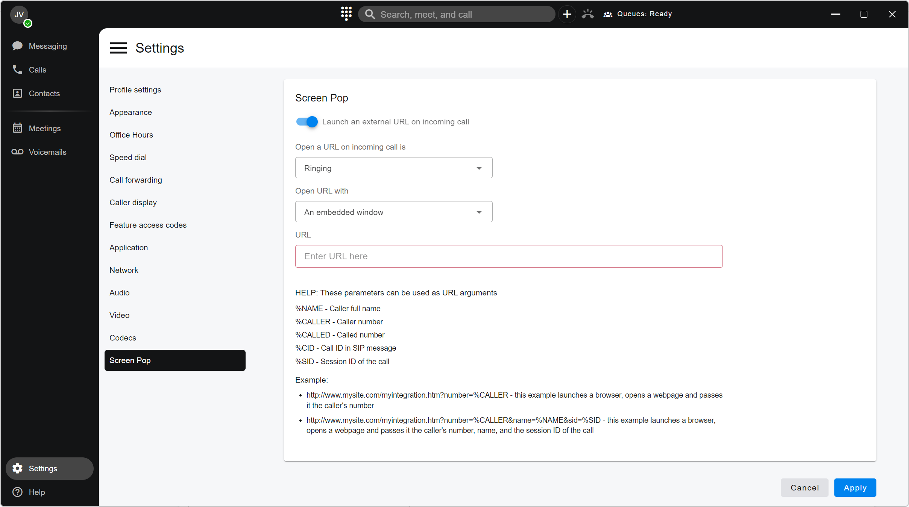

# Screen Pop

### Screen Pop (Call Pop)

Screen pop, also known as _call pop_, is a feature in the PortSIP ONE App that automatically opens a web page when you make or receive a call. This allows agents to quickly view contact information before or during a conversation.

A screen pop typically displays relevant data such as:

* Contact or account details
* Information collected through an IVR flow
* Help or prompt content for handling the call
* Data retrieved from a contact management or CRM system

This feature helps agents immediately identify who they are speaking with and respond more efficiently.

***

### Activating Screen Pop

To enable the screen pop feature:

1. Go to **Settings > Screen Pop**.
2. Enable **Launch an external URL on incoming call**.

<figure><figcaption></figcaption></figure>

***

### Screen Pop Configuration

After enabling the feature, configure the following options:

#### Open contact from incoming call at:

* **Ringing**\
  The screen pop opens as soon as the incoming call starts ringing, before the call is answered. This allows the agent to review caller information in advance.
* **Answered**\
  The screen pop opens when the agent answers the call. This is useful when you want to display information only for active conversations.
* **Ended**\
  The screen pop opens after the call has ended. This option is typically used for post-call actions, such as call notes, wrap-up tasks, or disposition updates.

#### Open URL with:

* **Embedded window**\
  The screen pop opens inside the PortSIP ONE App in an embedded browser window, allowing agents to stay within the application while viewing contact information.
* **Default browser**\
  The screen pop opens in the system’s default web browser, which may be preferred for full-page CRM interfaces or external web applications.

#### URL

Enter the screen pop URL. For example:

```
https://example.com/SA/SearchResults?caller_number=%CALLER&call_id=%CID&session_id=%SID
```

When PortSIP ONE launches the URL, the following placeholders are automatically replaced with call-specific values:

* `%CALLER` – The caller’s number, taken from the **From** header of the SIP INVITE message
* `%CID` – The value of the **Call-ID** header
* `%SID` – The value of the **X-Session-Id** header

PortSIP ONE also supports the following additional parameters:

* `%NAME` – The caller’s full name
* `%CALLED` – The called number

These parameters allow you to dynamically pass call and caller information to external web applications, such as CRM or contact management systems.


