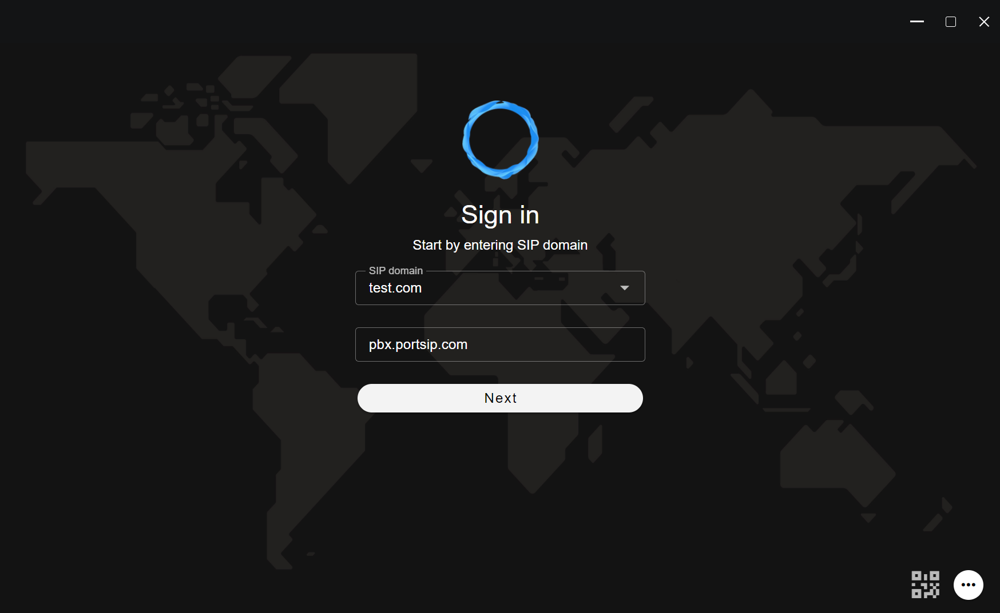
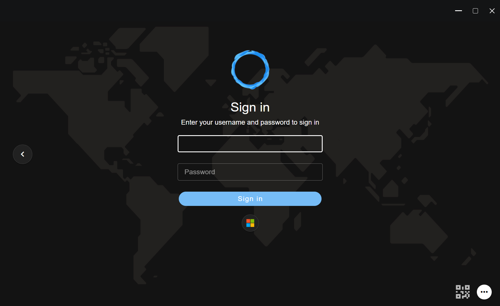

# Sign in to PBX

To download the latest version of PortSIP ONE for Windows desktop, visit the [PortSIP website](https://www.portsip.com/download-portsip-one/). The application is provided as an MSI installer. Simply double-click the downloaded file to start the installation process.

This guide applies to both **PortSIP ONE for Windows** and **PortSIP ONE WebRTC**.

### Logging into the PortSIP ONE app via QR code

The PortSIP ONE app makes logging in effortless by using a QR code. Please follow the below steps to process.

#### 1. Obtaining a QR code

If the SMTP server has been configured in PortSIP PBX by the tenant manager, the PBX will automatically email the account information and QR code to the extension user upon successful extension creation.

As a tenant manager or normal extension user, you can also manually access and manage QR codes by following these steps:

1. Sign in to the PBX web portal as the tenant manager.
2. Navigate to **Call Manager > Users** to list all users.
3. Select a user by either clicking **Edit** or double-clicking their name.
4. The user’s QR code will be displayed. To refresh the QR code, click on it.

<figure><figcaption></figcaption></figure>

Within the **Extension** tab of a user’s settings, there are two QR code configuration options:

1. **Preferred transport for QR code:**
   * This dropdown menu lets you specify the preferred transport protocol (e.g., TCP, UDP) for the QR code. When scanning the QR code to register with the PBX, the PortSIP ONE app will prioritize this setting.
2. **Generate a QR Code with the network interface below:**
   * Use this option to designate the Outbound Proxy Server for the PortSIP ONE app when scanning the QR code to log in to the PBX.

**Important Note:** If you modify the PBX IP address or adjust either of the above options, you must refresh the QR code by clicking on it to ensure the updated configuration is applied.

#### 2. Logging into the PortSIP ONE app

The PortSIP ONE app makes logging in effortless by using a QR code. On the PortSIP ONE login window, click the QR code icon located at the bottom-right corner. Select the QR code option, and then scan the QR code provided by the PBX. The app will log in automatically.

<figure><figcaption></figcaption></figure>

### Logging into the PortSIP ONE app via SSO

Once you have configured the [**Microsoft 365 integration**](../../portsip-communications-solution/portsip-pbx-administration-guide/integrations/) and synced Microsoft 365 users with PortSIP PBX users, you can log into the **PortSIP ONE app** using your Microsoft 365 credentials.

#### Prerequisites

* Ensure your tenant has successfully configured the Microsoft 365 integration.
* Verify that the users have been properly synced and provisioned to PortSIP PBX.

#### Steps to log in

1. **Launch the PortSIP ONE app:** Open the **PortSIP ONE app** (either the Windows desktop app or WebRTC app).
2. **Enter Connection Information:**
   * In the login window, enter your tenant’s **SIP domain** and the **PBX IP address** or **hostname/domain**.
   * Click the **Next** button to proceed.

<figure><figcaption></figcaption></figure>

3. **SSO Authentication via Microsoft 365:**
   * If the Microsoft 365 integration is configured correctly, the PortSIP ONE app will detect your tenant and display the Microsoft 365 logo (as shown in the screenshot below).
   * Click on the **Microsoft 365 logo** to initiate the authentication process.

<figure><figcaption></figcaption></figure>

4. **Login to Microsoft 365:**
   * A browser window will automatically open, directing you to the Microsoft 365 portal.
   * Enter your **Microsoft 365 username** and **password** to sign in.
   * After successfully logging into Microsoft 365, the PortSIP ONE app will automatically log you into the PortSIP PBX.

<figure><figcaption></figcaption></figure>

### Logging into the PortSIP ONE app manually

You can manually input user details in the PortSIP ONE app to log in to the PortSIP PBX. In this example, we assume the following configurations:

* The PortSIP PBX and SBC are installed on a server with:
  * **Public IP:** `66.175.221.120`
  * **Private IP:** `192.168.1.72`
* The PBX web domain **`uc.portsip.cc`** resolves to the PBX server’s public IP: `66.175.221.120`.
* The PBX is configured with the following transport protocols in the SBC:
  * UDP on port `5060`
  * TLS on port `5061`
  * TCP on port `5063`
  * WSS on port `5065`
* A tenant has been created with the SIP domain set as **`test.io`**.

Based on these configurations, after signing in to the PBX as the system administrator, you will see a page similar to the screenshot below.

<figure><figcaption></figcaption></figure>

#### 1. Entering the server information

At the PortSIP ONE login window, provide the following details:

* **SIP Domain**: Enter the tenant's SIP domain. For this example, the SIP domain is **`test.io`**.
* **Server Address**: Enter the PBX server's IP address or web domain:
  * If logging in from the internet, use the public IP (**`66.175.221.12`**`0`).
  * If logging in from a LAN, use the private IP (**`192.168.1.72`**).
  * Alternatively, you can enter the web domain (**`uc.portsip.cc`**) instead of the IP address.

<figure><figcaption></figcaption></figure>

Click **Next** after entering this information. If the details are correct, the next window will prompt you to enter user credentials.

#### 2. Entering user information

In the user information window, provide the following:

* **Username**: Enter the username of the extension user. Note that this is **not the extension number**, but the designated username.
* **Password**: Enter the password for the extension user. This is **not the extension password**, but the user’s account password.

<figure><figcaption></figcaption></figure>

Click the **Sign In** button to complete the login process. The PortSIP ONE app will successfully log in to the PortSIP PBX.

