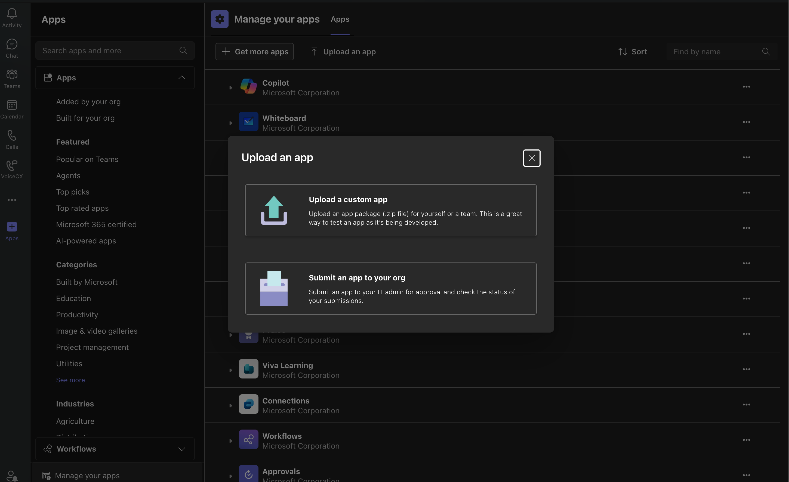

# PortSIP ONE for Microsoft Teams

**PortSIP ONE for Microsoft Teams** is a SIP softphone solution designed to work seamlessly with Microsoft Teams. It allows users to make and receive SIP-based voice and video calls directly from the Teams environment.

PortSIP ONE for Microsoft Teams consists of two components:

1. **Desktop Client Application:** Installed on the user’s Windows computer, responsible for handling SIP calls.
2. **Microsoft Teams App (Plugin):** Installed inside Microsoft Teams, providing integration and call control within the Teams interface.

This guide describes how to install and use PortSIP ONE for Microsoft Teams.

***

### Installing the PortSIP ONE for Microsoft Teams Desktop APP (Windows)

1. Download the PortSIP ONE for Microsoft Teams installer from the [PortSIP websit](https://www.portsip.com/download-portsip-one/)e.
2. Double-click the installer package and follow the on-screen instructions to complete the installation.
3. SIPS Protocol Association (Required)

After installation, if the **SIPS protocol association** is not set to PortSIP ONE for Teams, you must configure it manually.

#### Windows 11

On Windows 11, if the app detects that the default application for the sips: link is not **PortSIP ONE for Teams**, it will automatically navigate you to the **Set default file types or link types** settings page.

When prompted, the system opens Set default file types or link types. Locate the SIPS protocol. Select PortSIP ONE for Teams as the default application. No additional manual steps are required.

#### Windows 10

On Windows 10, the SIPS protocol must be associated manually using the following steps:

1. Open **Settings** > **Apps** > **Default apps**
2. Scroll down and click **Choose default apps by protocol**&#x20;
3. Locate the **SIPS** protocol&#x20;
4. Click the app icon on the right and select **PortSIP ONE for Teams** as the default application

***

### Installing the PortSIP ONE for Teams App in Microsoft Teams

1. Download the PortSIP ONE for Teams app package from the [PortSIP website](https://www.portsip.com/downloads/portsip1/portsip-one-for-teams-plug.zip).&#x20;
2. Open **Microsoft Teams** and follow these steps:
   * Click **Apps** in the left navigation bar
   * Select **Manage your apps**
   * Click **Upload an app** , then choose one of the following options:
     * **Upload a custom app** (for personal or team use)
     * **Submit an app to your org** (requires Teams administrator permissions)
   * Click **Upload an app** **>** **Upload a custom app**
   * If you are an admin of the team, you can also click **Upload an app >** **Submit an app to your org**
   * Select the downloaded `portsip-one-for-teams-plug.zip` file from your local disk&#x20;
3. Click **Install** and follow the prompts to complete the installation.

<figure><figcaption></figcaption></figure>

***

### Using PortSIP ONE for Microsoft Teams

1. In Microsoft Teams, click the **PortSIP ONE for Teams** icon to launch the application.
2. **Sign in manually**:
   * Enter your **PortSIP PBX tenant domain** and **server address**
   * Enter your **username** and **password**
   * Click **Sign In**
3. **Or sign in using QR code**:
   * Click the **QR code icon**
   * Scan the user QR code generated by your PortSIP PBX
4. After successful login, you can use PortSIP ONE for Teams to:
   * Make and receive **voice and video calls**
   * Browse and manage your **contacts**
   * Dial numbers directly
   * Answer incoming calls
   * View and manage **call history**

***

### Support

If you encounter any issues during installation or while using PortSIP ONE for Teams, please contact the [PortSIP Technical Support Team](mailto:support@portsip.com) for assistance.

