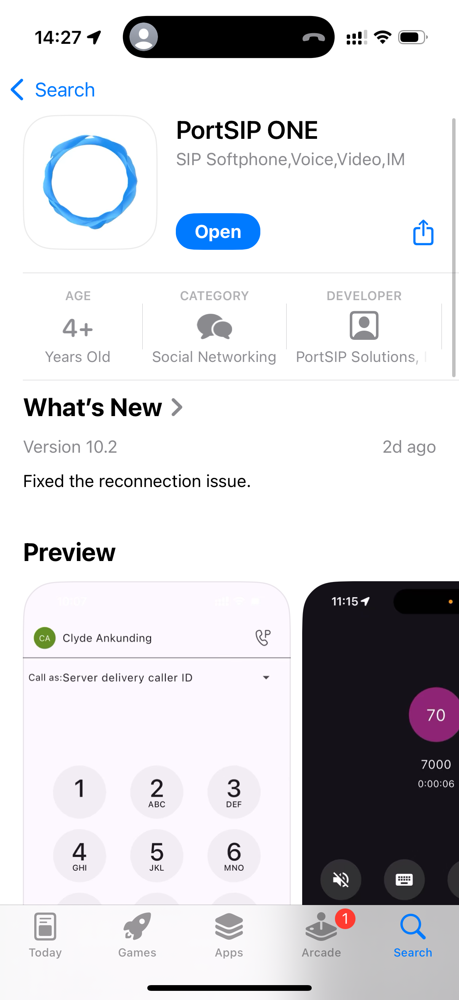

# PortSIP ONE Mobile App


The PortSIP ONE app is compatible only with PortSIP PBX version 22.0 or higher. It does **not** support PortSIP PBX version 16.x.


PortSIP ONE is a versatile app that lets you manage your calling service from your computer, browser, or mobile device. With it, you can make and receive calls, send and receive text messages, engage in group chats and sharing with colleagues and contacts, view customer contact history, manage call forwarding settings, and access voicemails—all in one convenient platform.

The all-new PortSIP ONE App is one easy-to-use and secure app you can use to call, message, meet, and get work done:

* It brings everyone together to do exceptional work.
* It makes you smarter; it’s personalized to you.
* It gives you options to choose how you work.

## Downloading from the App Store or Google Play Store

You can also download the application by searching the App Store or Google Play store from your mobile device. Search **PortSIP ONE** to install it.

<figure><figcaption></figcaption></figure>

