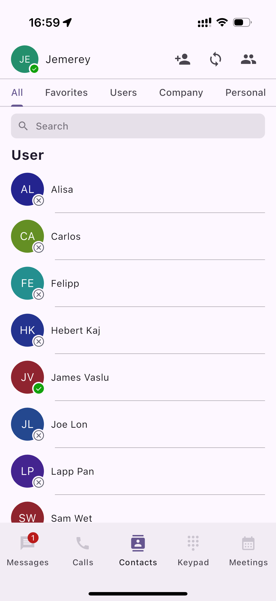
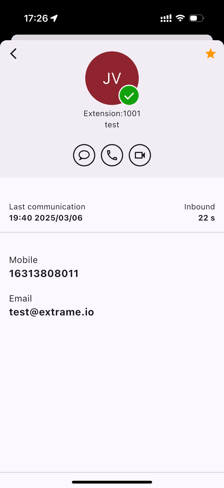
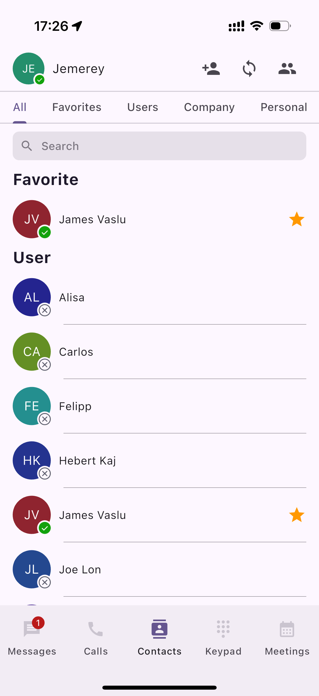

# Calls, Messages, and Voicemails

### Mobile App Overview

After signing in, the **Messages dashboard** is displayed by default. This is the first screen you see when you open the mobile app.\
Use this dashboard to quickly access your recent conversations and navigate the app.

***

### Chat Tab

The **Chat** tab is where you send and receive chat messages. It displays a list of your recent conversations, sorted chronologically with the **most recent messages at the top**.

Messaging is designed to be simple and intuitive.

#### Continue an Existing Chat

1. Open an existing conversation from the chat list.
2. Tap the **message field** and continue the conversation.

***

#### Start a New Chat

You can start a new chat in multiple ways:

**Option 1: From the Chat tab**

1. Tap the **+** icon in the upper-right corner.
2. Select the desired option from the pop-up menu.

**Option 2: From Contacts**

1. Tap the **Contacts** tab.
2. Select a user.
3. On the user details page, tap the **Message** icon to start a chat.

<figure><figcaption></figcaption></figure>

***

### Calls / History Tab

The **Calls** tab displays your recent call history, including **incoming**, **outgoing**, and **missed** calls.

#### View Missed Calls

To view only missed calls:

1. Tap the **Calls** tab at the bottom of the app.
2. Tap **Missed**.

Only calls you did not answer will be displayed.

***

#### Place a New Call

You can also start a new call directly from the Calls tab:

1. Tap the **New Call** icon.
2. Select a contact or enter a phone number to place the call.

<figure><figcaption></figcaption></figure>

***

### Contacts Tab

The **Contacts** tab contains all of your saved contacts and is organized into **five distinct sections**.

* **All Contacts**\
  Displays all contacts you have saved.
* **Company Contacts**\
  Displays contacts from your company’s internal directory.

<figure><figcaption></figcaption></figure>

***

### Keypad Tab

The **Keypad** tab is used to place calls to phone numbers that are not saved in your contacts.

In addition to dialing numbers, the Keypad allows you to dial **Feature Access Codes (FACs)** to perform specific actions, such as:

* Retrieving **group-parked calls**
* Enabling or disabling **Do Not Disturb (DND)**

<figure><figcaption></figcaption></figure>

***

### Meetings Tab

The **Meetings** tab lets you view and manage your video meetings in one place. From this tab, you can:

* View a list of **upcoming meetings**
* **Join** existing meetings
* **Schedule** new meetings

This centralized view allows you to quickly access and manage your scheduled video conferences.

<figure><figcaption></figcaption></figure>

***

### Accessing the Quick Menu

On the left side of the dashboard, you will see your **profile icon**, which displays your initials. This icon provides access to the mobile app’s **Quick Menu**.

#### To access the Quick Menu:

1. Tap your **Profile** icon.
2. The Quick Menu will open.

From the Quick Menu, you can manage the following settings and information:

<figure><figcaption></figcaption></figure>

**Change Your Presence Status**

* Tap your **presence status** to change your availability (for example, _Available_, _Busy_, or _Do Not Disturb_).

**View Personal Information**

* Your **name** and **extension number** are displayed for quick reference.

**Mute Calls on the Mobile App**

* Enable **Mute Calls** to stop incoming calls from ringing on the mobile app.
* When this option is enabled, incoming calls will continue to ring on **other devices** associated with your number or extension (such as desk phones or desktop apps).
* Change your presence status: tap the presence status and you can change your status
* Personal information is displayed here, including your name and extension.
* Here you can mute calls for the mobile app. When this option is enabled, all incoming calls will no longer ring the mobile app but will ring other devices associated with your number or extension.

### How to access your Settings 

To access your settings, from the Quick Menu, click on **Settings**. Here, you have the option to configure the following areas.

<figure><figcaption></figcaption></figure>

### How to Place Calls

There are several ways to place outbound calls using the **PortSIP ONE mobile app**.

***

#### Place a Call from a Contact

1. Find the contact in your **Favorites** list or search within **Contacts**.
2. Tap the contact’s **name**.
3. Tap the **Call** icon below the profile picture, or tap the **Call** icon next to the specific phone number you want to dial.

***

#### Place a Call from a Chat

1. Open the chat conversation.
2. Tap the **Phone** icon to place a voice call, or tap the **Camera** icon to start a video call.

***

#### Place a Call Using the Keypad

1. Select the **Keypad** tab from the main menu.
2. Enter the phone number.
3. Tap the **Dial** button to place the call.

<figure><figcaption></figcaption></figure>

***

### Blind Transfer a Call

A **blind transfer** sends the call directly to another party without speaking to them first.

#### To perform a blind transfer:

1. During an active call, tap the **Transfer** icon.
2. Select **Blind Transfer**.
3. Choose the transfer destination:
   * **Transfer to a contact or extension**\
     Search for and tap the contact or extension from your contacts list.
   * **Transfer to an external number**\
     Enter the number using the **Keypad**.
4. Once the destination is selected or entered, the call is transferred immediately.

<figure><figcaption></figcaption></figure>

***

### Attended Transfer a Call

An **attended transfer** (also known as a consultative transfer) allows you to speak with the recipient **before** completing the transfer.

#### To perform an attended transfer:

1. During an active call, tap the **Transfer** icon.
2. Select **Attended Transfer**.
3. Choose the transfer destination:
   * **Transfer to a contact or extension**\
     Search for and tap the contact or extension from the contacts list.
   * **Transfer to an external number**\
     Enter the number using the **Keypad**, then place the call.
4. When the third party answers, the **Attended Transfer** icon will begin flashing.
5. Tap the **Attended Transfer** icon to complete the transfer.

<figure><figcaption></figcaption></figure>

***

### Transfer a Call to Voicemail

A **Direct-to-Voicemail Transfer** allows you to send a call directly to another user’s voicemail without ringing their phone.

#### To transfer a call to voicemail:

1. During an active call, tap the **Transfer** icon.
2. Select **Transfer to Voicemail**.
3. From the **Contacts** panel, select the recipient.
4. The call is transferred directly to the recipient’s voicemail.

***

### Place a Call on Hold

You can temporarily place a call on hold during an active conversation.

#### To place a call on hold:

1. During an active call, tap **Hold**.
   * The caller is placed on hold and hears the **Music on Hold** configured for your tenant.
2. Tap **Hold** again to resume the call.

***

### Directly Parking a Call

**Direct Call Parking** allows you to park an active call on a specific extension so that the call can be retrieved by that user.

#### To park a call on an extension:

1. During an active call, tap the **Transfer** icon.
2. Select **Park**.

<figure><figcaption></figcaption></figure>

3. From the **Contacts** panel, select the extension on which you want to park the call.

The call is parked on the selected extension. The user associated with that extension will receive a notification.

You can also **copy the retrieval code** and share it with the user.\
The user can retrieve the parked call by dialing the provided retrieval code (for example, **\*881004**).

<figure><figcaption></figcaption></figure>

***

### Group Parking a Call

**Group Call Parking** allows you to park a call to a **park group**, enabling any member of the group to retrieve the call.

> **Prerequisite**\
> You must be a member of a park group to use this feature.

#### To park a call to a group:

1. During an active call, tap the **Transfer** icon.
2. Select **Group Park**.

The call is parked to the group. All members of the park group receive a notification and can retrieve the call.

***

### Retrieving a Parked Call

When a call is parked on an extension or park group, the intended recipient(s) will be notified.

#### To retrieve a parked call from the app:

1. When a call is parked, the **Call Hub** icon in the top title bar will begin flashing **red**.
2. Tap the **Call Hub** icon.
3. Locate the parked call in the list.
4. Tap **Retrieve** to answer the call.

<figure><figcaption></figcaption></figure>

***

### Expected Behavior

* Parked calls are held until retrieved by an authorized extension or group member.
* Notifications are sent to the target extension or park group members immediately.
* Retrieval codes can be shared to allow manual retrieval via the keypad.

***

### Call Flip

**Call Flip** allows you to move an active call from the PortSIP ONE app to another registered device, such as the **PortSIP ONE mobile app** or an **IP phone**, without disconnecting the call.

#### To perform a Call Flip:

1. During an active call, tap the **Transfer** icon.
2. Select **Flip**.
3. Your other registered devices will start ringing.
4. Answer the call on the device you want to continue the conversation on.

***

> **Expected Result**\
> The call is seamlessly transferred to the selected device, and the original device is disconnected from the call.

***

### Accessing Your Voicemail

You can access your voicemails directly from the **Messages** tab.

#### To view your voicemails:

1. Tap the **Messages** tab.
2. The Messages screen is divided into the following sections:
   * **Messages** – Displays internal team messages with other extensions.
   * **SMS** – Displays SMS conversations with contacts.
   * **WhatsApp** – Displays WhatsApp conversations with contacts.
   * **Voicemail** – Displays your voicemail messages.
3. Tap **Voicemail** to listen to, manage, or delete your voicemail messages.

<figure><figcaption></figcaption></figure>

***

### Accessing Your Contacts

Follow the steps below to access and browse your contact directory in the PortSIP ONE mobile app.

#### Open the Contacts Tab

1. Tap the **Contacts** tab in the bottom navigation bar.

***

#### Explore the Contacts Page

The Contacts page is organized into the following sections:

* **All：** Displays all contacts in a single list.
* **Favorites:** Shows your favorite contacts, including both **extension users** and **external contacts**.
* **Users:** Lists all **extension users** within your organization.
* **Company:** Displays **company-wide contacts** shared across the organization.
* **Personal:** Contains your **private, personal contacts**.
* **Device:** Shows contacts stored locally on your **mobile device**.

<figure><figcaption></figcaption></figure>

***

### Adding a New Contact

Follow the steps below to add a new contact to your directory in the PortSIP ONE mobile app.

#### To add a new contact:

1. Open the **Contacts** tab.
2. Tap the **+ Contact** icon in the top bar to open the **Add Contact** screen.
3.  Enter the contact details in the appropriate fields.

    * If you are a **tenant administrator** with permission to manage **Company Contacts**, tap **Title** to choose where the contact is saved:
      * **Company Contacts**, or
      * **Personal Contacts**

    This allows you to control contact visibility and access based on your organization’s needs.
4. Tap **Save** to create the contact. The new contact is saved successfully and appears in your **Contacts** list.

<figure><figcaption></figcaption></figure>

***

### Add a Contact to Favorites

You can mark frequently used contacts as **Favorites** to access them more quickly.

#### To add a contact to Favorites:

1. Tap the **Contacts** tab in the main navigation menu.
2. Select **Users**, **Company**, or **Personal** to view the desired contact list.
3. Tap the contact you want to add to Favorites to open the contact details.
4. Tap the **Star** icon in the upper-right corner.

When selected, the star turns **solid yellow (⭐)**, indicating the contact has been added to your Favorites list.

<figure><figcaption></figcaption></figure>

***

### Remove a Contact from Favorites

To remove a contact from Favorites, repeat the same steps and tap the **Star** icon again.

* The star will no longer be highlighted, indicating the contact has been removed from Favorites.

<figure><figcaption></figcaption></figure>

***

### Accessing Team Messages

PortSIP enables seamless internal communication through **extension-based team messaging**.\
If the person you are messaging is **not** an extension user, messages are automatically delivered through **SMS**, **MMS**, or **WhatsApp**, ensuring uninterrupted communication.

#### To access your team messages:

1. Tap the **Messaging** tab in the main navigation menu.
2. The Messaging screen is divided into the following sections:
   * **Messages**\
     Displays internal team messages with other extension users.\
     Conversations are sorted chronologically by date. Tap a conversation to view and reply.
   * **SMS**\
     Displays SMS conversations with external contacts.\
     Messages are sorted chronologically. Tap a conversation to view and reply.
   * **WhatsApp**\
     Displays WhatsApp conversations with contacts.\
     Messages are sorted chronologically. Tap a conversation to view and reply.
   * **Voicemail**\
     Displays your voicemail messages.\
     Tap a voicemail to view details and play the recording.

<figure><figcaption></figcaption></figure>

***

### Sending a New Team Message

You can send a new team message in two ways.

#### Option 1: From Contacts

1. Go to **Contacts**.
2. Select the desired **extension user**.
3. Tap the user’s name to open the chat window.
4. Compose and send your message.

***

#### Option 2: Using the New Message Button

1. Navigate to **Messaging**.
2. Tap the **+** icon in the top-right corner.
3. Select **Create a message**.
4. You will be redirected to the chat window.
5. Compose and send your message.

***

### Creating a Team Messaging Group

Group chats allow multiple extension users to collaborate in a single conversation.

#### To create a group chat:

1. Navigate to **Messaging**.
2. Tap the **+** icon in the top-right corner.
3. Select **Create a group**.\
   The **New Group** window appears.

***

#### Name and Customize the Group

1. Enter a **group name**.
2. (Optional) Add a **description** to provide context.
3. Tap **Next** to continue.

***

#### Add Group Members

1. From the **Extension Users** list, select the members you want to include.
2. After selecting all desired members, tap **Create** to finalize the group.

***

#### Finish and Manage the Group

* The newly created group appears in the **Messaging** list.
* You can edit the group later to **upload a group picture** or update details.

<figure><figcaption></figcaption></figure>

***

### Expected Behavior

* Team messages are delivered instantly to extension users.
* Group chats allow real-time collaboration among multiple users.
* Messaging channels (Messages, SMS, WhatsApp, Voicemail) remain clearly separated for easy navigation.

