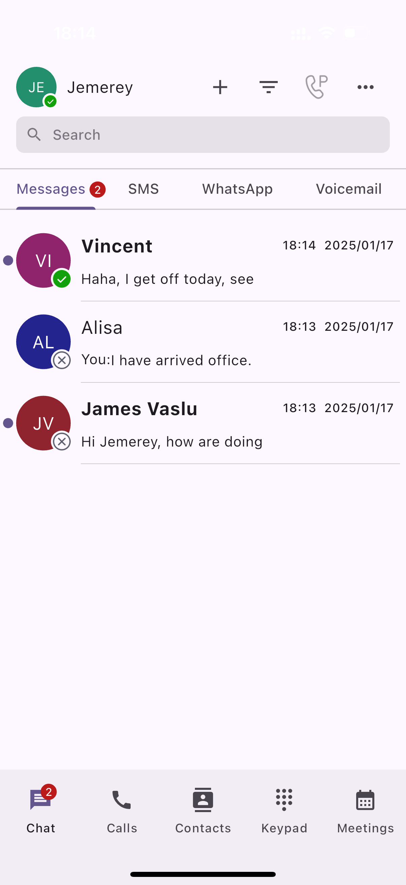
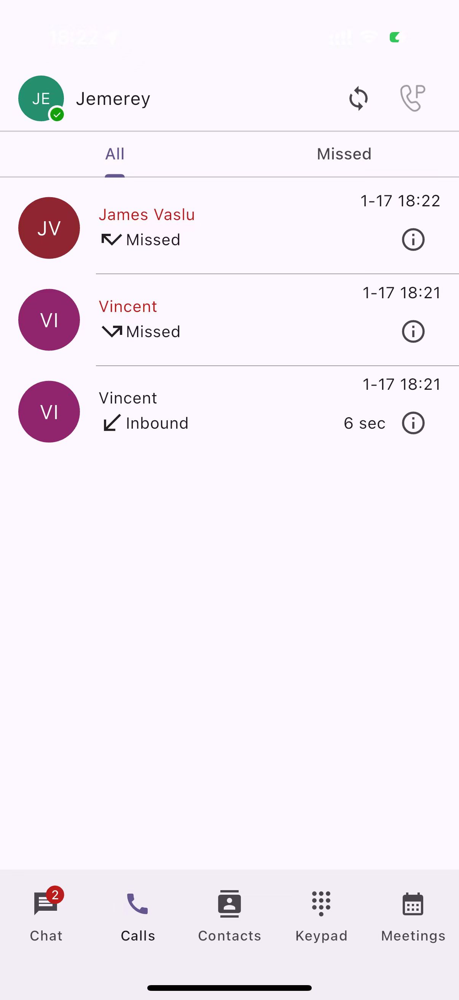
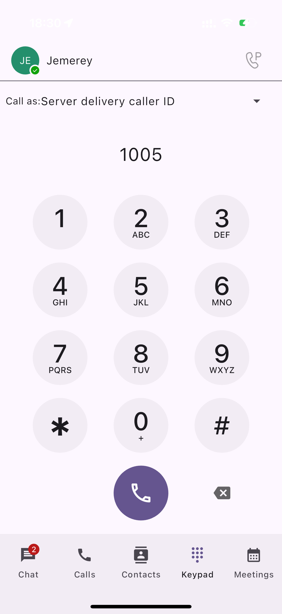
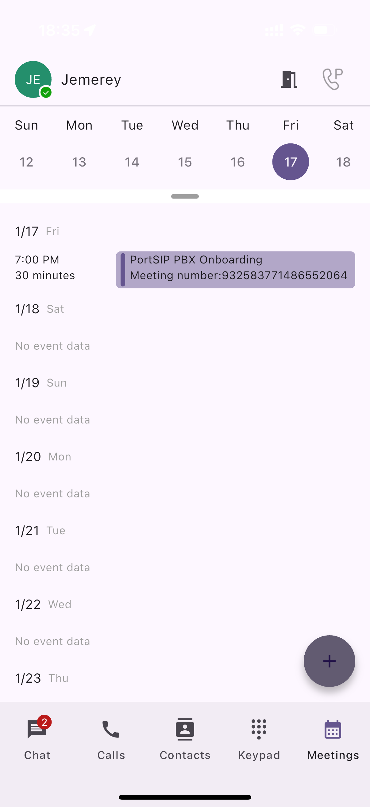
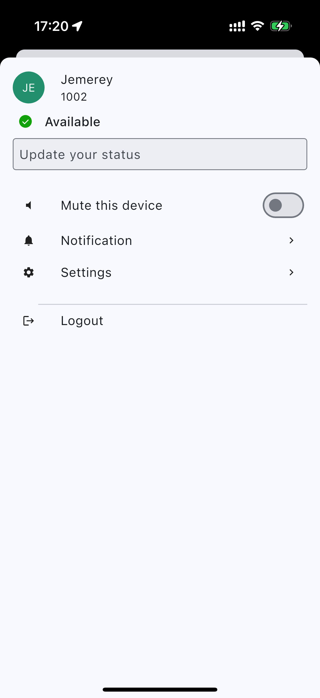

# Calls, Messages, and Voicemails

## Mobile App Overview 

Upon logging in, you will see the dashboard with Messages being the first page you see. Let’s take a look around the mobile client to familiarize yourself with the app.

### Chat Tab

The Chat tab is where you will send and receive chat messages and where a list of recent messages will be displayed. Chats are listed chronologically with the newest messages on top. Viewing and sending messages is easy.

1. To continue a chat, open the message field and continue that conversation.
2. To start a new chat, tap the **+** icon in the upper right corner, then choose the menu item from the popup menu.
3. Tap the Contacts tab, then tap a user, in the user details page, tap the message icon to start the chat.

<figure><figcaption></figcaption></figure>

### Call/History Tab

The Calls tab displays all recent calls, including those you made, received, and missed.

1. To view only the calls you’ve missed, tap the **Calls** tab at the bottom of the application.
2. Then tap the **Missed** tab.
3. You can also initiate a new call from this page by tapping the **New Call** icon.

<figure><figcaption></figcaption></figure>

### Contacts Tab

The Contacts tab contains all of your saved contacts. It is broken down into five distinct areas. All Contacts, which displays all your saved contacts, and your Company Contacts, which displays contacts listed in your company’s directory.

<figure><figcaption></figcaption></figure>

### Keypad Tab

The Keypad tab is used to make calls to numbers that have not been saved as contacts. Additionally, it allows you to enter special FAC to perform various actions, such as retrieving group-parked calls or enabling the "Do Not Disturb" feature.

<figure><figcaption></figcaption></figure>

### Meetings Tab

The Meetings tab is where you can access your upcoming meetings list, join existing meetings, and schedule new ones, allowing you to quickly view and manage your scheduled video conferences.

<figure><figcaption></figcaption></figure>

## How to access your Quick Menu 

On the left side of the dashboard, you will see your profile icon displaying your initials. This is the mobile client’s quick menu. To access this menu:

* Tap your **Profile** icon, and the menu window appears.

<figure><figcaption></figcaption></figure>

