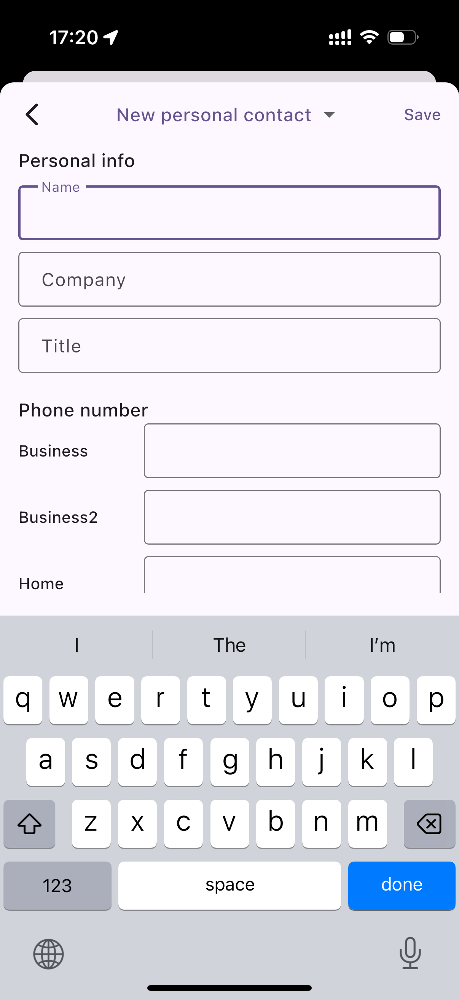

# Calls, Messages, and Voicemails

### Mobile App Overview

After signing in, the **Messages dashboard** is displayed by default. This is the first screen you see when you open the mobile app.\
Use this dashboard to quickly access your recent conversations and navigate the app.

***

### Chat Tab

The **Chat** tab is where you send and receive chat messages. It displays a list of your recent conversations, sorted chronologically with the **most recent messages at the top**.

Messaging is designed to be simple and intuitive.

#### Continue an Existing Chat

1. Open an existing conversation from the chat list.
2. Tap the **message field** and continue the conversation.

***

#### Start a New Chat

You can start a new chat in multiple ways:

**Option 1: From the Chat tab**

1. Tap the **+** icon in the upper-right corner.
2. Select the desired option from the pop-up menu.

**Option 2: From Contacts**

1. Tap the **Contacts** tab.
2. Select a user.
3. On the user details page, tap the **Message** icon to start a chat.

<figure><figcaption></figcaption></figure>

***

### Calls / History Tab

The **Calls** tab displays your recent call history, including **incoming**, **outgoing**, and **missed** calls.

#### View Missed Calls

To view only missed calls:

1. Tap the **Calls** tab at the bottom of the app.
2. Tap **Missed**.

Only calls you did not answer will be displayed.

***

#### Place a New Call

You can also start a new call directly from the Calls tab:

1. Tap the **New Call** icon.
2. Select a contact or enter a phone number to place the call.

<figure><figcaption></figcaption></figure>

***

### Contacts Tab

The **Contacts** tab contains all of your saved contacts and is organized into **five distinct sections**.

* **All Contacts**\
  Displays all contacts you have saved.
* **Company Contacts**\
  Displays contacts from your company’s internal directory.

<figure><figcaption></figcaption></figure>

***

### Keypad Tab

The **Keypad** tab is used to place calls to phone numbers that are not saved in your contacts.

In addition to dialing numbers, the Keypad allows you to dial **Feature Access Codes (FACs)** to perform specific actions, such as:

* Retrieving **group-parked calls**
* Enabling or disabling **Do Not Disturb (DND)**

<figure><figcaption></figcaption></figure>

***

### Meetings Tab

The **Meetings** tab lets you view and manage your video meetings in one place. From this tab, you can:

* View a list of **upcoming meetings**
* **Join** existing meetings
* **Schedule** new meetings

This centralized view allows you to quickly access and manage your scheduled video conferences.

<figure><figcaption></figcaption></figure>

***

### Accessing the Quick Menu

On the left side of the dashboard, you will see your **profile icon**, which displays your initials. This icon provides access to the mobile app’s **Quick Menu**.

#### To access the Quick Menu:

1. Tap your **Profile** icon.
2. The Quick Menu will open.

From the Quick Menu, you can manage the following settings and information:

<figure><figcaption></figcaption></figure>

**Change Your Presence Status**

* Tap your **presence status** to change your availability (for example, _Available_, _Busy_, or _Do Not Disturb_).

**View Personal Information**

* Your **name** and **extension number** are displayed for quick reference.

**Mute Calls on the Mobile App**

* Enable **Mute Calls** to stop incoming calls from ringing on the mobile app.
* When this option is enabled, incoming calls will continue to ring on **other devices** associated with your number or extension (such as desk phones or desktop apps).
* Change your presence status: tap the presence status and you can change your status
* Personal information is displayed here, including your name and extension.
* Here you can mute calls for the mobile app. When this option is enabled, all incoming calls will no longer ring the mobile app but will ring other devices associated with your number or extension.

### How to access your Settings 

To access your settings, from the Quick Menu, click on **Settings**. Here, you have the option to configure the following areas.

<figure><figcaption></figcaption></figure>

### How to Place Calls

There are several ways to place outbound calls using the **PortSIP ONE mobile app**.

***

#### Place a Call from a Contact

1. Find the contact in your **Favorites** list or search within **Contacts**.
2. Tap the contact’s **name**.
3. Tap the **Call** icon below the profile picture, or tap the **Call** icon next to the specific phone number you want to dial.

***

#### Place a Call from a Chat

1. Open the chat conversation.
2. Tap the **Phone** icon to place a voice call, or tap the **Camera** icon to start a video call.

***

#### Place a Call Using the Keypad

1. Select the **Keypad** tab from the main menu.
2. Enter the phone number.
3. Tap the **Dial** button to place the call.

<figure><figcaption></figcaption></figure>

***

### Blind Transfer a Call

A **blind transfer** sends the call directly to another party without speaking to them first.

#### To perform a blind transfer:

1. During an active call, tap the **Transfer** icon.
2. Select **Blind Transfer**.
3. Choose the transfer destination:
   * **Transfer to a contact or extension**\
     Search for and tap the contact or extension from your contacts list.
   * **Transfer to an external number**\
     Enter the number using the **Keypad**.
4. Once the destination is selected or entered, the call is transferred immediately.

<figure><figcaption></figcaption></figure>

***

### Attended Transfer a Call

An **attended transfer** (also known as a consultative transfer) allows you to speak with the recipient **before** completing the transfer.

#### To perform an attended transfer:

1. During an active call, tap the **Transfer** icon.
2. Select **Attended Transfer**.
3. Choose the transfer destination:
   * **Transfer to a contact or extension**\
     Search for and tap the contact or extension from the contacts list.
   * **Transfer to an external number**\
     Enter the number using the **Keypad**, then place the call.
4. When the third party answers, the **Attended Transfer** icon will begin flashing.
5. Tap the **Attended Transfer** icon to complete the transfer.

<figure><figcaption></figcaption></figure>

#### Transferring a call to voicemail 

A **Direct-to-Voicemail Transfer** is used when you wish to transfer a call directly to another user’s voicemail. To perform a transfer to voicemail while on an active call:

1. Click the **Transfer** button.
2. Select **Transfer to Voicemail**.
3. From the **Contact Panel**, select the recipient to whom you wish to transfer the call to click on it.
4. The call will be transferred directly to their voicemail.

#### Call on Hold 

To put a call on hold, during an active call:

* Tap **Hold**. The caller will go on hold and hear the on-hold audio based on the Music-on-Hold file that has been set up for your tenant.
* Tap the **Hold** icon again, the call will be resumed.

#### Direct parking a call 

To park a call to an extension while on an active call:

1. Click the **Transfer** button, and select **Park**.

<figure><figcaption></figcaption></figure>

2. From the **Contact Panel**, select the recipient to whom you wish to park the call and click on their name.&#x20;
3. The call will be parked on that extension, the extension which the call is parked on he will received the notification, or you can copy the retrieve code and share to him, then he can dial the `*881004` to retrieve the call.

<figure><figcaption></figcaption></figure>

#### Group parking a call 

If the user is a member of a park group, they can park a call to the group, allowing group members to retrieve the parked call.

To park a call to the group while on an active call:

1. Click the **Transfer** button.
2. Select **Group Park**.

The call will be parked to the group if the user is a member of a park group. All of the other members of this park group will receive notification and then can simply retrieve the call.

#### Retrieving a parked call 

Once a call is parked to an extension user or a park group, the extension user or group members will receive a notification. As shown in the screenshot below, the **Call HUB** icon on the top title bar will start blinking with red color.

1. Click the **HUD** icon. The parked call will appear in the list.
2. Click the **Retrieve** button to easily retrieve the call.

<figure><figcaption></figcaption></figure>

#### Call Flip 

**Call Flip** allows you to quickly transfer an active call from PortSIP ONE to another endpoint, such as PortSIP ONE mobile or an IP phone. To perform a Call Flip while on an active call:

1. Click the **Transfer** button.
2. Select **Flip**.
3. Your other devices (e.g., PortSIP ONE mobile or IP phone) will ring. Simply answer the call on the other device.

### How to access your voicemail 

To access your voicemails, click on the **Messages** tab. The page is divided into some sections:

1. Messages: This area displays your team messages with other extensions.
2. SMS: This area displays your SMS with contacts.
3. WhatsApp: This area displays your WhatsApp messages with contacts.
4. Voicemail: This area displays your voicemails.

<figure><figcaption></figcaption></figure>

### Accessing your contacts

To access your contact directory, follow these steps:

1. **Open the Contacts Tab**\
   Tap the **Contacts** tab at the bottom navigation menu.
2. **Explore the Contacts Page**
   * **All**: Shows all your contacts in one list.
   * **Favorites**: Displays your favorite contacts, including both extension users and general contacts.
   * **Users**: Lists all extension users within your organization.
   * **Company**: Displays company-wide contacts.
   * **Personal**: Contains your private, personal contacts.
   * **Device**: Shows contacts stored locally on your mobile device.

<figure><figcaption></figcaption></figure>

#### **Adding a new contact** 

To add a new contact to your directory, follow these steps:

1. Navigate to the **Contacts** tab. Tap the **+Contact** icon at the top bar to open the contact creation window.
2. **Enter Contact Information:** In the **Add Contact** window, fill in the necessary details in the appropriate fields.
3. If you are a tenant administrator with the necessary permissions to access Company Contacts, you have the option to save a new contact to either **Company Contacts** or **Personal Contacts** by tapping the Title. This allows you to manage contacts effectively based on their intended usage and accessibility.
4. **Save the Contact:** After entering all required information, click the **Save** button.

Your new contact will now appear in the **My Contacts** table.

<figure><figcaption></figcaption></figure>

#### **Adding a user/contact to favorites** 

To quickly access your most frequently used contacts, you can mark them as favorites. Follow these steps to add a contact to your **Favorites** list:

1. Click on the **Contacts** tab located in the main navigation menu.
   * Select the **Users,** **Company,** or **Personal** tab to view your contact list.
2. **Select the contact:** Locate the contact you wish to favor, and tap on the contact to view the details.
3. Tap the start icon at the upper right corner.

<figure><figcaption></figcaption></figure>

4. Once tapped, a **solid yellow star (⭐)** will appear to confirm that the contact has been successfully added to your **Favorites** list.
5. **Unfavorite a contact:** To remove a contact from your **Favorites**, follow the same steps. The yellow star will disappear, indicating that the contact is no longer in your favorites.

<figure><figcaption></figcaption></figure>


Both the extension users and contacts can be favored.


### How to access team messages 

PortSIP allows seamless communication within your team through internal extension user chat. If the contact you're messaging isn't an extension user, messages will be sent via SMS, MMS, or a WhatsApp channel, ensuring you're always connected.

To access your team messages, follow these steps:

1. **Navigate to the Messaging Tab:** Click on the **Messaging** tab in the main navigation menu.
2. **Understand the Messaging Interface:** The page is divided into four sections:
   * **Messages**: This is where your team messages are displayed. Messages are usually sorted by date and recipient in chronological order. You can tap the message to view the message details and reply to it.
   * **SMS**: This is where your SMS messages are displayed. Messages are usually sorted by date and recipient in chronological order. you can tap the message to view the message details and reply to it.
   * **WhatsApp**: This is where your WhatsApp messages are displayed. Messages are usually sorted by date and recipient in chronological order. You can tap the message to view the message details and reply to it.
   * **Voicemail**: This is where your Voicemail messages are displayed. Messages are usually sorted by date and recipient in chronological order. You can tap the message to view the message details and play them.

<figure><figcaption></figcaption></figure>

#### Sending a new team message 

There are two ways to send a new team message:

1. **From the Contacts Menu**
   1. Go to **Contacts** and select the desired extension user.
   2. Tap the user’s name; you’ll be taken to the chat window.
   3. Compose and send your message.
2. **Using the New Message Button**
   1. Navigate to **Messaging**.
   2. Tap the **+** icon in the top-right corner to open the menu.
   3. Select **Create a message**.
   4. You’ll be redirected to the chat window; compose and send your message.

#### Creating a team messaging group 

1. Navigate to **Messaging**.
2. Tap the **+** icon in the top-right corner to open the menu.
3. **Create a New Group:** Choose  **Create a group**. The **New Group** window will appear.
4. **Name and Customize the Group:**
   * Enter a name for your group chat.
   * Optionally, add a description for the group to provide more context.
5. **Add Group Members:**
   * After naming the group, click the **Next** button to proceed.
   * From the **Extension Users** list, select the members you want to add to the group.
   * Once you've selected all desired members, click **Create** to finalize the group creation.
6. **Finish and View the Group:** Once the group is created, you will see it listed in the **Messaging** window. You can edit it to upload the picture for the group.

<figure><figcaption></figcaption></figure>

