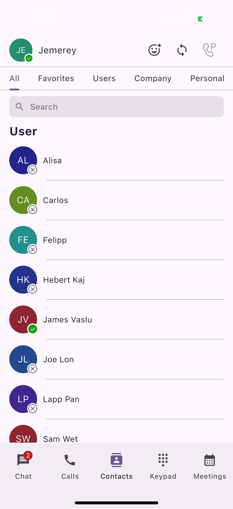
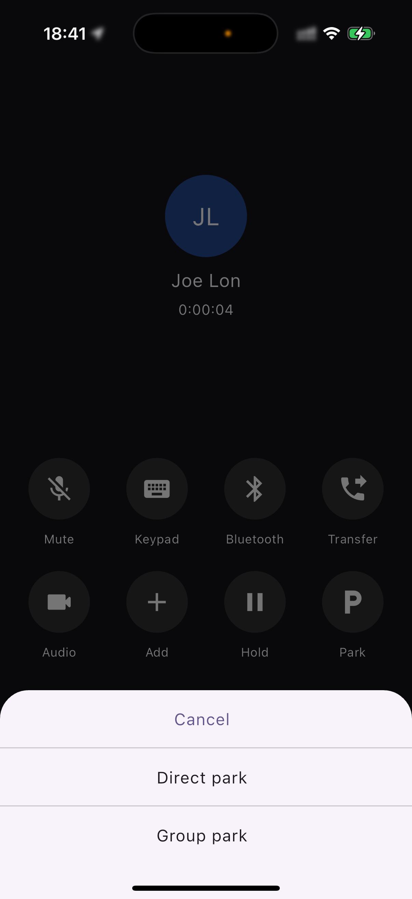

# Calls, Messages, and Voicemails

## Mobile App Overview 

Upon logging in, you will see the dashboard with Messages being the first page you see. Let’s take a look around the mobile client to familiarize yourself with the app.

### Chat Tab

The Chat tab is where you will send and receive chat messages and where a list of recent messages will be displayed. Chats are listed chronologically with the newest messages on top. Viewing and sending messages is easy.

1. To continue a chat, open the message field and continue that conversation.
2. To start a new chat, tap the **+** icon in the upper right corner, then choose the menu item from the popup menu.
3. Tap the Contacts tab, then tap a user, in the user details page, tap the message icon to start the chat.

<figure><figcaption></figcaption></figure>

### Call/History Tab

The Calls tab displays all recent calls, including those you made, received, and missed.

1. To view only the calls you’ve missed, tap the **Calls** tab at the bottom of the application.
2. Then tap the **Missed** tab.
3. You can also initiate a new call from this page by tapping the **New Call** icon.

<figure><figcaption></figcaption></figure>

### Contacts Tab

The Contacts tab contains all of your saved contacts. It is broken down into five distinct areas. All Contacts, which displays all your saved contacts, and your Company Contacts, which displays contacts listed in your company’s directory.

<figure><figcaption></figcaption></figure>

### Keypad Tab

The Keypad tab is used to make calls to numbers that have not been saved as contacts. Additionally, it allows you to enter special FAC to perform various actions, such as retrieving group-parked calls or enabling the "Do Not Disturb" feature.

<figure><figcaption></figcaption></figure>

### Meetings Tab

The Meetings tab is where you can access your upcoming meetings list, join existing meetings, and schedule new ones, allowing you to quickly view and manage your scheduled video conferences.

<figure><figcaption></figcaption></figure>

## How to access your Quick Menu 

On the left side of the dashboard, you will see your profile icon displaying your initials. This is the mobile client’s quick menu. To access this menu:

* Tap your **Profile** icon, and the menu window will appear.

<figure><figcaption></figcaption></figure>

* Change your presence status: tap the presence status and you can change your status
* Personal information is displayed here, including your name and extension.
* Here you can mute calls for the mobile app. When this option is enabled, all incoming calls will no longer ring the mobile app but will ring other devices associated with your number or extension.

## How to access your Settings 

To access your settings, from the Quick Menu, click on **Settings**. Here, you have the option to configure the following areas.

<figure><figcaption></figcaption></figure>

## How to Place Calls 

There are several ways to place outbound calls using the mobile app.

To place a call from a contact:

1. Find the contact in either your Favorites list or by searching your Contacts.
2. Tap their name.
3. Tap the **Call** icon under the profile picture or tap the Call icon next to a phone number you want to call.

You can also initiate a call from a Chat Message. From the chat window:

* Tap the **Call Phone** or **Camera** icon.

To place a call using your app:

1. Select the **Keypad** tab from the Main Menu.
2. Enter a phone number.
3. Tap on the **Dial** button.

<figure><figcaption></figcaption></figure>

### Blind transferring a call

To transfer a call, during an active call:

1. Tap **Transfer** icon.
2. Select **Transfer**.

<figure><figcaption></figcaption></figure>

3. You can transfer the call to a contact/extension user within the contacts list by searching and tapping the contact you wish to transfer the call to.
4. Or you can transfer the call to an ad-hoc number by using the keypad.
5. Once selected or entered in the dialpad, the call is transferred to the recipient.

### Attended transferring a call

If you are on an active call, you can perform an Attended Transfer to another contact within the company directory or any other number you dial via the keypad.

To do this while on an active call:

1. Tap **Transfer**.
2. Click **Attended Transfer**.
3. You can transfer the call to a contact/extension user within the contacts list by searching and tapping the contact you wish to transfer the call to.
4. Or you can transfer the call to an ad-hoc number by using the keypad.
5. Enter the number to call it.
6. Once the third-party answers,  the **Attend transfer** icon will flash,   you can then press it to complete the transfer.

<figure><figcaption></figcaption></figure>

### Transferring a call to voicemail 

A **Direct-to-Voicemail Transfer** is used when you wish to transfer a call directly to another user’s voicemail. To perform a transfer to voicemail while on an active call:

1. Click the **Transfer** button.
2. Select **Transfer to Voicemail**.
3. From the **Contact Panel**, select the recipient to whom you wish to transfer the call to click on it.
4. The call will be transferred directly to their voicemail.

### Call on Hold 

To put a call on hold, during an active call:

* Tap **Hold**. The caller will go on hold and hear the on-hold audio based on the Music-on-Hold file that has been set up for your tenant.
* Tap the **Hold** icon again, the call will be resumed.

## Direct parking a call 

To park a call to an extension while on an active call:

1. Click the **Transfer** button, and select **Park**.

<figure><figcaption></figcaption></figure>

2. From the **Contact Panel**, select the recipient to whom you wish to park the call and click on their name.&#x20;
3. The call will be parked on that extension, the extension which the call is parked on he will received the notification, or you can copy the retrieve code and share to him, then he can dial the `*881004` to retrieve the call.

<figure><figcaption></figcaption></figure>

## Group parking a call 

If the user is a member of a park group, they can park a call to the group, allowing group members to retrieve the parked call.

To park a call to the group while on an active call:

1. Click the **Transfer** button.
2. Select **Group Park**.

The call will be parked to the group if the user is a member of a park group. All of other members of this park group will received notification then can simply retrieve the call.

## Retrieving a parked call 

Once a call is parked to an extension user or a park group, the extension user or group members will receive a notification. As shown in the screenshot below, the **Call HUB** icon on the top title bar will start blinking with red color.

1. Click the **HUD** icon. The parked call will appear in the list.
2. Click the **Retrieve** button to easily retrieve the call.

<figure><figcaption></figcaption></figure>

## Call Flip 

**Call Flip** allows you to quickly transfer an active call from PortSIP ONE to another endpoint, such as PortSIP ONE mobile or an IP phone. To perform a Call Flip while on an active call:

1. Click the **Transfer** button.
2. Select **Flip**.
3. Your other devices (e.g., PortSIP ONE mobile or IP phone) will ring. Simply answer the call on the other device.

## How to access your voicemail 

To access your voicemails, click on the **Messages** tab. The page is divided into some sections:

1. Messages: This area displays your team messages with other extensions.
2. SMS: This area displays your SMS with contacts.
3. WhatsApp: This area displays your WhatsApp messages with contacts.
4. Voicemail: This area displays your voicemails.

<figure><figcaption></figcaption></figure>

## Accessing your contacts

