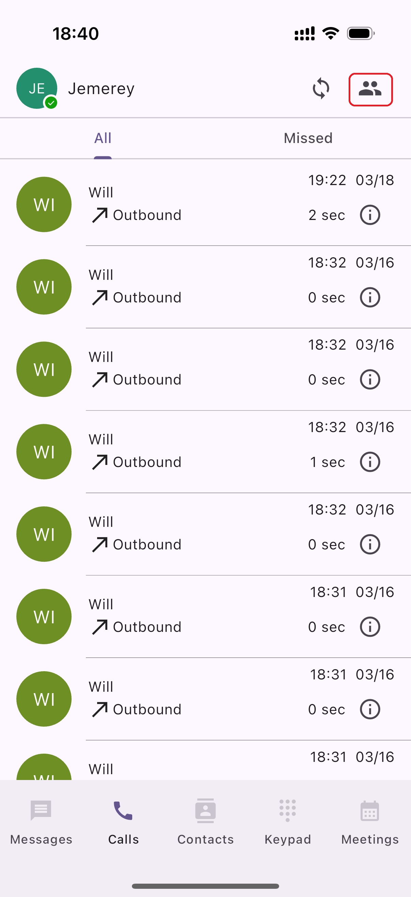

# Change Your Call Queue Status

When your administrator assigns you as an **agent** to a call queue, you can manage your **queue status** directly within the **PortSIP ONE** app.

When a call enters a queue you are assigned to and your status is set to **Ready**, you will receive an in-app notification and can answer the call directly from PortSIP ONE.

***

### Changing Your Call Queue Status

Follow the steps below to manage your agent status and queue participation.

#### 1. Locate the Queue Status Icon

In the **upper-right corner** of the app, locate the **Queue Status** icon.\
This icon shows your current agent status and provides access to the list of call queues you are assigned to.

<figure><figcaption></figcaption></figure>

***

#### 2. Open the Status Menu

Tap the **Queue Status** icon.\
A window will appear displaying:

* Your current **agent status**
* The list of call queues you belong to
* Available options to update your status

<figure><figcaption></figcaption></figure>

***

#### 3. Select a New Agent Status

From the **Agent Status** drop-down list, select the desired status (for example, **Ready** or **Not Ready**).

> The selected status applies to **all queues you are currently logged into**.

<figure><figcaption></figcaption></figure>

***

#### 4. Log In or Log Out of Individual Queues

In the queue list, each queue includes an **ON/OFF toggle**:

* Toggle **ON** to log in to the queue
* Toggle **OFF** to log out of the queue

Changes take effect immediately.

<figure><figcaption></figcaption></figure>

***

> **Note**\
> Changing your agent status affects **only the queues you are currently logged into**.\
> Queues you are logged out of will not receive calls regardless of your agent status.

