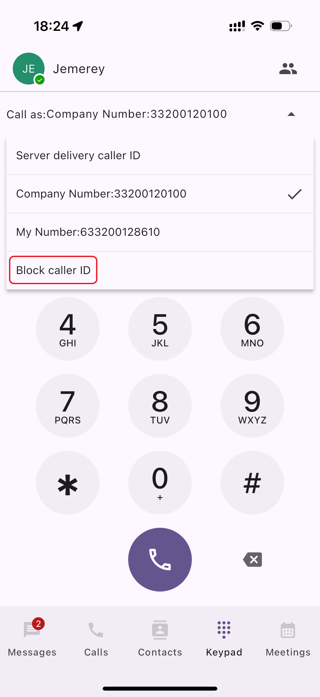
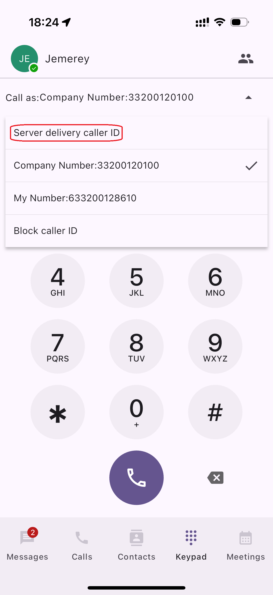

# Customize Your Caller ID

**Caller ID** is an essential feature that allows recipients to see the caller’s information before answering a call. It enhances communication transparency and professionalism within your organization.

### Default caller ID settings

By default, the **PortSIP PBX** system determines the outbound Caller ID based on the PBX configuration. This ensures consistency and accuracy in the information displayed to call recipients.

### Customizing caller ID

While the default settings provide a standardized Caller ID, there are scenarios where you might need to customize it for specific calls or globally across your organization. PortSIP PBX offers flexibility in adjusting Caller ID settings both on a per-call basis and globally.

**Note:** Administrators have the ability to restrict certain Caller ID modifications across the entire office to maintain control and security over outbound call information.

#### Set your caller ID

A user’s **outbound Caller ID** can be configured in several places within the **PortSIP PBX** system. The settings are applied based on the following hierarchy:

1. **Extension-Specific Settings:**
   * The **outbound Caller ID** can be set individually for each user under their **Extension** settings. This allows for personalized Caller ID information for specific users.
2. **User Group Settings:**
   * The **outbound Caller ID** can also be configured at the **user group** level. If the user belongs to a specific group, the group’s Caller ID setting will take precedence over individual user settings unless overridden.
3. **Company-Wide Settings:**
   * The **outbound Caller ID** can be defined at the **Company** level, under **Company > Outbound Caller ID**. This setting will apply to all users who do not have specific Caller ID settings at the extension or group level.

#### Adjust your caller ID 

Your caller ID can be adjusted in three places: on the **Keypad,** in the **Conversation Thread,** and on our **mobile apps** (both [iOS ](https://www.portsip.com/portsip-one/)and [Android](https://www.portsip.com/portsip-one/)).

Currently, caller ID cannot be updated via desk IP phones.

#### Adjust caller ID from the dialer pad 

To adjust your caller ID from your keypad:

1. Click the **Keypad** tab
2. Click the Arrow icon in the "**Call as**"&#x20;
3. Choose caller ID in the drop-down
4. Enter the number or contact you'd like to call, then press enter to start dialing

<figure><figcaption></figcaption></figure>

### Block your caller ID 

There may be a time when you need to block your caller ID.&#x20;

#### To block caller ID when placing a call from the Keypad

1. Click the **Drop-Down icon** alongside the **Call as**
2. Select **Block caller ID**

<figure><figcaption></figcaption></figure>

### Let the PBX Decide on Delivery Caller ID

If you prefer not to manually select the caller ID when placing a call, you can configure it to use the **Server delivery caller ID**.

<figure><figcaption></figcaption></figure>

Tab the **Drop-Down icon** alongside the **Call as,** choose the **Server delivery caller ID** option. With this setting, when the app places the call and route through the SIP trunk,  the PBX will automatically select the appropriate caller ID based on its configuration.

For further details on how the PBX determines the outbound caller ID, please refer to the article [**Handle Outbound Calls Through SIP Trunk**](../../portsip-communications-solution/portsip-pbx-administration-guide/7-trunk-management/handle-outbound-calls-through-sip-trunk.md#outboundcallerid), which explains how the PBX dynamically chooses the correct caller ID.

Note: This logic is typically applied to desk IP phones as well, which always follow this automatic caller ID selection process.

