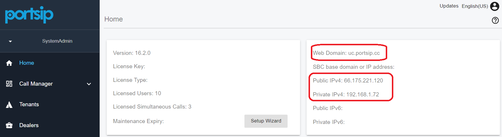
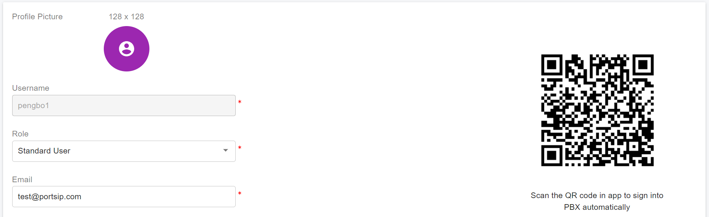
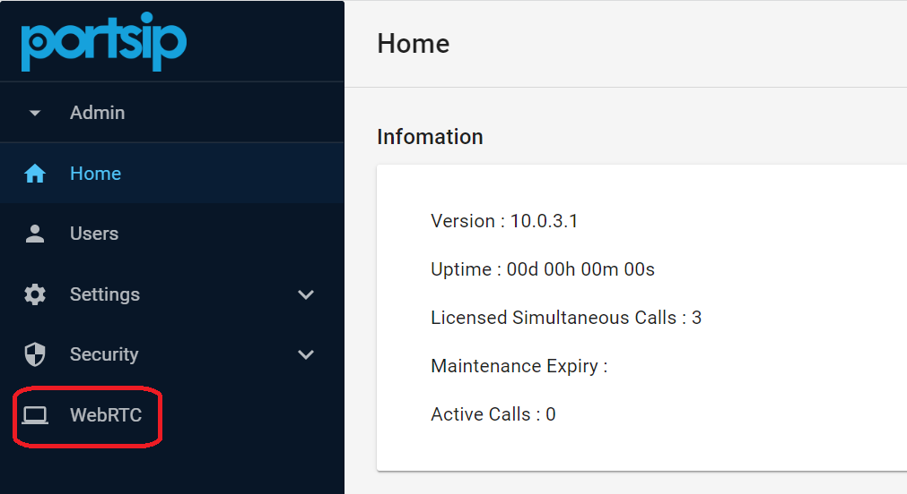
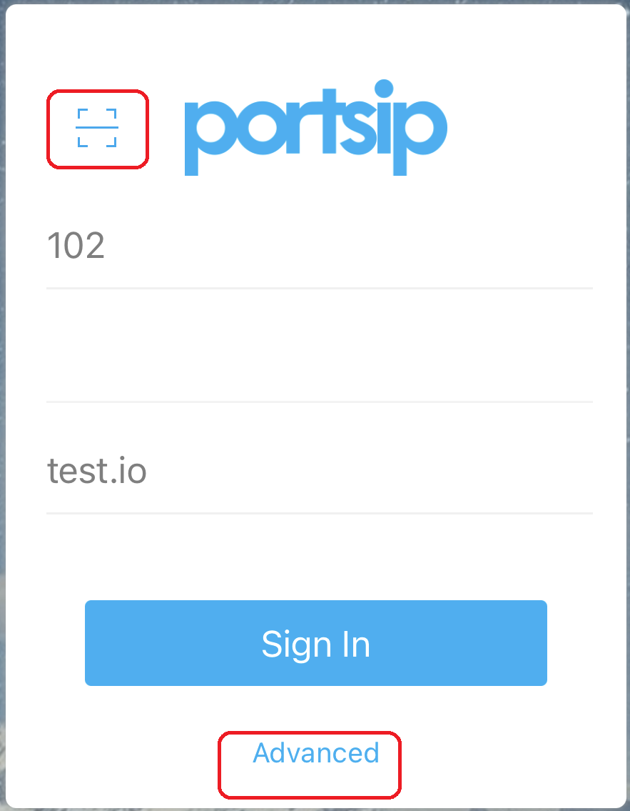
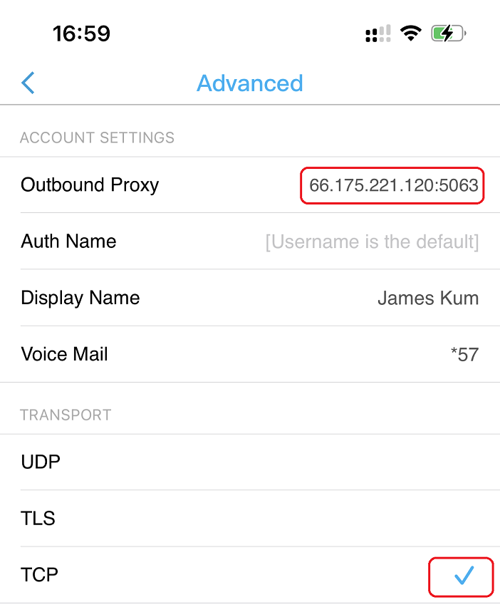
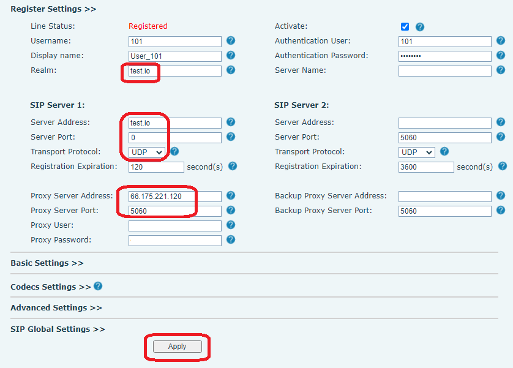
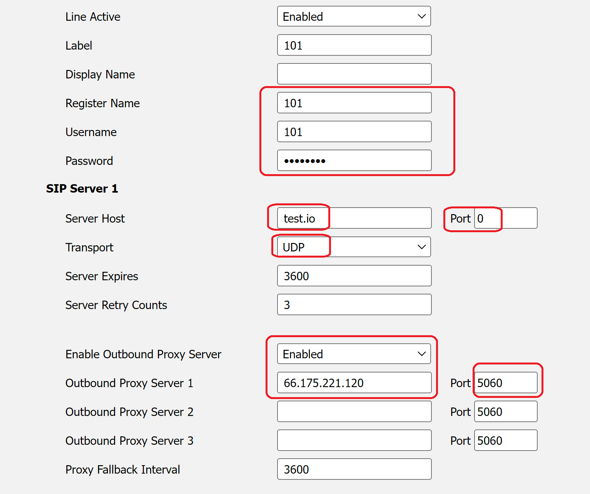

# PortSIP Softphone

After successfully [configuring the PortSIP PBX](../portsip-communications-solution/portsip-pbx-administration-guide/2-configuring-the-portsip-pbx.md) and [SBC](../portsip-communications-solution/portsip-pbx-administration-guide/9-configuring-portsip-sbc/), and [creating the tenants](../portsip-communications-solution/portsip-pbx-administration-guide/3-tenant-management.md) and [extensions](../portsip-communications-solution/portsip-pbx-administration-guide/5-user-management/), you can now register the endpoints (WebRTC, mobile app, Windows Desktop app, IP Phone, and any SIP-based device) to the PBX. This will allow you to make and receive calls.

## Configuring the PortSIP ONE App

If you are using the PortSIP PBX v22.0 or higher, please follow the guide [Apps Guides](portsip-one-app/) to configure it.

## Configuring the PortSIP Softphone App

In this article, we assume the following configurations:

* The PortSIP PBX and SBC are installed on a server with a public IP of **66.175.221.120** and a private IP of **192.168.1.72**.
* The PBX web domain **uc.portsip.cc** has been resolved to the PBX server public IP **66.175.221.120**.
* The PBX created UDP transport on port **5060**, TLS transport on port **5061** over TLS,  TCP transport on port **5063**, and WSS transport on port **5065** in the SBC.
* A tenant has been created with the SIP domain set up as **test.io**.

As per the above settings, after you sign in to the PBX as the system administrator, you will see the page like the screenshot below:

<figure><figcaption></figcaption></figure>

## Essential Information

There are some rules for configuring the client endpoints for the above scenario:

* **Transport.** It's the network transport for sending & receiving the SIP message in the PBX. For more details please read the article: [Transport Management](../portsip-communications-solution/portsip-pbx-administration-guide/6-transport-management.md).
* **Outbound Proxy server.** The PBX server IP refers to the **Outbound Proxy Server** in the client endpoints. If the client endpoint registers to PBX over the internet, use the public IP as the **Outbound Proxy Server**. You can also use **uc.portsip.cc** as the **Outbound Proxy Server** if registering to PBX over the internet since this domain has been resolved to the public IP; If registering to PBX from the LAN, use the private IP as the **Outbound Proxy Server**.
* **Outbound Proxy Server Port.** The port of transport is created in the PBX or SBC. For example, if you want the endpoint registered to the PBX over TCP transport, then you will need to set 5063 for **Outbound Proxy Server Port** in the endpoint settings.
* **Domain.** Also known as **SIP domain** or **SIP server** in the endpoint settings. It’s the **SIP domain** of the tenant that was created in PortSIP PBX - so just set the tenant’s **SIP domain** for Domain/SIP Domain/SIP server in the endpoint settings.&#x20;


&#x20;Just need to set the transport port for the Outbound Proxy Server Port only. Don’t set the transport port for the Domain in the endpoint settings. If the endpoint requires filling the port for the Domain, please fill in 0 for the domain port.


## Register the Client App to PBX by Scanning QR Code

In the PortSIP mobile app, desktop app, or WebRTC app, you can simply click the scan icon to scan the PBX user’s QR code, and then the app will register to the PBX automatically.&#x20;

After signing in to the PBX web portal, list all users by selecting the menu **Call Manager > Users**. Choose a user to edit or double-click, and you can see the QR code for this user and can click on the QR code to refresh it.

<figure><figcaption></figcaption></figure>

On the **Extension** page of the user's settings, there have two options for the QR code, please pay attention to them:

* **Preferred transport for QR code**. This list box allows you to specify the preferred transport for the QR code; when registering PBX by scanning the QR code, the PortSIP App will prioritize the preferred transport.
* **Generate a QR code with the network interface below**. This option allows you to specify the **Outbound Proxy Server** for the client app when scanning the QR code to register to the PBX. For more information about the **Outbound Proxy Server**, please refer to the explanation in the section above.

If you make changes to the PBX IP or the above two options, you will need to refresh the QR code by clicking on it.

## Manually register the client app to the PBX


This section is only applicable to the PortSIP Softphone v6.1x, it's not for the PortSIP ONE app.


You can fill in the user details in the client app manually to register the app to the PortSIP PBX.

### Desktop App

* Enter the PBX user extension number and extension password.
* Enter the tenant's SIP domain for the SIP domain, in case is **test.io**.

<figure><figcaption></figcaption></figure>

Click the settings icon for advanced settings. Then, enter the values for the Outbound Proxy Server and Port.&#x20;

* **Outbound Proxy Server**. Enter the PBX’s public or private IP. For more information, please refer to the explanation in the section above.&#x20;
* **Outbound Proxy Server Port**. Enter the transport port here. For example, if using UDP transport, set the port to 5060. If using TCP transport, set the port to 5063.&#x20;
* **Transport**. Choose the transport that you prefer to register the client app to PortSIP PBX. For example, TCP. Note that if you change the transport here, you must enter the **corresponding port** for the **Outbound Proxy Server Port**.

<figure><figcaption></figcaption></figure>

### WebRTC App

After successfully [configuring the PortSIP PBX](../portsip-communications-solution/portsip-pbx-administration-guide/2-configuring-the-portsip-pbx.md) and [SBC](../portsip-communications-solution/portsip-pbx-administration-guide/9-configuring-portsip-sbc/), and [creating the tenants](../portsip-communications-solution/portsip-pbx-administration-guide/3-tenant-management.md) and [extensions](../portsip-communications-solution/portsip-pbx-administration-guide/5-user-management/) in the PBX,  assume the SBC web domain is `uc.portsip.com`,  you can launch the WebRTC client app by opening the link [https://uc.portsip.cc:8883/webrtc](https://uc.portsip.cc:10443/webrtc) to launch the WebRTC client app or click the WebRTC menu from the SBC web portal.

<figure><figcaption></figcaption></figure>

The WebRTC app settings are the same as the Windows desktop app. However, there is no need to set the Outbound Proxy Server and Outbound Proxy Server Port transport.

You can also scan the QR code to sign in the WebRTC client automatically.

<figure><figcaption></figcaption></figure>

### Mobile App

* Enter the PBX user extension number and extension password.
* Enter the tenant's SIP domain for the SIP domain, in case is **test.io**.

<figure><figcaption></figcaption></figure>

Click the **Advanced** icon for advanced settings. Then, enter the values for the Outbound Proxy Server and Port.&#x20;

* **Outbound Proxy Server**. Enter the PBX’s public or private IP. For more information, please refer to the explanation in the section above.&#x20;
* **Outbound Proxy Server Port**. Enter the transport port here. For example, if using UDP transport, set the port to 5060. If using TCP transport, set the port to 5063. Append it to the outbound proxy server IP and separate it with a colon.
* **Transport**. Choose the transport that you prefer to register the client app to PortSIP PBX. For example, TCP. Note that if you change the transport here, you must enter the **corresponding port** for the **Outbound Proxy Server Port**.

<figure><figcaption></figcaption></figure>

## Auto Provision the IP Phone to PBX

For popular IP Phones such as Fanvil, Yelaink, SNOM, GrandStream, DinStar, ALE, and Htek, they can be auto-provisioned to register to the PortSIP PBX without the need to configure the IP Phone manually. For more details please read this article: [Phone Device Management](../portsip-communications-solution/portsip-pbx-administration-guide/4-phone-device-management/).

## Manually Register the IP Phone to PBX

You can also enter the SIP user extension details on the IP Phone web portal to register the IP Phone or other SIP-based device/app.

### Example of Fanvil IP Phone

<figure><figcaption></figcaption></figure>

### Example of Yealink IP Phone

<figure><figcaption></figcaption></figure>

For other SIP-based apps and IP Phones, you can configure them similarly to the above description.

