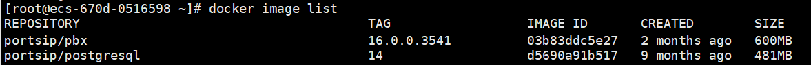

# Backup and Restore PortSIP PBX

This article provides procedures for backing up and restoring a PortSIP PBX server. The procedures are designed to ensure no data loss in upgrading and migration.

Backup files and data should be stored on a different server than the one that is used for daily running.

All procedures are performed at the command prompt and require root-level access.

## **Creating a Backup Using Snapshots**

If your PortSIP PBX is running within a virtual environment or hosted on a cloud platform, it’s likely that these platforms offer the capability to create a snapshot of the server. This is a highly recommended method for backing up your current PortSIP PBX server.

## **Restoring from a Snapshot**

Restoring your PBX from a snapshot is a straightforward process. Simply follow the steps provided by your virtual environment or cloud platform to restore the PBX from the snapshot you’ve created.

Remember, it’s always a good idea to test the restore process periodically to ensure your backups are working as expected. This will help you avoid any surprises in the event of a system failure.

## **Backing Up PBX Data**

### **Linux**&#x20;

When [installing PortSIP PBX for Linux](../portsip-sbc-administration-guide/1-installation-of-the-portsip-sbc.md#step-3-create-and-run-the-portsip-sbc-docker-container-instance), in step 3, you typically use the following command to create the PortSIP PBX Docker instance:

```shell
/bin/sh pbx_ctl.sh \
run -p /var/lib/portsip \
-a 66.175.221.120 \
-i portsip/pbx:16
```

In the above command used to create the PortSIP PBX Docker instance, the `-p` parameter is used to specify the **parent** folder for storing the PBX data. To back up the data, simply copy the folder `/var/lib/portsip/pbx` and `/var/lib/portsip/postgresql` to another server or an external disk.

<pre class="language-bash"><code class="lang-bash"><strong>mkdir -p /back/pbx-data
</strong><strong>cp -p -r /var/lib/portsip/pbx /back/pbx-data
</strong><strong>mkdir -p /back/pbx-db
</strong>cp -p -r /var/lib/portsip/postgresql /back/pbx-db
</code></pre>

For example, if you specified the **parent**  path as `/portsip/data` using the `-p` parameter when installing the PortSIP PBX, then you need to back up the folder `/portsip/data/pbx` and `/portsip/data/postgresql`.

```sh
mkdir -p /back/pbx-data
cp -p -r /portsip/data/pbx /back/pbx-data
mkdir -p /back/pbx-db
cp -p -r /portsip/data/postgresql /back/pbx-db
```

### **Windows**&#x20;

When [installing PortSIP PBX for Windows](../portsip-pbx-administration-guide/1-installation-of-the-portsip-pbx.md#step-1-installing-a-fresh-portsip-pbx-for-windows), in step 1, there is an option that allows you to choose the **parent** folder for storing the PBX data.&#x20;

To back up the data, simply copy this folder to another server or an external disk. By default, if you didn’t specify otherwise, the **parent** folder is `C:\ProgramData\PortSIP`.&#x20;

The following folders need to be copied:

* C:\ProgramData\PortSIP\pbx
* C:\ProgramData\PortSIP\postgresql
* C:\ProgramData\PortSIP\html

## **Restoring from Backup Data on Linux**

Please follow the steps below to restore the PortSIP PBX from the backup data in a Linux environment.


You can't restore the backup data of a Windows PBX to a Linux PBX.


### **1. Stop the Currently Running PBX Instance**

Execute the following commands to stop the PBX and delete the data:

```bash
cd /opt/portsip && /bin/sh pbx_ctl.sh stop
/bin/sh pbx_ctl.sh rm
rm -rf /var/lib/portsip/pbx/*
rm -rf /var/lib/portsip/postgresql/*
```

### **2. Upgrade the PortSIP PBX Docker Image (Optional)**

You have the option to upgrade the PortSIP PBX Docker image before restoring the PortSIP PBX data.

First, list the PBX Docker images with the following command:

```bash
docker image list
```

You will get the result shown in the below screenshot.

<figure><figcaption></figcaption></figure>

You can then delete Docker images using the first 4 digits of the IMAGE ID for PBX and Postgresql:

```bash
docker image rm 03b8 d569 
```

#### **Update the PortSIP PBX Scripts**

Next, delete the existing PortSIP PBX scripts:

```bash
rm install_pbx_docker.sh
rm install_docker.sh
rm pbx_ctl.sh
```

Download the latest installation scripts:

```bash
curl https://raw.githubusercontent.com/portsip/portsip-pbx-sh/master/v16.x/new/install_docker.sh -o install_docker.sh
curl https://raw.githubusercontent.com/portsip/portsip-pbx-sh/master/v16.x/new/pbx_ctl.sh -o pbx_ctl.sh
```

#### **Install the Docker-Compose Environment**

Execute the following command to install the Docker-Compose environment. If you encounter a prompt like `*** cloud.cfg (Y/I/N/O/D/Z) [default=N] ?`, enter `Y` and then press the Enter button:

```bash
/bin/sh install_docker.sh
```

### **3. Restoring a PortSIP PBX**

First, copy the backup data to the PortSIP PBX server. You can use the default folder, such as `/var/lib/portsip`, or another folder of your choice.

For example:

<pre class="language-sh"><code class="lang-sh"><strong>mkdir -p /var/lib/portsip/pbx
</strong><strong>cp -p -r /back/pbx-data/pbx /var/lib/portsip/
</strong><strong>mkdir -p /var/lib/portsip/postgresql
</strong>cp -p -r /back/pbx-db/postgresql /var/lib/portsip/
</code></pre>

The command below is used to create and run the PBX on a server with the IP `66.175.221.120`. If you’re running the PBX in a LAN without a public IP, replace `66.175.221.120` with the PBX server’s private LAN IP. If you copied the backup data to a folder other than `/var/lib/portsip`, make sure to use the actual folder in the commands below.

```bash
/bin/sh pbx_ctl.sh \
run -p /var/lib/portsip \
-a 66.175.221.120 \
-i portsip/pbx:16
```

Congratulations! Your PBX has now been successfully restored.

#### **Restoring Backup Data to a New PBX Server**

The steps for restoring backup data to a new PBX server are essentially the same. The only difference is that you’ll need to use the new server’s IP address in step 5.

After signing into the PBX web portal, launch the PortSIP PBX Setup Wizard. In step 1 of the Setup Wizard, make sure to update the PBX IP address to match the new server’s IP.

## **Restoring from Backup Data on Windows**

Please follow the steps below to restore the PortSIP PBX from the backup data in a Windows environment.


You can't restore the backup data of a Linux PBX to a Windows PBX.


### **1. Uninstall the Currently Running PBX Instance**

* Uninstall the PortSIP PBX from Windows
* Delete the below PBX data folders:
  * C:\ProgramData\PortSIP\pbx
  * C:\ProgramData\PortSIP\postgresql
  * C:\ProgramData\PortSIP\html
  * C:\Program Files\PortSIP\PBX

### **2. Upgrading the PortSIP PBX Installer (Optional)**

You have the option to upgrade the PortSIP PBX Installer before restoring the PortSIP PBX data. The latest PortSIP PBX installer for Windows can be downloaded from the [PortSIP website](https://www.portsip.com/download-portsip-pbx/).

### **3. Restoring a PortSIP PBX**

First, copy the backup data to the PortSIP PBX server folders:

* C:\ProgramData\PortSIP\pbx
* C:\ProgramData\PortSIP\postgresql
* C:\ProgramData\PortSIP\html

You can use the default folder as the data **parent** folder, such as `C:\ProgramData\PortSIP`, or another folder of your choice.

Next, double-click the PortSIP PBX installer to install the PortSIP PBX. In the installation UI, choose the PortSIP PBX data **parent** folder ( `C:\ProgramData\PortSIP`), then click the `Next` button. Wait for the installation to complete.&#x20;

Congratulations! Your PBX has now been successfully restored.

#### **Restoring Backup Data to a New PBX Server**

The steps for restoring backup data to a new PBX server are essentially the same.&#x20;

After signing into the PBX web portal, launch the PortSIP PBX Setup Wizard. In step 1 of the Setup Wizard, make sure to update the PBX IP address to match the new server’s IP.

