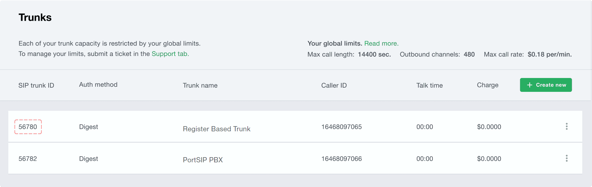
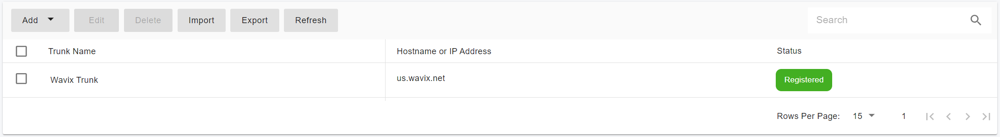

# Configuring QuestBlue Authentication Trunk

Before proceeding with the next steps, you need to [purchase a DID on the Wavix platform](../wavix-sip-trunk/purchase-a-did-on-wavix-platform.md).

## Create a SIP Trunk on the Wavix platform

To create a new SIP trunk on the Wavix platform

1. Select **Trunks** under **Numbers & trunks** in the top menu
2. Click the **Create new** button
3. Select **Digest** under the **Authentication method**
4. Specify the SIP trunk name, set the SIP trunk password, and select one of the DIDs on your account as Caller ID.

<figure><figcaption></figcaption></figure>

5. Optionally you can set max outbound call duration, max number of simultaneous calls via the SIPtrunk, and max call cost. If these parameters are not set, global account limits apply.
6. Click **Create**

After the SIP trunk is successfully created, it will appear on the list of SIP trunks on your account.

<figure><figcaption></figcaption></figure>


for security reasons, all new Wavix accounts can place only 2 simultaneous calls. In case you’d like to adjust the limit, reach out to your account manager or email support@wavix.com



Please be advised that your 5-digit SIP trunk username is generated automatically and displayed in the SIP trunk ID column.


## Configure Digest Trunk in PortSIP PBX

The Digest Wavix trunk refers to the **Register Based Trunk** in PortSIP PBX. You can configure the Register Based Trunk at either the PortSIP PBX **system administrator level** or the **Tenant Admin level**:

* If configured at the system administrator level, you can share this trunk with tenants.
* If configured at the tenant admin level, this trunk can only be used by the tenant itself

Please follow the below steps:

1. Sign in to the PortSIP PBX Web Portal as a System Administrator or Tenant Admin. Navigate to the left menu and select **Call Manager > Trunks**.&#x20;
2. Click the **Add** button to open a menu. From the menu, choose **Register Based Trunk**.

<figure><figcaption>
Configure Wavix Trunk in PortSIP PBX
</figcaption></figure>

3. Enter the trunk name and choose the brand:
   * **Name**: Enter a friendly name for the trunk.
   * **Brand**: Select one of the Wavix trunks from the Brand field, such as **Wavix - US**.
   * **DID Pool**: This step is only for you at the _**Tenant admin Level**_ to configure this **Register Based Trunk**,  you will need to set up your Wavix DID numbers for this DID pool for this trunk.
     * This tenant can only use the DID numbers within the DID pool range to create inbound and outbound rules and configure the outbound caller ID for extensions.
     * &#x20;The DID pool can consist of a single number, a range of numbers, or a combination of both. For example:
       * `16468097065`
       * `16468097065-16468097066`
       * `16468097065-16468097066;16468097069`&#x20;
       * `16468097065-16468097066;16468097070-16468097080`

<figure><figcaption></figcaption></figure>

4. Click the **Next** button, and provide the **SIP trunk ID** and **password** set up for the SIP  trunk on the Wavix platform.&#x20;

<figure><figcaption></figcaption></figure>

5. Click the **Next** button, you can adjust the options for the trunk, we recommend using the default settings except for the **Max Concurrent Calls,** this field is limited to the maximum calls that PortSIP established with this trunk, you can change it to an appropriate value.

<figure><figcaption></figcaption></figure>

6. This step is only available when configuring the Register-Based Trunk at the _**System Administrator Level**_. Click the **Next** button to assign this trunk to the tenants and provide your Wavix DIDs/Numbers to them with the DID Pool (DID numbers).  A DID can be only assigned to one tenant.
   * A tenant assigned to this trunk can only use the DID numbers within the DID pool range to create inbound and outbound rules and configure the outbound caller ID for extensions.
   * DID Pool: The DID pool can consist of a single number, a range of numbers, or a combination of both. For example:
     * `16468097065`
     * `16468097065;16468097066`
     * `16468097065-16468097066;16468097069`&#x20;
     * `16468097065-16468097066;16468097070-16468097080`

<figure><figcaption></figcaption></figure>

Click the **OK** button to save the changes, the trunk configuration is completed.

Once the PortSIP PBX successfully registers this trunk to the Wavix platform, in the trunk list page you will see the status displayed as **Registered**.

<figure><figcaption></figcaption></figure>

Now you can follow the article to [Configuring inbound and outbound calls](../wavix-sip-trunk/configuring-outbound-and-inbound-calls.md).

