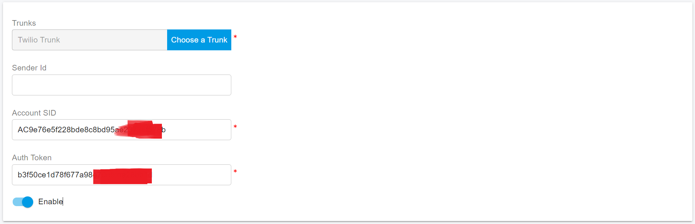

# QuestBlue SMS Integration

Before proceeding with the next steps, you need to [purchase a DID on the QuestBlue platform](purchase-a-did-on-questblue-platform.md) with the SMS/MMS enabled.

## Obtain the QuestBlue API Key

You need to take the QuestBlue API key for the PortSIP PBX to sending the SMS/MMS. Please follow the below steps:

1. Login to the [QuestBlue ](https://customer.questblue.com/)online account
2. Navigate the menu API Management,&#x20;

<figure><figcaption></figcaption></figure>

## Register a Sender ID

An Alphanumeric Sender ID is your company name or brand used as the Sender ID in one-way SMS messages sent to [supported countries](https://help.twilio.com/hc/en-us/articles/223133767-International-support-for-Alphanumeric-Sender-ID). Alphanumeric Sender IDs may be up to 11 characters long. Accepted characters include both upper- and lower-case Ascii letters, the digits 0 through 9, and the space character. They may not be only numerals.

If you want to enable the Sender ID, under Twilo [Console](https://www.twilio.com/console/phone-numbers/search), navigate to the menu **Develop > Phone Numbers > Alphanumeric Sender IDs**, and follow the instructions to register a Sender ID.

For more details please check the article [Alphanumeric Sender ID](https://www.twilio.com/docs/glossary/what-alphanumeric-sender-id).

<figure><figcaption></figcaption></figure>

## Configure SMS with Twilio Trunk in PortSIP PBX

Before configuring SMS in PortSIP PBX, you must have already configured a Twilio SIP trunk using one of the following guides:

* [Configuring Twilio Register Based Trunk](../twilio-sip-trunk/configuring-twilio-register-based-trunk.md)
* [Configuring Twilio Interconnect Trunk](../twilio-sip-trunk/configuring-twilio-interconnect-trunk.md)

### Sign in PortSIP PBX Web Portal

You can sign in to the PortSIP PBX Web portal using one of the following methods:

1. Sign in as the PBX system administrator, navigate to the **Tenants** menu, choose a tenant, and click the **Manage** button to switch to that tenant.
2. Sign in as a tenant admin to manage the tenant.

For more details please reference [Tenant Management](../../portsip-pbx-administration-guide/3-tenant-management.md).

### Add an SMS configuration

Please follow the below steps:

1. In the PortSIP PBX Web portal, navigate to the left menu, select **SMS/MMS**, and click the **Add** button.&#x20;
2. Choose your configured Twilio Trunk:
   * **Sender ID**: If you want to send the SMS with a Sender ID, enter the Sender ID that you created in the [Register a Sender ID section](questblue-sms-integration.md#register-a-sender-id). You can leave it as empty.
   * **Account SID**: Paste your copied Twilio Account SID here.
   * **Auth Token**: Paste your copied Twilio Auth Token here.

<figure><figcaption></figcaption></figure>

3. Click **OK** to be brought to the SMS/MMS list page. You can select that SMS configuration, then press the **Copy Webhook** button to copy the Webhook URL. Or Double-click the SMS configuration to edit the SMS configuration, in the details copy the Webhook URL.

## Configure the SMS in Twilio

1. Log in to your [Twilio console](https://console.twilio.com/)
2. Navigate to the menu **Develop > Phone Numbers > Manage > Active Numbers**, and you will see the numbers you have purchased.

<figure><figcaption></figcaption></figure>

3. Click a number to edit it and configure the messaging webhook with PBX's Webhook URL that you copied in PortSIP PBX in the above steps.

<figure><figcaption></figcaption></figure>

3. Enable the geographic permission for the desired region(s) where you want to send SMS messages so that messages can be successfully sent to the phone numbers within the region(s).

<figure><figcaption></figcaption></figure>

## Verify Configuration

Now you can [create the outbound and inbound](../twilio-sip-trunk/configuring-outbound-and-inbound-calls.md) rules in PortSIP PBX for sending and receiving SMS/MMS using the Twilio Trunk, just like you create the rules for making and receiving calls.

