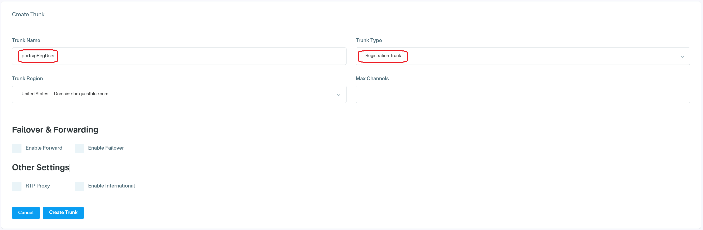
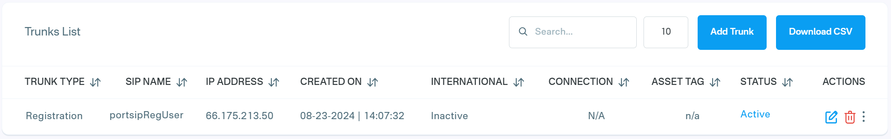
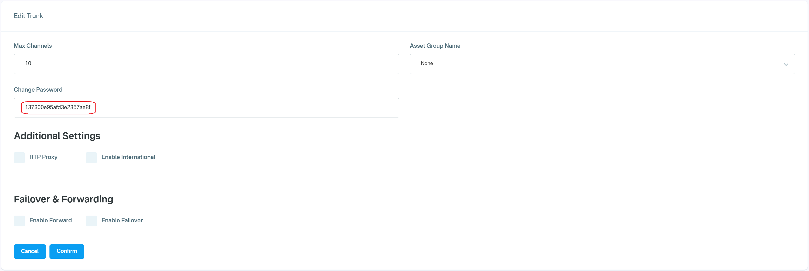
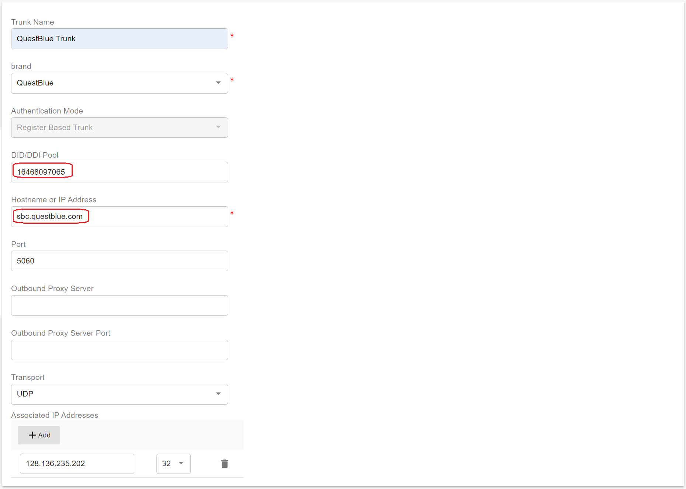
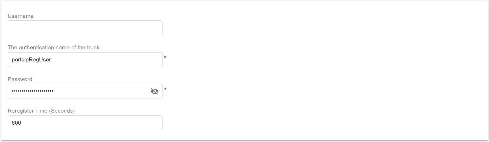
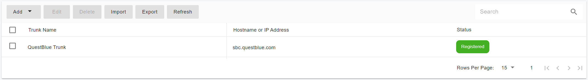

# Configuring Telnyx Register Authentication Trunk

Before proceeding with the next steps, you need to [purchase a DID on the Telnyx platform](purchase-a-did-on-telnyx-platform.md).

## Create a SIP Trunk on the QuestBlue platform

To create a new SIP trunk on the QuestBlue platform:

1. Select **Trunks** under **SIP Trunks** in the left menu
2. Click the **Add Trunk** button
3. Enter a name for the trunk, this is also the password for registering, please note it
4. Select **Registration Trunk** for the **Trunk Type** field
5. Choose an appropriate location for the **Trunk Region**, and note down the SBC domain, for example, `sbc.questblue.com`.
6. Set an appropriate value for the **Max Channels**
7. Enter your PortSIP PBX static IP for the **IP Address** field and click **Create Trunk**

<figure><figcaption></figcaption></figure>

After the SIP trunk is successfully created, it will appear on the list of SIP trunks on your account.

<figure><figcaption></figcaption></figure>

## Retrieve Trunk Password

On the trunks list page, click the **pen icon** next to a trunk, please copy and note the password of this trunk.

<figure><figcaption></figcaption></figure>

## Assign DID to a SIP Trunk

To assign the DID to a SIP trunk, please follow the below steps:&#x20;

1. Navigate to the menu **Telphone Numbers > Telphone Numbers**, you can see all active DIDs.
2. Click the **pen icon** next to a DID. In the popup window, select the desired trunk from the **Trunk** field combo box to assign the DID to it.
3. Click **Submit** to save changes.
4. You can repeat the above steps to assign more DIDs.

## Configure Register Based Trunk in PortSIP PBX

The **QuestBlue Registration** trunk refers to the **Register Based Trunk** in PortSIP PBX. You can configure the Register Based Trunk at either the PortSIP PBX **system administrator level** or the **Tenant Admin level**:

* If configured at the system administrator level, you can share this trunk with tenants.
* If configured at the tenant admin level, this trunk can only be used by the tenant itself.

Please follow the below steps:

1. Sign in to the PortSIP PBX Web Portal as a System Administrator or Tenant Admin. Navigate to the left menu and select **Call Manager > Trunks**.&#x20;
2. Click the **Add** button to open a menu. From the menu, choose **Register Based Trunk**.

<figure><figcaption>
Configure Wavix Trunk in PortSIP PBX
</figcaption></figure>

3. Enter the trunk name and choose the brand:
   * **Name**: Enter a friendly name for the trunk.
   * **Brand**: Select **QuestBlue** for this field.
   * **DID Pool**: This step is only for you at the _**Tenant admin Level**_ to configure this **Register Based Trunk**,  you will need to set up your QuestBlue DID numbers for this DID pool for this trunk.
     * This tenant can only use the DID numbers within the DID pool range to create inbound and outbound rules and configure the outbound caller ID for extensions.
     * &#x20;The DID pool can consist of a single number, a range of numbers, or a combination of both. For example:
       * `16468097065`
       * `16468097065-16468097066`
       * `16468097065-16468097066;16468097069`&#x20;
       * `16468097065-16468097066;16468097070-16468097080`

<figure><figcaption></figcaption></figure>

4. Click the **Next** button, and set up the trunk credentials.
   * Authentication name: Enter the QuestBlue trunk name that you specified in [Create a SIP Trunk on the QuestBlue Platform](configuring-telnyx-register-authentication-trunk.md#create-a-sip-trunk-on-the-questblue-platform), in this case, **portsipRegUser**.
   * Password: The password you noted in the [Retrieve Trunk Password.](configuring-telnyx-register-authentication-trunk.md#retrieve-trunk-password)

<figure><figcaption></figcaption></figure>

5. Click the **Next** button, you can adjust the options for the trunk.
   * &#x20;**Max Concurrent Calls:** This field sets the maximum number of calls that PortSIP can establish with this trunk. You can adjust it to an appropriate value.
   * We recommend keeping the default settings for other options unless you have specific requirements.

<figure><figcaption></figcaption></figure>

6. This step is only available when configuring the Register-Based Trunk at the _**System Administrator Level**_. Click the **Next** button to assign this trunk to the tenants and provide your QuestBlue DIDs/Numbers to them with the DID Pool (DID numbers).  A DID can be only assigned to one tenant.
   * A tenant assigned to this trunk can only use the DID numbers within the DID pool range to create inbound and outbound rules and configure the outbound caller ID for extensions.
   * DID Pool: The DID pool can consist of a single number, a range of numbers, or a combination of both. For example:
     * `16468097065`
     * `16468097065;16468097066`
     * `16468097065-16468097066;16468097069`&#x20;
     * `16468097065-16468097066;16468097070-16468097080`

<figure><figcaption></figcaption></figure>

Click the **OK** button to save the changes, the trunk configuration is completed.

Once the PortSIP PBX successfully registers this trunk to the QuestBlue platform, in the trunk list page you will see the status displayed as **Registered**.

<figure><figcaption></figcaption></figure>

Now you can follow the article to [Configuring Outbound & Inbound Calls](configuring-outbound-and-inbound-calls.md).

