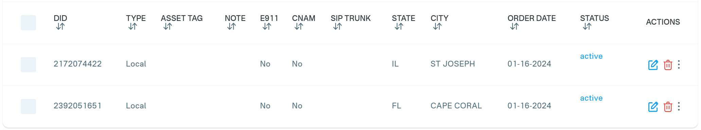

# Purchase a DID on Telnyx Platform

Before placing or receiving a call, you need to have an active DID or a dozen DID numbers on your QuestBlue account. If you already have an active number on your QuestBlue account, the below steps are optional.

To purchase a DID on your QuestBlue account:

1. Log in to your account on the [QuestBlue ](https://customer.questblue.com/)platform
2. Click on **Telphone Numbers > Oder Telphone Numbers menu** in the[ left-hand menu](https://customer.questblue.com/did/order/)
3. Search the numbers and click **Order** to buy the DID number in&#x20;
4. You can see all purchased numbers in the menu **Telphone Numbers > Telphone Numbers.**

<figure><figcaption></figcaption></figure>

After purchasing the DID, you can follow one of the guides to configure the trunk with PortSIP PBX.

* [Configuring Telnyx IP Authentication Trunk](configuring-telnyx-ip-authentication-trunk.md)
* [Configuring Telnyx Register AuthenticationTrunk](configuring-telnyx-register-authentication-trunk.md)

