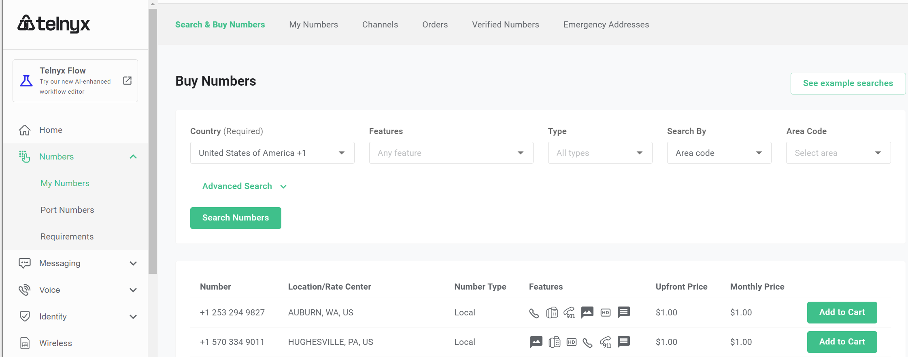

# Purchase a DID on Telnyx Platform

Before placing or receiving a call, you need to have an active DID or a dozen DID numbers on your Telnyx account. If you already have an active number on your Telnyx account, the below steps are optional.

To purchase a DID on your Telnyx account:

1. Log in to your account on the [Telnyx ](https://portal.telnyx.com/)platform
2. Click on **Numbers > My Numbers** menu in the[ left-hand menu](https://customer.questblue.com/did/order/), and click the tab **Search & Buy Numbers**
3. Search the number and click **Add to Cart** to buy the DID numbers

<figure><figcaption></figcaption></figure>

Once you are checked out, navigate to the menu **Numbers > My Numbers**, click the **My Numbers** tab on the page, and your purchased numbers are listed.

After purchasing the DID, you can follow one of the guides to configure the trunk with PortSIP PBX.

* [Configuring Telnyx IP Authentication Trunk](configuring-telnyx-ip-authentication-trunk.md)
* [Configuring Telnyx Register AuthenticationTrunk](configuring-telnyx-register-authentication-trunk.md)

