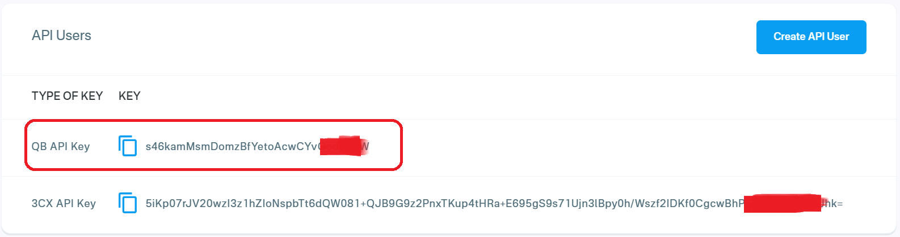
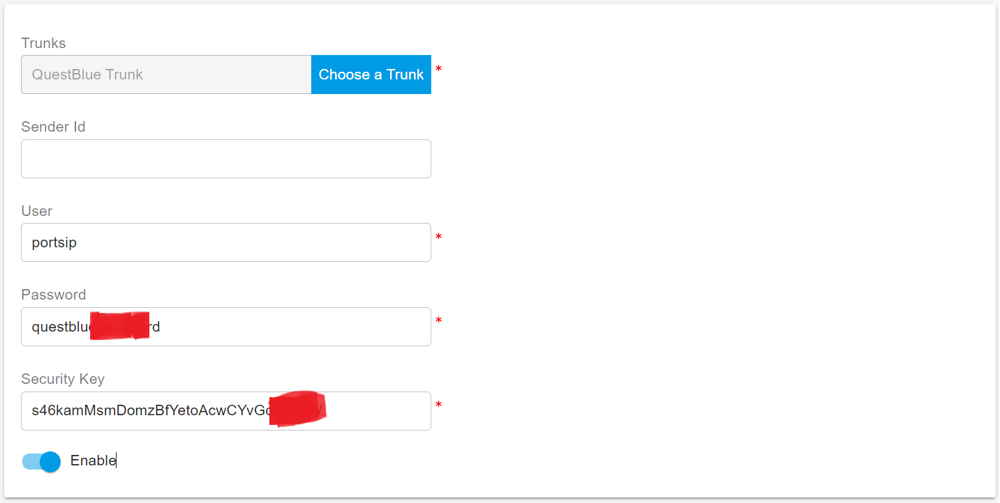
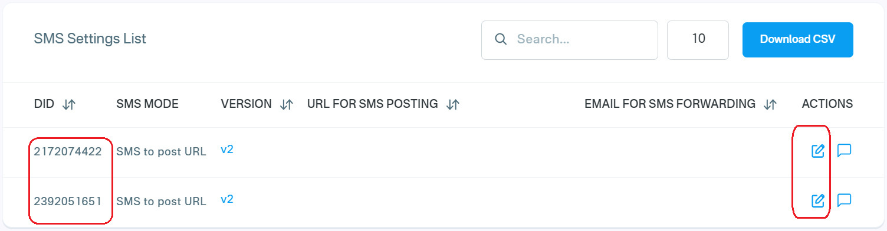
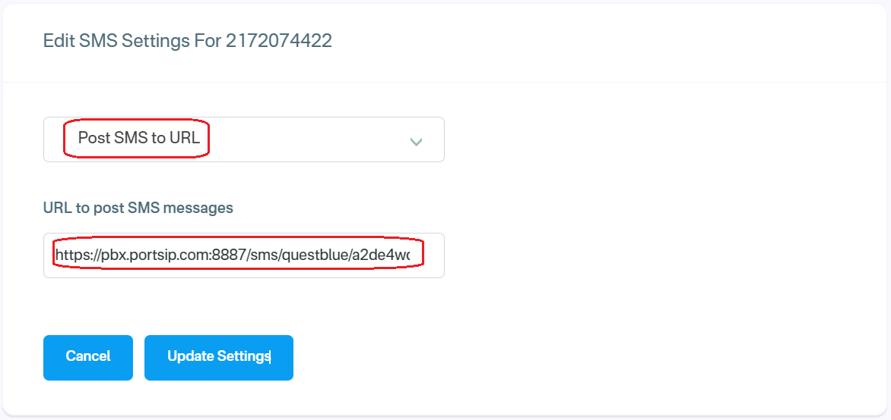

# Telnyx SMS Integration


As you are looking to integrate SMS, It is required that for outbound messaging, you must also register a Brand and Campaign through your QuestBlue customer portal as required by the TCR.


Before proceeding with the next steps, you need to [purchase a DID on the QuestBlue platform](../questblue-sip-trunk/purchase-a-did-on-questblue-platform.md) with the SMS/MMS enabled.

## Obtain the QuestBlue API Key

You need to take the QuestBlue API key for the PortSIP PBX to send the SMS/MMS. Please follow the below steps:

1. Login to the [QuestBlue ](https://customer.questblue.com/)online account
2. Navigate the menu API Management, and note the **QB API Key**.

<figure><figcaption></figcaption></figure>

## Configure SMS with QuestBlue Trunk in PortSIP PBX

Before configuring SMS in PortSIP PBX, you must have already configured a QuestBlue SIP trunk using one of the following guides:

* [Configuring QuestBlue Register Based Trunk](../questblue-sip-trunk/configuring-questblue-register-authentication-trunk.md)
* [Configuring QuestBlue IP Based Trunk](../questblue-sip-trunk/configuring-questblue-register-authentication-trunk.md)

### Sign in PortSIP PBX Web Portal

You can sign in to the PortSIP PBX Web portal using one of the following methods:

1. Sign in as the PBX system administrator, navigate to the **Tenants** menu, choose a tenant, and click the **Manage** button to switch to that tenant.
2. Sign in as a tenant admin to manage the tenant.

For more details please reference [Tenant Management](../../portsip-pbx-administration-guide/3-tenant-management.md).

### Add an SMS configuration

Please follow the below steps:

1. In the PortSIP PBX Web portal, navigate to the left menu, select **SMS/MMS**, and click the **Add** button.&#x20;
2. Choose your configured QuestBlue Trunk :
   * **User**: Enter your QuestBlue Username here.
   * **Password**: Enter your QuestBlue password.
   * **Security Key**: Paste your copied [QuestBlue QB API Key](telnyx-sms-integration.md#obtain-the-questblue-api-key) here.

<figure><figcaption></figcaption></figure>

3. Click **OK** to be brought to the SMS/MMS list page. You can select that SMS configuration, then press the **Copy Webhook** button to copy the Webhook URL. Or Double-click the SMS configuration to edit the SMS configuration, in the details copy the Webhook URL.

## Configure the SMS in QuestBlue

1. Log in to your [QuestBlue account](https://customer.questblue.com/)
2. Navigate to the menu **Messaging > SMS Settings**, the DIDs are listed, and click the pencil icon next to the DID that you want to enable the SMS.

<figure><figcaption></figcaption></figure>

3. In the SMS Settings page, choose **Post SMS to URL** from the combo box, and paste the PortSIP PBX Webhook URL to **URL to post SMS Message** field.
4. Click **Update Settings**.

<figure><figcaption></figcaption></figure>

## Verify Configuration

Now you can [create the outbound and inbound](../../portsip-pbx-administration-guide/8-call-route-management/) rules in PortSIP PBX for sending and receiving SMS/MMS using the Twilio Trunk, just like you create the rules for making and receiving calls.

