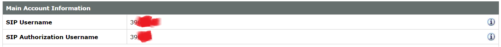
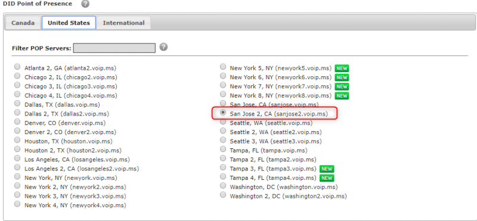
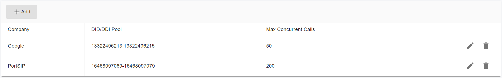

# Configuring Twilio Register Based Trunk

Before proceeding with the next steps, you need to [purchase a DID on Twilio](purchase-a-did-on-the-twilio.md).

## Create a SIP Trunk on the Twilio Platform

To create a new SIP trunk on the Twilio platform:

1. From your [Twilio Console](https://console.twilio.com/), navigate to the **Elastic SIP Trunking** area (or click on the icon on the left vertical navigation bar).
2. Select the menu **Manage > Trunks**.

<figure><figcaption></figcaption></figure>

3. Click **Create new SIP Trunk**,  give it a friendly name, then press **Create**.

<figure><figcaption></figcaption></figure>

### Trunk Termination

Once created, we can leave all of the settings on the General page untouched and switch over to the Termination section.  When PortSIP PBX places a call, this is where it’ll be sending the call information to Twilio.

<figure><figcaption></figcaption></figure>

1. Go ahead and configure a unique URI:
   * In the **Termination** section, enter a Termination SIP URI you prefer.
   * If there display the **Available** in green means that URI is acceptable. This full value (`portsip-pbx.pstn.twilio.com` in this case, yours will need to be different) will eventually be added to the PortSIP PBX Trunk configuration later.

<figure><figcaption></figcaption></figure>

2. Move down to the **Authentication** section.  Starting with an IP ACL, create one that has the public IP address of your PortSIP PBX installation.  This information is present in the PortSIP PBX Home page.

<figure><figcaption></figcaption></figure>

3\. Create a username and password pairing in the **Credential List**. This info will also make its way into the PortSIP PBX Trunk configuration.

<figure><figcaption></figcaption></figure>

Press the **Create** button and now switch to the **Origination** page.

### Trunk Origination

In the **Origination** section of the configuration add a new **Origination URI**, specifying your PortSIP PBX FQDN (available on the PortSIP PBX Web portal home) with a `sip:` prefix:

### Collecting Settings for PortSIP PBX

In order to be able to register and operate the trunk in your PortSIP PBX, you will to gather some information that will be needed in the configuration of the trunk in PortSIP PBX.

* Username: The username for registering the trunk can be found under the **Main Menu > Account Information.**

<figure><figcaption></figcaption></figure>

* Password: The trunk password can be found in the email you received from VoIP.ms during the registration process. You can also change the password by navigating to the menu **Main Menu > Account Settings > Security**.
* DID numbers: The DID numbers can be seen by navigating to the menu **DID Numbers > Manage DID(s).**
* Registrar: Go to the menu **Main Menu > Account Settings > Default DID Routing**. From here make a note of the selected server. In this example, the server is **sanjose2.voip.ms**.

<figure><figcaption></figcaption></figure>

## Configuring the Trunk with PortSIP PBX

The Register Based VoIP.ms trunk refers to the **Register Based Trunk** in PortSIP PBX. You can configure the Register Based Trunk at either the PortSIP PBX **system administrator level** or the **Tenant Admin level**:

* If configured at the system administrator level, you can share this trunk with tenants.
* If configured at the tenant admin level, this trunk can only be used by the tenant itself

Please follow the below steps:

1. Sign in to the PortSIP PBX Web Portal as a System Administrator or Tenant Admin. Navigate to the left menu and select **Call Manager > Trunks**.&#x20;
2. Click the **Add** button to open a menu. From the menu, choose **Register Based Trunk**.

<figure><figcaption></figcaption></figure>

3. Enter the trunk name and choose the brand:
   * **Name**: Enter a friendly name for the trunk.
   * **Brand**: Select VoIP.ms from the Brand field.
   * **DID Pool**: This step is only for you at the _**Tenant admin Level**_ to configure this **Register Based Trunk**, you will need to set up your VoIP.ms DID numbers for this DID pool for this trunk.&#x20;
     * This tenant can only use the DID numbers within the DID pool range to create inbound and outbound rules and configure the outbound caller ID for extensions.
     * The DID pool can consist of a single number, a range of numbers, or a combination of both. For example:
       * `13322496213`
       * `13322496213;13322496215`
       * `13322496213-13322496215;16468097069`&#x20;
       * `13322496213-13322496215;16468097069-16468097079`

<figure><figcaption></figcaption></figure>

3. Hostname or Address: For this field, enter **sanjose2.voip.ms** that you noted in the[ Collecting Settings for PortSIP PBX](configuring-twilio-register-based-trunk.md#collecting-settings-for-portsip-pbx).
4. Associated IP Addresses: [VoIP.ms](http://www.voip.ms/) offers many different points of presence, please add the the server IPs to the Associated IP Address with CIDR format. All traffic originating from these IP addresses will be recognized as VoIP.ms trunk and the anti-hacking algorithms will not come into effect. For more information on the IPs related to our servers, click [here](https://wiki.voip.ms/article/Servers).
5. Click the **Next** button, and provide the **SIP trunk authentication name** and **password** set up for the SIP  trunk on the VoIP.ms platform([Collecting Settings for PortSIP PBX](configuring-twilio-register-based-trunk.md#collecting-settings-for-portsip-pbx)).&#x20;

<figure><figcaption></figcaption></figure>

7. Click the **Next** button, you can adjust the options for the trunk, we recommend using the default settings except for the **Max Concurrent Calls,** this field is limited to the maximum calls that PortSIP established with this trunk, you can change it to an appropriate value.

<figure><figcaption></figcaption></figure>

8. This step is only available when configuring the Register-Based Trunk at the _**System Administrator Level**_. Click the **Next** button to assign this trunk to the tenants and provide your VoIP.MS DIDs/Numbers to them with the DID Pool (DID numbers).  A DID can be only assigned to one tenant.

* A tenant assigned to this trunk can only use the DID numbers within the DID pool range to create inbound and outbound rules and configure the outbound caller ID for extensions.
* DID Pool: The DID pool can consist of a single number, a range of numbers, or a combination of both. For example:
  * `13322496213`
  * `13322496213;13322496215`
  * `13322496213-13322496215;16468097069`&#x20;
  * `13322496213-13322496215;16468097069-16468097079`

<figure><figcaption></figcaption></figure>

Click the **OK** button to save the changes, the trunk configuration is completed.

Once the PortSIP PBX successfully registers this trunk to the VoIP.ms platform, in the trunk list page you will see the status displayed as **Registered**.

<figure><figcaption></figcaption></figure>

Now you can follow the article to [Configuring inbound and outbound calls.](../voip.ms-sip-trunk/configuring-outbound-and-inbound-calls.md)

