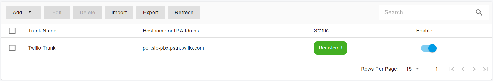

# Configuring Twilio Register Based Trunk

Before proceeding with the next steps, you need to [purchase a DID on Twilio](purchase-a-did-on-the-twilio.md).

## Create a SIP Trunk on the Twilio Platform

To create a new SIP trunk on the Twilio platform:

1. From your [Twilio Console](https://console.twilio.com/), navigate to the **Elastic SIP Trunking** area (or click on the icon on the left vertical navigation bar).
2. Select the menu **Manage > Trunks**.

<figure><figcaption></figcaption></figure>

3. Click **Create new SIP Trunk**,  give it a friendly name, then press **Create**.

<figure><figcaption></figcaption></figure>

### Trunk Termination

Once created, we can leave all of the settings on the General page untouched and switch over to the Termination section.  When PortSIP PBX places a call, this is where it’ll be sending the call information to Twilio.

<figure><figcaption></figcaption></figure>

1. Go ahead and configure a unique URI:
   * In the **Termination** section, enter a Termination SIP URI you prefer.
   * If there display the **Available** in green means that URI is acceptable. This full value (`portsip-pbx.pstn.twilio.com` in this case, yours will need to be different) will eventually be added to the PortSIP PBX Trunk configuration later.

<figure><figcaption></figcaption></figure>

2. Move down to the **Authentication** section.  Starting with an IP ACL, create one that has the public IP address of your PortSIP PBX installation.  This information is present in the PortSIP PBX Home page.

<figure><figcaption></figcaption></figure>

3\. Create a username and password pairing in the **Credential List**. This info will also make its way into the PortSIP PBX Trunk configuration.

<figure><figcaption></figcaption></figure>

Press the **Create** button and now switch to the **Origination** page.

### Trunk Origination

In the **Origination** section of the configuration, we'll need to add the Origination URI to route traffic towards PortSIP PBX.  Specify your PortSIP PBX static public IP address (available on the PortSIP PBX Web portal home, for example, 151.101.2.3) with a `sip:` prefix.

1. For the Origination SIP URI edit box, enter the format (without the quotes and with your  SIP elements unique public IP address or Fully Qualified Domain Name): `sip:151.101.2.3;region=us1` with a priority of **10** and a weight of **10**.\
   \
   This will originate all SIP Traffic from the Twilio US1 (Virginia) data center to your SIP element and limit the IP addresses to that region. Click **Add.**

<figure><figcaption></figcaption></figure>

2. Click the plus button (`+`) next to Origination URI, to add a secondary Origination URI, should the primary encounter issues reaching your SIP element. For the Origination SIP URI edit box, enter the format (without the quotes and with your unique public IP address or Fully Qualified Domain Name): `sip:151.101.2.3;region=us2` with a priority of 20 and a weight of 10.

<figure><figcaption></figcaption></figure>

This will originate SIP Traffic from the Twilio US2 (Oregon) data center to your SIP element, only if the US1 Virginia data center is unable to deliver the call. Click **Add**.

### Assigning DID Numbers To Your Elastic SIP Trunk

1. On the left side of the screen under **Phone Numbers > Manage > Active Numbers**.
2. Click a number that you want to assign to your trunk.
3. In the new page under the **Voice Configuration** section, choose SIP Trunk for Configure with, and choose the trunk that you want to assign the number.
4. Click the **Save Configuration**, that number is now associated with your SIP Trunk.

<figure><figcaption></figcaption></figure>

And with that, you’ve configured Twilio Elastic SIP Trunk!

## Configuring the Trunk with PortSIP PBX

The Register Based Twilio trunk refers to the **Register Based Trunk** in PortSIP PBX.&#x20;

You can configure the Register Based Trunk at either the PortSIP PBX **system administrator level** or the **Tenant Admin level**:

* If configured at the system administrator level, you can share this trunk with tenants.
* If configured at the tenant admin level, this trunk can only be used by the tenant itself.

Please follow the below steps:

1. Sign in to the PortSIP PBX Web Portal as a System Administrator or Tenant Admin. Navigate to the left menu and select **Call Manager > Trunks**.&#x20;
2. Click the **Add** button to open a menu. From the menu, choose **Register Based Trunk**.

<figure><figcaption></figcaption></figure>

3. Enter the trunk name and choose the brand:
   * **Name**: Enter a friendly name for the trunk.
   * **Brand**: Select Twilio from the Brand field.
   * **DID Pool**: This step is only for you at the _**Tenant admin Level**_ to configure this **Register Based Trunk**, you will need to set up your Twilio DID numbers for this DID pool for this trunk.&#x20;
     * This tenant can only use the DID numbers within the DID pool range to create inbound and outbound rules and configure the outbound caller ID for extensions.
     * The DID pool can consist of a single number, a range of numbers, or a combination of both. For example:
       * `12027594810`
       * `12027594810;12027594815`
       * `12027594810-12027594815;12027594820`&#x20;
       * `12027594810-12027594815;12027594830-12027594845`
4. Hostname or Address: For this field, enter your Twilio trunk Termination URI, in this case, is `portsip-pbx.pstn.twilio.com`.

<figure><figcaption></figcaption></figure>

5. Click the **Next** button, and enter the ID and Password that we had defined in the Twilio Credential List for the **SIP trunk authentication name** and **password** fields**.**

<figure><figcaption></figcaption></figure>

6. Click the **Next** button, you can adjust the options for the trunk.
   * You must turn off the **Need Registration** option since Twilio trunk doesn't accept the REGISTER message.
   * **Max Concurrent Calls:** This field sets the maximum number of calls that PortSIP can establish with this trunk. You can adjust it to an appropriate value.
   * We recommend keeping the default settings for other options unless you have specific requirements.

<figure><figcaption></figcaption></figure>

7. This step is only available when configuring the Register-Based Trunk at the _**System Administrator Level**_. Click the **Next** button to assign this trunk to the tenants and provide your Twilio DIDs/Numbers to them with the DID Pool (DID numbers).  A DID can be only assigned to one tenant.
   * A tenant assigned to this trunk can only use the DID numbers within the DID pool range to create inbound and outbound rules and configure the outbound caller ID for extensions.
   * DID Pool: The DID pool can consist of a single number, a range of numbers, or a combination of both. For example:
     * `12027594810`
     * `12027594810;12027594815`
     * `12027594810-12027594815;12027594820`&#x20;
     * `12027594810-12027594815;12027594830-12027594845`

<figure><figcaption></figcaption></figure>

Click the **OK** button to save the changes, the trunk configuration is completed.

Since the Twilio trunk is turned off the **Need Registration** option, in the trunk list page you will always see the status displayed as **Registered**.

<figure><figcaption></figcaption></figure>

Now you can follow the article to [Configuring inbound and outbound calls.](configuring-outbound-and-inbound-calls.md)

