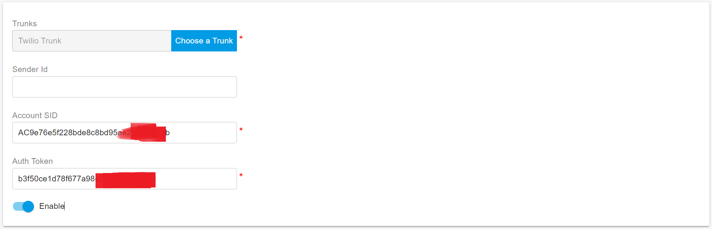
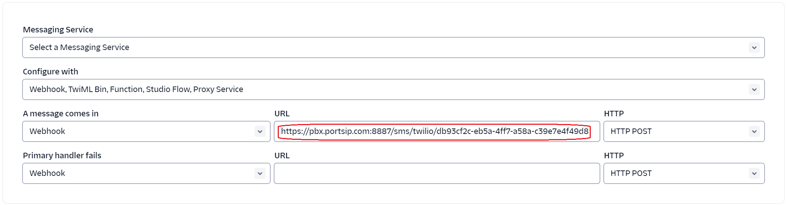
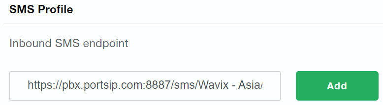

# Twilio SMS Integration

Before proceeding with the next steps, you need to [purchase a DID on the Twilio platform](purchase-a-did-on-the-twilio.md) with the SMS/MMS enabled.


According to US legislation (A2P 10DLC SMS), 10DLC (10-digit Long Code) phone numbers that are used for A2P (Application-to-Person) messaging MUST be registered, otherwise, SMS messages sent to US numbers from the unregistered 10DLC numbers will be blocked.

If your business communicates with US-based customers, you should confirm the registration requirements with the SMS service provider and [complete the phone number registration](https://support.twilio.com/hc/en-us/articles/1260801864489-How-do-I-register-to-use-A2P-10DLC-messaging-) to avoid disruption in message delivery.


## Obtain the Twilio Account Info

Login to the [Twilio Console](https://console.twilio.com/), and click the Account Dashboard, copy and note the **Account SID** and **Auth Token** in **Account Info** section.

1. On the left side of the screen under **Phone Numbers > Manage > Active Numbers**.
2. Click a number that you want to assign to your trunk.
3. In the new page under the **Voice Configuration** section, choose SIP Trunk for Configure with, and choose the trunk that you want to assign the number.
4. Click the **Save Configuration**, that number is now associated with your SIP Trunk.

## Configure SMS with Twilio Trunk in PortSIP PBX

Before configuring SMS in PortSIP PBX, you must have already configured a Twilio SIP trunk using one of the following guides:

* [Configuring Twilio Register Based Trunk](configuring-twilio-register-based-trunk.md)
* [Configuring Twilio Interconnect Trunk](configuring-twilio-interconnect-trunk.md)

### Sign in PortSIP PBX Web Portal

You can sign in to the PortSIP PBX Web portal using one of the following methods:

1. Sign in as the PBX system administrator, navigate to the **Tenants** menu, choose a tenant, and click the **Manage** button to switch to that tenant.
2. Sign in as a tenant admin to manage the tenant.

For more details please reference [Tenant Management](../../portsip-pbx-administration-guide/3-tenant-management.md).

### Add an SMS configuration

Please follow the below steps:

1. In the PortSIP PBX Web portal, navigate to the left menu, select **SMS/MMS**, and click the **Add** button.&#x20;
2. Choose your configured Twilio Trunk:
   * **Sender ID**: If you want to send the SMS with a Sender ID, please follow this [guide ](https://www.twilio.com/docs/glossary/what-alphanumeric-sender-id)to create it., please enter that Sender ID in this field. Otherwise, leave it empty, and the PortSIP PBX will use the DID number you configured for that Twilio trunk as the Sender ID.
   * **Account SID**: Paste your copied Twilio Account SID here.
   * **Auth Token**: Paste your copied Twilio Auth Token here.

<figure><figcaption></figcaption></figure>

3. Click **OK** to be brought to the SMS/MMS list page. You can select that SMS configuration and click the **Copy Webhook** button to copy it. Or Double-click the SMS configuration you created and copy the Webhook URL.

Configure the SMS in Twilio

1. Log in to your [Twilio console](https://console.twilio.com/)
2. Navigate to the menu **Develop > Phone Numbers > Manage > Active Numbers**, you will see the numbers you are purchased.

<figure><figcaption></figcaption></figure>

3. Click a number to edit it and configure the messaging webhook with PBX's Webhook URL that you copied in PortSIP PBX in the above steps.

<figure><figcaption></figcaption></figure>

3. Enable the geographic permission for the desired region(s) where you want to send SMS messages so that messages can be successfully sent to the phone numbers within the region(s).\

4. You can also navigate to **Numbers & Trunks > My Numbers** in the [Wavix account](https://app.wavix.com/profile/api-keys),  select the number you want to edit, and paste the Webhook URL in the **Inbound SMS Endpoint** field.

<figure><figcaption></figcaption></figure>

## Verify Configuration

Now you can [create the outbound and inbound rules](../wavix-sip-trunk/configuring-outbound-and-inbound-calls.md) in PortSIP PBX for sending and receiving SMS/MMS using the Wavix Trunk, just like you create the rules for making and receiving calls.

