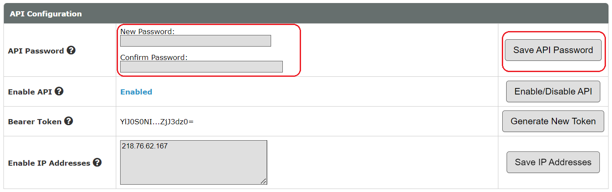
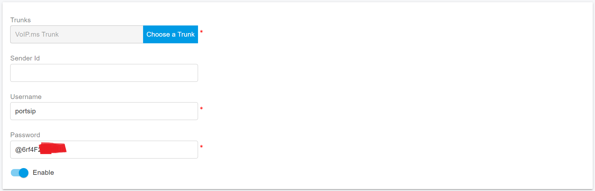

# VoIP.ms SMS Integration

Before proceeding with the next steps, you need to[ purchase a DID on the VoIP.ms platform](purchase-a-did-on-voip.ms.md).

The VoIP.ms SMS service has some limitations. Please refer to this link for more details: [Service Limitations](https://wiki.voip.ms/article/SMS-MMS#Service\_Limitations).

## Set an API Password

If you don’t already have an API Password set up, please follow these steps to generate one:

1. Log in to your VoIP.ms client portal.
2. Navigate to **Main Menu > SOAP and REST/JSON API**.
3. If the API is not already enabled, click on **Enable the API**.
4. Enter a password in the **API Password** field, then click **Save API Password**.
5. Make sure to note down the API Password for future reference.

<figure><figcaption></figcaption></figure>


When you set up the API Password, be sure to copy and store it in a secure place, as it won't be visible again after generation. It will only be available to be copied once it is set up. If you lost your API Password, you need to set up a new one.


## Configure SMS with VoIP.ms Trunk in PortSIP PBX

Before configuring SMS in PortSIP PBX, you must have already configured a VoIP.ms SIP trunk using one of the following guides:

* [Configuring VoIP.ms Register Authentication Trunk](configuring-voip.ms-register-based-trunk.md)

### Sign in PortSIP PBX Web Portal

You can sign in to the PortSIP PBX Web portal using one of the following methods:

1. Sign in as the PBX system administrator, navigate to the **Tenants** menu, choose a tenant, and click the **Manage** button to switch to that tenant.
2. Sign in as a tenant admin to manage the tenant.

For more details please reference [Tenant Management](../../portsip-pbx-administration-guide/3-tenant-management.md).

### Add an SMS configuration

Please follow the below steps:

1. In PortSIP PBX Web portal, navigate to the left menu, select **SMS/MMS**, and click the **Add** button.&#x20;
2. Choose your configured VoIP.ms Trunk:
   * **Username: E**nter your VoIP.ms account password
   * **Password**: Paste your copied VoIP.ms API Password here

<figure><figcaption></figcaption></figure>

3. Click **OK** to be brought to the SMS/MMS list page. You can select that SMS configuration and click the **Copy Webhook** button to copy it. Or Double-click the SMS configuration you created and copy the Webhook URL.
4. Go to your VoIP.ms client portal and navigate to **DID Number > Manage DIDs**
5. Click the yellow pencil Edit button of your DID you wish to use for SMS
6. &#x20;Scroll down to the SMS section until you see the Message Service (SMS/MMS) section.
7. Enable the SMS/MMS service.
8. In the **SMS/MMS Webhook URL** field, paste the Webhook URL you copied from PortSIP PBX
9. Select if you wish to send and receive SMS/MMS messages in the NANPA or E164 format.
   * E164: To send an SMS or MMS with this format, you will need to include `+` sign and the country code for every message
   * NANPA: To send an SMS or MMS with this format, you only need to enter the 10-digit number without the country code.
10. Press the button **Click here to apply changes** then you get it done.

<figure><figcaption></figcaption></figure>

## Verify Configuration

Now you can [create the outbound and inbound rules](configuring-outbound-and-inbound-calls.md) in PortSIP PBX for sending and receiving SMS/MMS using VoIP.ms Trunk, just like you create the rules for making and receiving calls.

