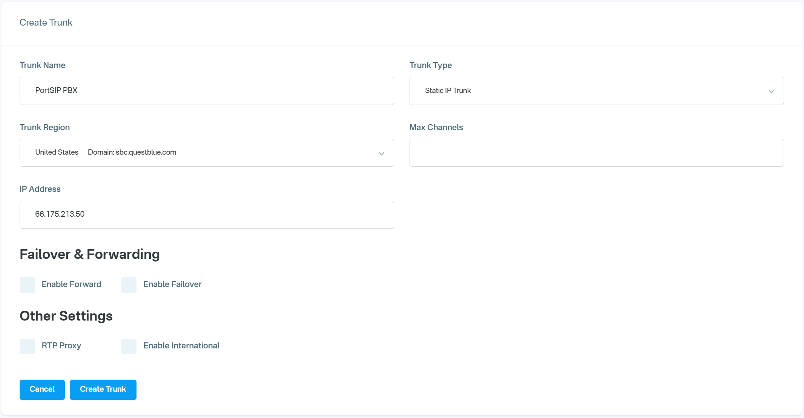
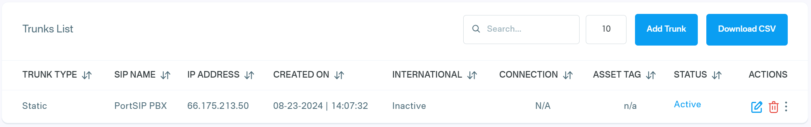
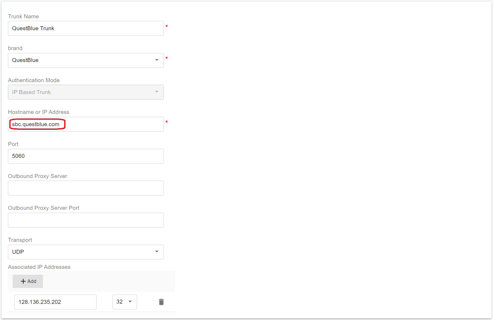

# Configuring Vonage IP Authentication Trunk

Before proceeding with the next steps, you need to [purchase a DID on the Telnyx platform](../telnyx-sip-trunk/purchase-a-did-on-telnyx-platform.md).

## Create a SIP Trunk on the QuestBlue platform

To create a new SIP trunk on the QuestBlue platform:

1. Select **Trunks** under **SIP Trunks** in the left menu
2. Click the **Add Trunk** button
3. Enter a friendly name for the trunk
4. Select **Static IP Trunk** for the **Trunk Type** field
5. Choose an appropriate location for the **Trunk Region**, and note down the SBC domain, the QuestBlue recommends `sbc.questblue.com`.
6. Set an appropriate value for the **Max Channels**
7. Enter your PortSIP PBX static IP for the **IP Address** field and click **Create Trunk**

<figure><figcaption></figcaption></figure>

After the SIP trunk is successfully created, it will appear on the list of SIP trunks on your account.

<figure><figcaption></figcaption></figure>

## Assign DID to a SIP Trunk

To assign the DID to a SIP trunk, please follow the below steps:&#x20;

1. Navigate to the menu **Telphone Numbers > Telphone Numbers**, you can see all active DIDs.
2. Click the **pen icon** next to a DID. In the popup window, select the desired trunk from the **Trunk** field combo box to assign the DID to it.
3. Click **Submit** to save changes.
4. You can repeat the above steps to assign more DIDs.

## Configure IP Authentication Trunk in PortSIP PBX

The IP Authentication QuestBlue trunk refers to the **IP Based Trunk** in PortSIP PBX.&#x20;

You must configure the **IP Based Trunk** at the PortSIP PBX system administrator level. Once successfully configured, you can share this trunk with tenants.

Please follow the below steps:

1. Sign in to the PortSIP PBX Web Portal as a System Administrator. Navigate to the left menu and select **Call Manager > Trunks**.&#x20;
2. Click the **Add** button to open a menu. From the menu, choose **IP Based Trunk**.

<figure><figcaption></figcaption></figure>

3. Enter the trunk name and choose the brand:
   * **Name**: Enter a friendly name for the trunk.
   * **Brand**: Select **QuestBlue** from the Brand field
   * Hostname or IP address: Enter the QuestBlue SBC domain that is noted above [Create a SIP Trunk on the QuestBlue](configuring-vonage-ip-authentication-trunk.md#create-a-sip-trunk-on-the-questblue-platform), for example, `sbc.questblue.com`.

<figure><figcaption></figcaption></figure>

4. Click the **Next** button, you can adjust the options for the trunk.
   * &#x20;**Max Concurrent Calls:** This field sets the maximum number of calls that PortSIP can establish with this trunk. You can adjust it to an appropriate value.
   * We recommend keeping the default settings for other options unless you have specific requirements.

<figure><figcaption></figcaption></figure>

5. Click the **Next** button to assign this trunk to the tenants and provide your QuestBlue DIDs/Numbers to them with the DID Pool (DID numbers).  A DID can be only assigned to one tenant.

A tenant assigned to this trunk can only use the DID numbers within the DID pool range to create inbound and outbound rules and configure the outbound caller ID for extensions.

<figure><figcaption></figcaption></figure>

* DID Pool: The DID pool can consist of a single number, a range of numbers, or a combination of both. For example:
  * `16468097065`
  * `16468097065;16468097066`
  * `16468097065-16468097066;16468097069`&#x20;
  * `16468097065-16468097066;16468097070-16468097080`

Click the **OK** button to save the changes. The trunk configuration is now complete.

In the trunk list, you will see the status displayed as **Registered** (for IP Based Trunk it always displays Registered).

<figure><figcaption></figcaption></figure>

Now you can follow the article to [Configuring Outbound & Inbound Calls](configuring-outbound-and-inbound-calls.md).

