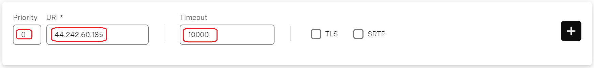
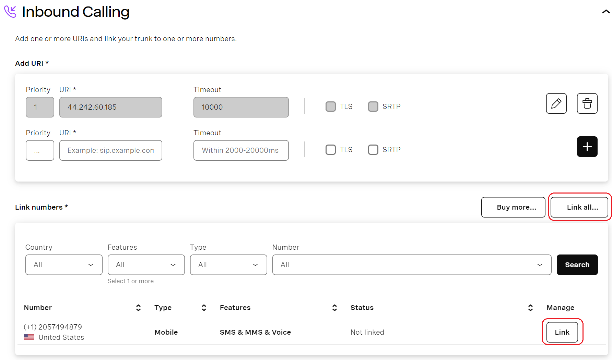

# Configuring Vonage Register Authentication Trunk

Before proceeding with the next steps, you need to [purchase a DID on the Vonage platform](purchase-a-did-on-vonage-platform.md).

## Create a SIP Trunk on the Vonage platform

To create a new SIP trunk on the Vonage platform:

1. Navigate to the menu **Build & Manage > SIP**.&#x20;
2. By default, Vonage has created a SIP trunk for you. You can click the settings icon to adjust its settings or click **Create New** to set up a new SIP trunk. In this guide, we will demonstrate how to create a new trunk.
3. Click **Create New** and enter a domain for your trunk, such as “portsip,” and click **Create**.

<figure><figcaption></figcaption></figure>

4. Once the SIP trunk is successfully created, you will automatically be directed to the trunk details page.

<figure><figcaption></figcaption></figure>

5. Click **Add Authentication** under the **Outbound Calling** section you will be redirected to the **Authentication** page, under **User Key and Secret** section, enter the values for the **User Key** and **Secret** fields, then press the **+** button. Please make sure to note these values, as they will be needed for authentication from your PortSIP PBX later.

<figure><figcaption></figcaption></figure>

6. After adding the User Key and Secret, the **User Key and Secret** section will display as enabled in green, indicating that the register authentication is enabled.&#x20;


If you have added the User Key and Secret for authentication, you must not add the Access Control List (ACL), as they cannot be enabled simultaneously.


<figure><figcaption></figcaption></figure>

7. Click **Back**. On the trunk details page, you will see that Outbound Calling is displayed as ready. Please copy and note the Vonage SIP trunk's domain, in this case, they are below, you can pick up one near your PortSIP PBX location:
   * portsip.sip-us.vonage.com
   * portsip.sip-eu.vonage.com
   * portsip.sip-ap.vonage.com

<figure><figcaption></figcaption></figure>

8. Under the **Inbound Calling** section, add the URI so that the Vonage SIP trunk knows how to route inbound calls to your PortSIP PBX. Simply input the priority(0-100), such as 1, and enter the URI, which is your PortSIP PBX IP address or domain (e.g., 44.242.60.185 or pbx.portsip.com).
   * **Priority**: Set the **priority** of the SIP trunk using unique numbers from 0 to 100. Vonage will process calls based on the set priority, with 0 being the highest priority. Keep in mind that if the priority values are not unique, Vonage cannot guarantee the delivery of calls according to the priority.
   * **Timeout**: Set a timeout for the SIP URI in the text box next to it. The accepted values range from 2000 ms to 20000 ms. If no value is entered, Vonage will use a default timeout of 5000 ms.
   * **TLS**: Vonage supports TLS for forwarded calls. To enable this, please check the TLS box in the SIP URI section. By default, traffic is sent to the port `5061`. for example, if you enabled the TLS, and your PortSIP PBX listened on port 5063 for TLS, you need to add the URI `44.242.60.185:5063`.
   * **SRTP**: Vonage will also encrypt media using SRTP if necessary. To do that please check the SRTP box in SIP URI section.

<figure><figcaption></figcaption></figure>

9. Click the **+** button to add the URI. Once added, the URI will be successfully displayed.

<figure><figcaption></figcaption></figure>

10. Add one or multiple numbers to this SIP Trunk by clicking the **Link all...** or **Link** button Link numbers section. If there are no numbers, you can buy them, and it will redirect you to the buy number portal. In the numbers dashboard, you can easily filter, link, and unlink multiple numbers.

<figure><figcaption></figcaption></figure>

11. Once the number is successfully linked, Vonage will display the information indicating that you are ready to receive calls.

<figure><figcaption></figcaption></figure>

## Configure Register Based Trunk in PortSIP PBX

The **Vonage Registration** trunk refers to the **Register Based Trunk** in PortSIP PBX. You can configure the Register Based Trunk at either the PortSIP PBX **system administrator level** or the **Tenant Admin level**:

* If configured at the system administrator level, you can share this trunk with tenants.
* If configured at the tenant admin level, this trunk can only be used by the tenant itself.

Please follow the below steps:

1. Sign in to the PortSIP PBX Web Portal as a System Administrator or Tenant Admin. Navigate to the left menu and select **Call Manager > Trunks**.&#x20;
2. Click the **Add** button to open a menu. From the menu, choose **Register Based Trunk**.

<figure><figcaption></figcaption></figure>

3. Enter the trunk name and choose the brand:
   * **Name**: Enter a friendly name for the trunk.
   * **Brand**: Select **Vonage** for this field.
   * **DID Pool**: This step is only for you at the _**Tenant admin Level**_ to configure this **Register Based Trunk**,  you will need to set up your Vonage DID numbers for this DID pool for this trunk.
     * This tenant can only use the DID numbers within the DID pool range to create inbound and outbound rules and configure the outbound caller ID for extensions.
     * &#x20;The DID pool can consist of a single number, a range of numbers, or a combination of both. For example:
       * `12057494879`
       * `12057494879-12057494880`
       * `12057494879-12057494880;12057494885`&#x20;
       * `12057494879-12057494880;12057494890-12057494899`
   * **Hostname or IP Address**: Paste the Vonage SIP trunk domain that you copied in previous steps

<figure><figcaption></figcaption></figure>

4. Click the **Next** button, and set up the trunk credentials.
   * **Authentication name**: Enter the User Key that you created in Vonage Trunk previously
   * **Password**: Enter the Secret that you created in Vonage Trunk previously

<figure><figcaption></figcaption></figure>

5. Click the **Next** button, you can adjust the options for the trunk.
   * &#x20;**Max Concurrent Calls:** This field sets the maximum number of calls that PortSIP can establish with this trunk. You can adjust it to an appropriate value.
   * We recommend keeping the default settings for other options unless you have specific requirements.

<figure><figcaption></figcaption></figure>

6. This step is only available when configuring the Register-Based Trunk at the _**System Administrator Level**_. Click the **Next** button to assign this trunk to the tenants and provide your Vonage DIDs/Numbers to them with the DID Pool (DID numbers).  A DID can be only assigned to one tenant.
   * A tenant assigned to this trunk can only use the DID numbers within the DID pool range to create inbound and outbound rules and configure the outbound caller ID for extensions.
   * DID Pool: The DID pool can consist of a single number, a range of numbers, or a combination of both. For example:
     * `12057494879`
     * `12057494879-12057494880`
     * `12057494879-12057494880;12057494885`&#x20;
     * `12057494879-12057494880;12057494890-12057494899`

<figure><figcaption></figcaption></figure>

Click the **OK** button to save the changes, the trunk configuration is completed.

Once the PortSIP PBX successfully registers this trunk to the Vonage platform, you will see the status displayed as **Registered** on the trunk list page.

<figure><figcaption></figcaption></figure>

Now you can follow the article to [Configuring Outbound & Inbound Calls](configuring-outbound-and-inbound-calls.md).

