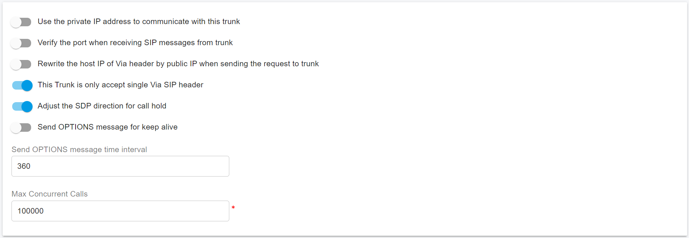

# Configuring Voxtelesys IP Authentication Trunk

Before proceeding with the next steps, you need to [purchase a DID on the Voxtelesys platform](purchase-a-did-on-questblue-platform.md).

## Create a SIP Trunk on the Voxtelesys platform

Navigate to the menu **SIP Trunks,** we can see and manage our Inbound and Outbound SIP Trunks. These trunks are internal work for Voxtelesys, and they are created automatically.&#x20;

<figure><figcaption></figcaption></figure>

* **Inbound**: The Inbound trunk means the Call/SMS is from the Voxteleys to PortSIP PBX.
* **Outbound**: The Outbound trunk means the Call/SMS is from the PortSIP PBX to Voxtelesys.

### Add IP Address to the Outbound Trunk Group

Please follow the below steps to add the PBX IP Address to the Outbound Trunk Group.

1. Select the **Outbound Trunk Group**.
2. Navigate to the **IP Addresses** tab.
3. Click the green `+` **sign** to add a new IP address.

<figure><figcaption></figcaption></figure>


Your outbound trunk group is used for outbound calling.


Fill in the following information:

* **IP**: Enter your PortSIP PBX static public IP address
* **Tech Prefix**: Set to "none" by default. If you want to add a prefix for another SIP Trunk, add it here.
* **Enabled**: Check this box to enable this IP address.

<figure><figcaption></figcaption></figure>

### Add IP Address to the Inbound Trunk Group

Please follow the below steps to add the PBX IP Address to the Inbound Trunk Group.

1. Select the **Inbound Trunk Group**.
2. Navigate to the **Routing** tab.
3. Click the green `+` **sign** to add a new IP address.

<figure><figcaption></figcaption></figure>


Your inbound trunk group is used for inbound calling and may have multiple routes, so make sure you are on the correct route.


4. Give a friendly name to the route and press **Confirm**. The route will be created.
5. Double-click the newly added route to expand it.
6. Click the pencil **Edit** icon to modify the route settings.
7. Fill in the following information:
   * **Priority**: Adjust the priority level of this route.
   * **Destination Type**: Set this to **Customer IP**.
   * **Destination**: Enter your PortSIP PBX static public IP address.

<figure><figcaption></figcaption></figure>

You can adjust the inbound route priority as below:

1. Press the **Edit Priorities** button to adjust the routes' priorities.
2. Change the Customer IP's position with the priority drop-down menu to change how Voxtelesys reaches your PortSIP PBX.

Click on **Confirm Changes** to complete the process.1

## Assign DID to a SIP Trunk

To assign the DID to a SIP trunk, please follow the below steps:&#x20;

1. Navigate to the menu **Telphone Numbers > Telphone Numbers**, you can see all active DIDs.
2. Click the **pen icon** next to a DID. In the popup window, select the desired trunk from the **Trunk** field combo box to assign the DID to it.
3. Click **Submit** to save changes.
4. You can repeat the above steps to assign more DIDs.

## Configure IP Authentication Trunk in PortSIP PBX

The IP Authentication Voxtelesys trunk refers to the **IP Based Trunk** in PortSIP PBX.&#x20;

You must configure the **IP Based Trunk** at the PortSIP PBX system administrator level. Once successfully configured, you can share this trunk with tenants.

Please follow the below steps:

1. Sign in to the PortSIP PBX Web Portal as a System Administrator. Navigate to the left menu and select **Call Manager > Trunks**.&#x20;
2. Click the **Add** button to open a menu. From the menu, choose **IP Based Trunk**.

<figure><figcaption></figcaption></figure>

3. Enter the trunk name and choose the brand:
   * **Name**: Enter a friendly name for the trunk.
   * **Brand**: Select **Voxtelesys** from the Brand field
   * Hostname or IP address: Enter the IP `23.155.16.10` for this field.

<figure><figcaption></figcaption></figure>

3. Click the **Next** button, you can adjust the options for the trunk.
   * &#x20;**Max Concurrent Calls:** This field sets the maximum number of calls that PortSIP can establish with this trunk. You can adjust it to an appropriate value.
   * We recommend keeping the default settings for other options unless you have specific requirements.

<figure><figcaption></figcaption></figure>

3. Click the **Next** button to assign this trunk to the tenants and provide your Voxtelesys DIDs/Numbers to them with the DID Pool (DID numbers).  A DID can be only assigned to one tenant.

A tenant assigned to this trunk can only use the DID numbers within the DID pool range to create inbound and outbound rules and configure the outbound caller ID for extensions.

<figure><figcaption></figcaption></figure>

* DID Pool: The DID pool can consist of a single number, a range of numbers, or a combination of both. For example:
  * `16468097065`
  * `16468097065;16468097066`
  * `16468097065-16468097066;16468097069`&#x20;
  * `16468097065-16468097066;16468097070-16468097080`

Click the **OK** button to save the changes. The trunk configuration is now complete.

In the trunk list, you will see the status displayed as **Registered** (for IP Based Trunk it always displays Registered).

<figure><figcaption></figcaption></figure>

Now you can follow the article to [Configuring inbound and outbound calls](configuring-outbound-and-inbound-calls.md).

