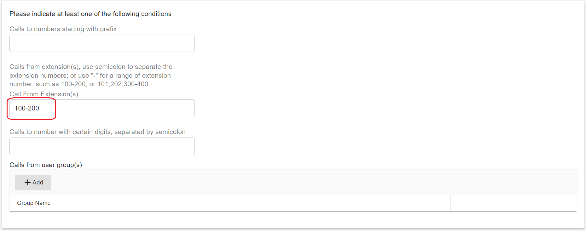
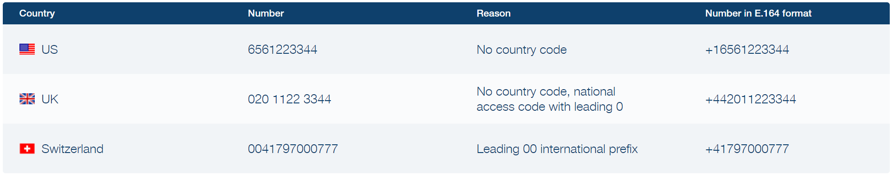
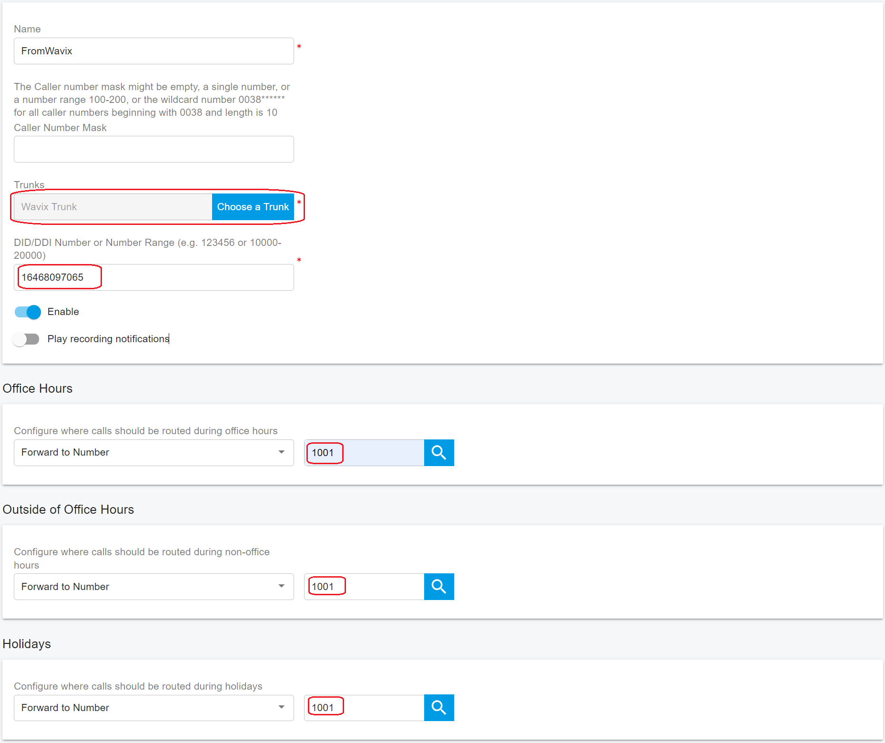

# Configuring Outbound & Inbound Calls

You need to sign in to the PortSIP PBX web portal to create the outbound and inbound rules for making & receiving calls.

## Sign in PortSIP PBX Web Portal

You can sign in to the Web portal in the following ways:

1. Sign in as PBX system administrator, choose a tenant, and click the Manage button to switch to that tenant.
2. Sign in as a tenant admin to manage the tenant.

For more details please reference [Tenant Management](../../portsip-pbx-administration-guide/3-tenant-management.md).

## Configure Outbound Rules

### Add Outbound Rule in PortSIP PBX

In order to place outbound calls you need to configure Outbound Rules. Go to **Call Manager > Outbound Rules** in the left hand side menu and click the **Add** button:

1. Give your Outbound Rule a name
2. Set up at least one condition for this outbound rule in the section **Apply this rule to the following calls**

<figure><figcaption></figcaption></figure>

3. Scroll to the Place outbound calls using the following trunk routes section, click the Add icon, then select **Wavix Trunk** and save the Outbound Rule.

<figure><figcaption></figcaption></figure>

### Number Format

When you make the outbound call to the Wavix trunk, all destination phone numbers must be in the E.164 international format. E.164 numbers can have up to fifteen digits and are usually formatted as follows: `[+][country code][subscriber number including area code]`. An example of a US number in E.164 format is `+16561223344`. Calls to numbers without country code or carrying national access codes will be rejected by the Wavix platform.

Below are typical examples of incorrectly formatted phone numbers.

<figure><figcaption></figcaption></figure>

Depending on your users’ dialing habits, you may want to strip some of the leading digits or prepend the country code. For example, the below configuration can be used to prepend all dialed numbers with the leading 1 in case your users are accustomed to US domestic number in the national format.

<figure><figcaption></figcaption></figure>

## Configure Inbound Rules

### Add Inbound Rule in PortSIP PBX

In order to receive inbound calls you need to configure Inbound Rules. Go to **Call Manager > Outbound Rules** in the left hand side menu and click the **Add** button:

1. Give your Inbound Rule a name
2. Click the **Choose a Trunk** button to select the trunk
3. Enter the number for **DID/DDI Number or Number Range** field, the entered number must in the DID pool range of the selected trunk
4. Set the extension to route calls to.

<figure><figcaption></figcaption></figure>

Click **OK** to save the rule. Depending on your business needs, you may set specific office hours for the rule and route calls to different extensions, and voice mailbox or automatically drop the call based on the schedule. Please reference the article [Office Hours and Holiday Schedule](../../portsip-pbx-administration-guide/office-hours-and-holiday-schedule/) for more details.

### Configure Route in Wavix

For calls to be routed to your PortSIP PBX, log in to your Wavix account, select **My DIDs** under **Numbers & trunk** in the top menu, click on the three dots on the right hand side, and select the **Edit DID** option.

1. Select the destination trunk in the **Destination** section
2. Click **Add** to add the destination for the DID
3. Click **Save** to save the settings

<figure><figcaption></figcaption></figure>

4. Select the trunk in the **Destination** section. Click **Add** to add the destination for the DID and **Save** to save the settings.

<figure><figcaption></figcaption></figure>

5. You can also edit several DIDs at the same time. To do so, select multiple numbers to edit and click the **Bulk actions** button.

<figure><figcaption></figcaption></figure>

## Configure Inbound Routing for Trunks with IP Authentication


Skip this section if your trunks are configured to Digest authentication.



SIP trunks with IP authentication enabled cannot be used for inbound call routing as they do not maintain registration with Wavix proxies. In order to configure inbound routing for your numbers you must specify a valid SIP URI address instead.


### Configure Inbound call routing to a valid SIP URI

Please follow the below steps to configure the routing:

1. Log in to your Wavix account
2. Select **My DIDs** under Numbers & trunks
3. Click on the three dots on the right-hand side and select the **Edit DID** option. Double click is also supported
4. Select **SIP URI** in the transport drop-down menu
5. Enter a valid SIP URI using the format: `+[did]@FQDN:port;transport=connection`, where:
   * FQDN is the fully qualified domain name or IP address of your PortSIP PBX
   * The port is the SIP port used by the PBX
   * The connection could be either udp, tcp, or tls. The default transport is udp

For example, if your PortSIP PBX domain is `sip.yourpbx.com`, and the PBX static IP is `98.11.99.12`, and the PBX uses port 5060 over UDP to communicate with Wavix trunk, the SIP URI can be one of the below formats:

* \+did@sip.yourpbx.com:5060;transport=udp
* \+did@98.11.99.12:5060;transport=udp

6. Click **Add** to add the destination for the DID
7. Click **Save** to apply settings

Keep in mind that `[did]` parameter will be automatically updated with the actual dialed phone number when routing the call.

You can also edit several DIDs at the same time. To do so, select multiple numbers to edit and click the **Bulk actions** button. Note that changes will be applied to all selected numbers.

Please make sure that all your Wavix DIDs are set up in the DID Pool of the Wavix Trunk you configured in the PortSIP PBX.

