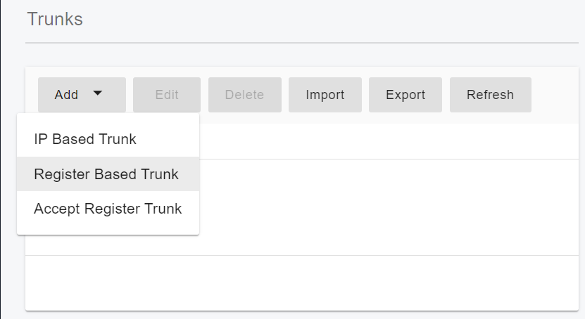

# Configuring Wavix Digest Trunk

Before proceeding with the next steps, you need to [purchase a DID on the Wavix platform](purchase-a-did-on-wavix-platform.md).

## Create a SIP Trunk on the Wavix platform

To create a new SIP trunk on the Wavix platform

1. Select **Trunks** under **Numbers & trunks** in the top menu
2. Click the **Create new** button
3. Select **Digest** under the **Authentication method**
4. Specify the SIP trunk name, set SIP trunk password, and select one of the DIDs on your account as Caller ID.

<figure><figcaption></figcaption></figure>

5. Optionally you can set max outbound call duration, max number of simultaneous calls via the SIPtrunk, and max call cost. If these parameters are not set, global account limits apply.
6. Click **Create**

After the SIP trunk is successfully created, it will appear on the list of SIP trunks on your account.

<figure><figcaption></figcaption></figure>


Please be advised that your 5-digit SIP trunk username is generated automatically and displayed in the SIP trunk ID column.


## Configure IP Authentication Trunk in PortSIP PBX

If you chose the **Authentication method** as **IP Authentication** when you [created the Wavix trunk](configuring-wavix-digest-trunk.md#ip-authentication)**, y**ou must configure this trunk at the PortSIP PBX system administrator level, and you can share this trunk with tenants once it is successfully configured.

Please follow the below steps:

1. Log in to the PortSIP PBX Web Portal as System administrator, go to the left menu **Call Manager > Trunks, and** click the **Add** button will pop up a menu.
2. Choose the IP Based Trunk in the menu.

<figure><figcaption>
Configure Wavix Trunk in PortSIP PBX
</figcaption></figure>

3. Enter the trunk name and choose the brand:
   * Name: Enter a friendly name for the trunk.
   * Brand: Choose one of Wavix trunks from the **Brand** field, for example, **Wavix - US**.

<figure><figcaption></figcaption></figure>

4. Click the **Next** button, you can adjust the options for the trunk, we recommend using the default settings except for the **Max Concurrent Calls,** this field is limited to the maximum calls that PortSIP established with this trunk, you can change it to an appropriate value.

<figure><figcaption></figcaption></figure>

5. Click the **Next** button, you can now assign this trunk to the tenants, and also give them the DID Pool(DID numbers). A tenant who assigned this trunk can only use the DID numbers which in the DID pool range to create the inbound rule & outbound rule, and configure the outbound caller ID for extensions.&#x20;

<figure><figcaption></figcaption></figure>

* DID Pool: The DID pool can consist of a single number, a range of numbers, or a combination of both. For example:
  * `16468097065`
  * `16468097065;16468097066`
  * `16468097065-16468097066`
  * `16468097065-16468097066;16468097069`&#x20;
  * `16468097065-16468097066;16468097070-16468097080`

Click the **OK** button to save the changes, the trunk configuration is completed.

