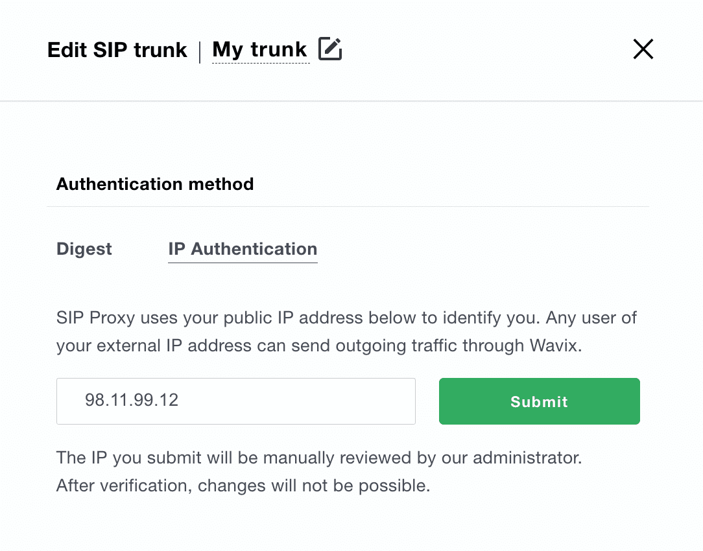

# Configuring Wavix IP Authentication Trunk

Before proceeding with the next steps, you need to [purchase a DID on the Wavix platform](purchase-a-did-on-wavix-platform.md).

## Create a SIP Trunk on the Wavix platform

To create a new SIP trunk on the Wavix platform:

1. Select **Trunks** under **Numbers & trunks** in the top menu
2. Click the **Create new** button
3. Select **IP Authentication** under the **Authentication method**
4. Enter your PortSIP PBX static IP and click **Submit**
5. Click **Save** to apply changes

<figure><figcaption></figcaption></figure>

Once the Wavix ops team approves your request, IP authentication will be activated on your Wavix SIP trunk.


After submitting the IP authentication request, you’ll not be able to update your IP address or change the authentication method.



By default, an IP address can only be mapped to a single SIP trunk. If you need to have several Wavix SIP trunks sharing the same IP address, please get in touch with support@wavix.com


After the SIP trunk is successfully created, it will appear on the list of SIP trunks on your account.

<figure><figcaption></figcaption></figure>


Please be advised that your 5-digit SIP trunk username is generated automatically and displayed in the SIP trunk ID column.


## Configure IP Authentication Trunk in PortSIP PBX

The IP Authentication Wavix trunk corresponds to the **IP-Based Trunk** in PortSIP PBX. You must configure the **IP-Based Trunk** at the PortSIP PBX system administrator level. Once successfully configured, you can share this trunk with tenants.

Please follow the below steps:

1. Sign in to the PortSIP PBX Web Portal as a System Administrator. Navigate to the left menu and select **Call Manager > Trunks**.&#x20;
2. Click the **Add** button to open a menu. From the menu, choose **IP-Based Trunk**.

<figure><figcaption>
Configure Wavix Trunk in PortSIP PBX
</figcaption></figure>

3. Enter the trunk name and choose the brand:
   * **Name**: Enter a friendly name for the trunk.
   * **Brand**: Select one of the Wavix trunks from the Brand field, such as **Wavix - US**.

<figure><figcaption></figcaption></figure>

4. Click the **Next** button to adjust the options for the trunk. We recommend using the default settings, except for the **Max Concurrent Calls** field. This field limits the maximum number of calls that PortSIP can establish with this trunk. You can change it to an appropriate value.

<figure><figcaption></figcaption></figure>

5. Click the **Next** button to assign this trunk to the tenants and provide them with the DID Pool (DID numbers). A tenant assigned to this trunk can only use the DID numbers within the DID pool range to create inbound and outbound rules, and configure the outbound caller ID for extensions.

<figure><figcaption></figcaption></figure>

* DID Pool: The DID pool can consist of a single number, a range of numbers, or a combination of both. For example:
  * `16468097065`
  * `16468097065;16468097066`
  * `16468097065-16468097066`
  * `16468097065-16468097066;16468097069`&#x20;
  * `16468097065-16468097066;16468097070-16468097080`

Click the **OK** button to save the changes. The trunk configuration is now complete.

