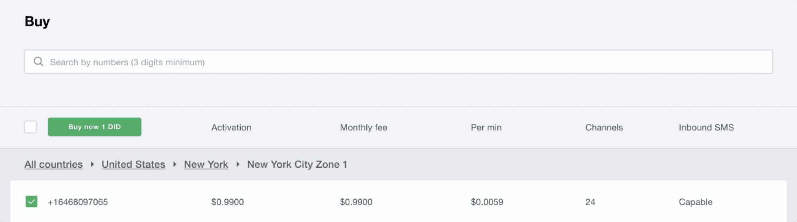
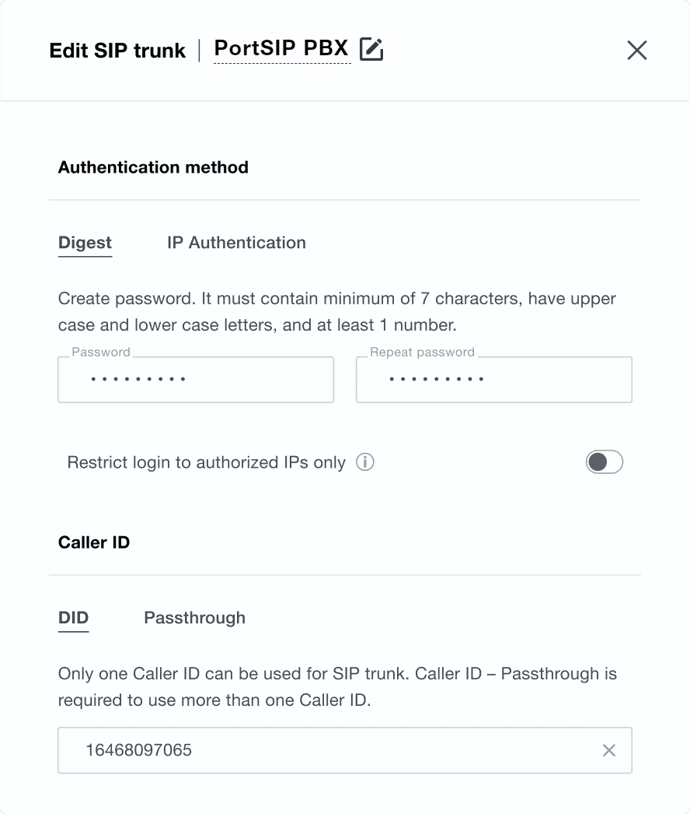
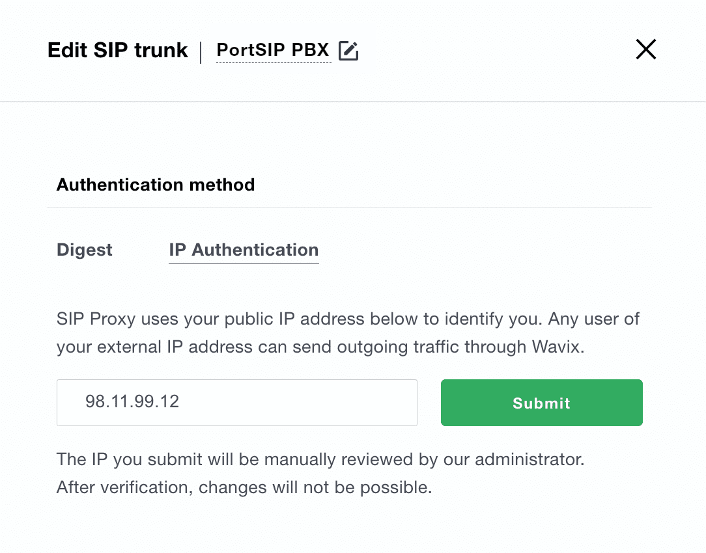
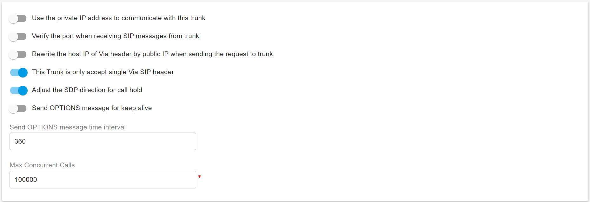

# Set Up Wavix SIP Trunk


This guide is only applicable for the PortSIP PBX v22 or higher.


Wavix is a SIP trunk provider, it provides a robust set of calling, SMS/MMS features, and reliability that enhances your communications.

One of the primary advantages of trunking with Wavix is its greatly expanded geographic reach. Wavix provides connectivity across 170+ countries, allowing you to make and receive calls around the world. Your callers and customers worldwide can connect with your business at local rates.

PortSIP PBX integrated the Wavix SIP trunking that allows you to set up easily.

## Purchase a DID on the Wavix platform

Before placing or receiving a call, you need to have an active DID or a dozen DID numbers on your Wavix account. If you already have an active number on your Wavix account, the below steps are optional.

To purchase a DID on your Wavix account:

1. Log in to your account
2. Click on **Buy** under **Numbers & trunks** in the top menu
3. Select a country and region you wish to purchase a DID in
4. Choose a specific number or numbers and click the **Buy Now** button
5. You will be redirected to the Cart where you can confirm your choice and check out the DID(s).

<figure><figcaption>
Search and buy a number
</figcaption></figure>


Some DIDs may require proof of local address and other documents before they can be activated. To enable these DIDs to receive inbound calls, upload the documents required, and wait until they are approved by the Wavix Number Provisioning team.


## Create a SIP Trunk on the Wavix platform

To create a new SIP trunk on the Wavix platform

1. Select **Trunks** under **Numbers & trunks** in the top menu
2. Click the **Create new** button
3. Select **Digest** or **IP Authentication** under the **Authentication method**

### Digest

If selected **Digest**, specify the SIP trunk name, set SIP trunk password, and select one of the DIDs on your account as Caller ID.

<figure><figcaption></figcaption></figure>

### IP Authentication

If select **IP Authentication**, please follow the below steps:

1. Enter your PortSIP PBX static IP and click **Submit**
2. Click **Save** to apply changes

<figure><figcaption></figcaption></figure>

Once the Wavix ops team approves your request, IP authentication will be activated on your Wavix SIP trunk.


After submitting the IP authentication request, you’ll not be able to update your IP address or change the authentication method.



By default, an IP address can only be mapped to a single SIP trunk. If you need to have several Wavix SIP trunks sharing the same IP address, please get in touch with support@wavix.com


After the SIP trunk is successfully created, it will appear on the list of SIP trunks on your account.

<figure><figcaption>
List of SIP trunks and SIP trunk ID
</figcaption></figure>


Please be advised that your 5-digit SIP trunk username is generated automatically and displayed in the SIP trunk ID column.


## Configure IP Authentication Trunk in PortSIP PBX

If you chose the **Authentication method** as **IP Authentication** when you [created the Wavix trunk](set-up-wavix-sip-trunk.md#ip-authentication)**, y**ou must configure this trunk at the PortSIP PBX system administrator level, and you can share this trunk with tenants once it is successfully configured.

Please follow the below steps:

1. Log in to the PortSIP PBX Web Portal as System administrator, go to the left menu **Call Manager > Trunks, and** click the **Add** button will pop up a menu.
2. Choose the IP Based Trunk in the menu.

<figure><figcaption>
Configure Wavix Trunk in PortSIP PBX
</figcaption></figure>

3. Enter the trunk name and choose the brand:
   * Name: Enter a friendly name for the trunk.
   * Brand: Choose one of Wavix trunks from the **Brand** field, for example, **Wavix - US**.

<figure><figcaption></figcaption></figure>

4. Click the **Next** button, you can adjust the options for the trunk, we recommend using the default settings except for the **Max Concurrent Calls,** this field is limited to the maximum calls that PortSIP established with this trunk, you can change it to an appropriate value.

<figure><figcaption></figcaption></figure>

5. Click the **Next** button, you can now assign this trunk to the tenants, and also give them the DID Pool(DID numbers). A tenant who assigned this trunk can only use the DID numbers which in the DID pool range to create the inbound rule & outbound rule, and configure the outbound caller ID for extensions.&#x20;

<figure><figcaption></figcaption></figure>

* DID Pool: The DID pool can consist of a single number, a range of numbers, or a combination of both. For example:
  * `16468097065`
  * `16468097065;16468097066`
  * `16468097065-16468097066`
  * `16468097065-16468097066;16468097069`&#x20;
  * `16468097065-16468097066;16468097070-16468097080`

Click the **OK** button to save the changes, the trunk configuration is completed.

