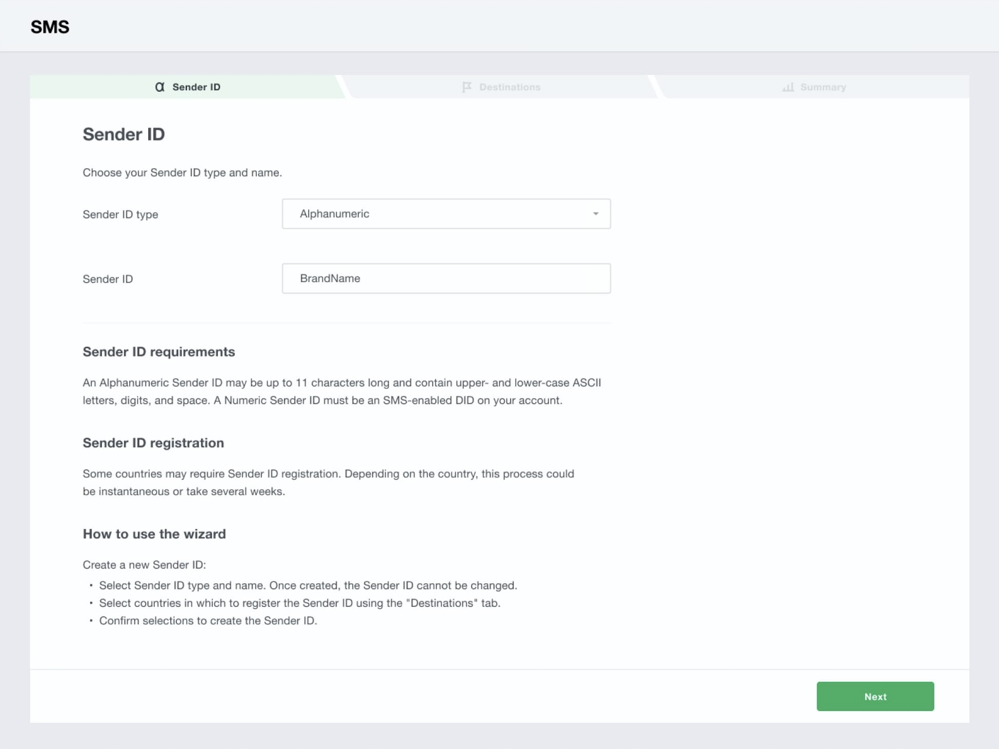

# Wavix SMS Integration

Before proceeding with the next steps, you need to [purchase a DID on the Wavix platform](purchase-a-did-on-wavix-platform.md).

## Register a Sender ID

Before sending an SMS or MMS message, you need to activate a Sender ID on the Wavix platform. A Sender ID is the message sender details recipients will see on their devices. Sender IDs can be either numeric or alphanumeric presenting your brand or service name.


You must use Numeric Sender IDs, if you want to enable 2-way messaging service. For one-way SMS you can use both Numeric and AlphanumericSender IDs.


Assume you have purchased DID phone numbers as per the guide on[Purchase a DID on the Wavix platform](purchase-a-did-on-wavix-platform.md).

The following step [SMS-enable your number](wavix-sms-integration.md#sms-enable-your-number) is mandatory only if you have purchased U.S. or Canadian numbers to send messages using a U.S. or Canadian phone number as the Sender ID.

If you have purchased other countries' phone numbers and wish to use them as the Sender ID, please skip  [SMS-enable your number](wavix-sms-integration.md#sms-enable-your-number) and scroll down to the Create a Sender ID on the Wavix Platform section.

### SMS-enable your number

Inbound SMS can be enabled on US and Canadian phone numbers only. To activate support of inbound SMS and MMS:

1. Select **Numbers & trunks** in the top menu and click **My Numbers**
2. Select a number you want to activate inbound SMS on
3. Click on the down arrow to see additional details
4. Click **Activate** next to **Inbound SMS**

<figure><figcaption></figcaption></figure>


In case of any questions, please raise a ticket in the support tab or email [support@wavix.com](mailto:support@wavix.com)


## Create a Sender ID on the Wavix platform

To create a Sender ID:

1. Select **SMS** in the top menu and click on **Sender IDs**
2. Then click **Add New Sender ID** and select the Sender ID type, i.e. Alphanumeric or Numeric

<figure><figcaption></figcaption></figure>

Alphanumeric Sender ID can be up to 11 characters long and can only include upper- and lower-case letters and the digits from 0 through 9, and space. A numeric Sender ID can be associated with an SMS-enabled number in your account only.


If you have chosen the Numeric Sender ID type, but do not see any of your numbers in the Sender ID drop-down list, make sure the number you are looking for is actually SMS-enabled.


3. Select country(-ies) you will be sending SMS to. Depending on the destination countries, additional restrictions for Sender IDs may apply. Hover over the i icon next to the country name to see the details. If the Sender ID Type you’ve selected is not supported for the destination, the country will be greyed out.


Alphanumeric Sender IDs are not supported in a variety of countries, including the US and Canada, and may require pre-registration by local carriers in some others.


<figure><figcaption></figcaption></figure>

4. Review your Sender ID and the list of destinations. Your Sender ID will be automatically listed in countries that do not require additional paperwork. A member of the Wavix provisioning team will reach out to you with additional information regarding the process of Sender ID registration in countries that do.

## Configure IP Authentication Trunk in PortSIP PBX

The IP Authentication Wavix trunk refers to the **IP Based Trunk** in PortSIP PBX.&#x20;

You must configure the **IP Based Trunk** at the PortSIP PBX system administrator level. Once successfully configured, you can share this trunk with tenants.

Please follow the below steps:

1. Sign in to the PortSIP PBX Web Portal as a System Administrator. Navigate to the left menu and select **Call Manager > Trunks**.&#x20;
2. Click the **Add** button to open a menu. From the menu, choose **IP Based Trunk**.

<figure><figcaption>
Configure Wavix Trunk in PortSIP PBX
</figcaption></figure>

3. Enter the trunk name and choose the brand:
   * **Name**: Enter a friendly name for the trunk.
   * **Brand**: Select one of the Wavix trunks which near your location from the Brand field, such as **Wavix - US**.

<figure><figcaption></figcaption></figure>

4. Click the **Next** button, you can adjust the options for the trunk.
   * &#x20;**Max Concurrent Calls:** This field sets the maximum number of calls that PortSIP can establish with this trunk. You can adjust it to an appropriate value.
   * We recommend keeping the default settings for other options unless you have specific requirements.

<figure><figcaption></figcaption></figure>

5. Click the **Next** button to assign this trunk to the tenants and provide your Wavix DIDs/Numbers to them with the DID Pool (DID numbers).  A DID can be only assigned to one tenant.

A tenant assigned to this trunk can only use the DID numbers within the DID pool range to create inbound and outbound rules and configure the outbound caller ID for extensions.

<figure><figcaption></figcaption></figure>

* DID Pool: The DID pool can consist of a single number, a range of numbers, or a combination of both. For example:
  * `16468097065`
  * `16468097065;16468097066`
  * `16468097065-16468097066;16468097069`&#x20;
  * `16468097065-16468097066;16468097070-16468097080`

Click the **OK** button to save the changes. The trunk configuration is now complete.

In the trunk list, you will see the status displayed as **Registered** (for IP Based Trunk it always displays Registered).

<figure><figcaption></figcaption></figure>

Now you can follow the article to [Configuring inbound and outbound calls](configuring-outbound-and-inbound-calls.md).

