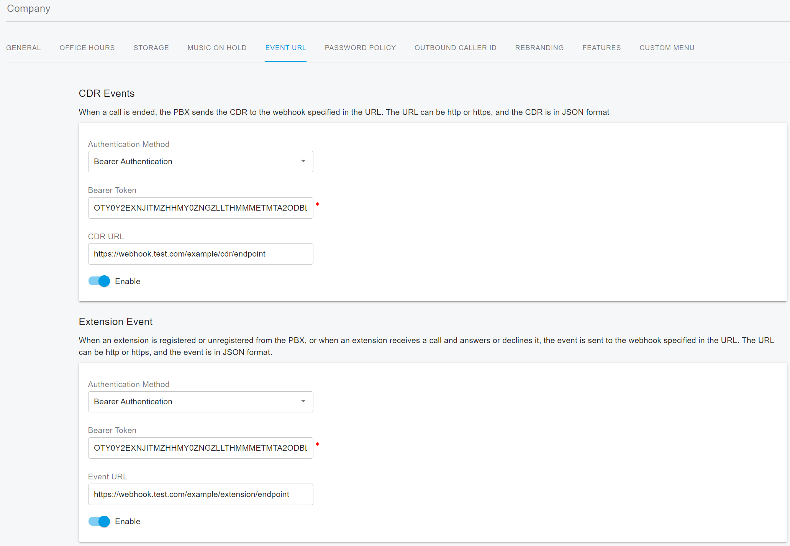

# Registering a Webhook

To register an endpoint to begin receiving webhooks, sign in to the PortSIP PBX Web portal as the tenant administrator, navigate to the menu **Company,** and click the **Event URL** tab.

<figure><figcaption></figcaption></figure>

## CDR Events

The PortSIP PBX sends Call Detail Record (CDR) information to the specified webhook. You can choose from the following authentication methods for the webhook:

* Authentication Method
  * **Disable**: No authentication is required for the PBX request.
  * **Basic Authentication**: The webhook requires Basic Authentication for the PortSIP PBX request. You need to enter the username and password.
  * **Digest Authentication**: The webhook requires Digest Authentication for the PortSIP PBX request. You need to enter the username and password.
  * **Bearer Authentication**: The webhook requires Bearer Authentication for the PortSIP PBX request. You need to enter the bearer token.
* CDR URL: The URL to which events will be posted. This URL must be accessible to PortSIP PBX. We strongly advise to use HTTPS for this endpoint.&#x20;
* Enable: This switch toggles the webhook on and off, allowing you to halt the flow of event notifications temporarily or permanently.

## Extension Events

The PortSIP PBX sends the extension call status, presence status, and online/offline status, the status of queues to the specified webhook. You can choose from the following authentication methods for the webhook:

* Authentication Method
  * **Disable**: No authentication is required for the PBX request.
  * **Basic Authentication**: The webhook requires Basic Authentication for the PortSIP PBX request. You need to enter the username and password.
  * **Digest Authentication**: The webhook requires Digest Authentication for the PortSIP PBX request. You need to enter the username and password.
  * **Bearer Authentication**: The webhook requires Bearer Authentication for the PortSIP PBX request. You need to enter the bearer token.
* CDR URL: The URL to which events will be posted. This URL must be accessible to PortSIP PBX. We strongly advise to use HTTPS for this endpoint.&#x20;
* Enable: This switch toggles the webhook on and off, allowing you to halt the flow of event notifications temporarily or permanently.

