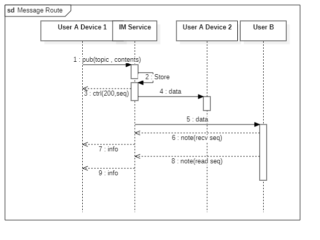

# Protocol

## Overview

The PortSIP Instant Messaging (IM) service facilitates the routing and storage of messages for both peer-to-peer and group communications, utilizing a publish-subscribe model. The core components of this service include sessions, users, and topics.

* **Sessions**: These are WebSocket connections established between client applications and the server.
* **Users**: PBX users (extensions) who connect to the IM service through active sessions.
* **Topics**: Named communication channels that route content between sessions. Both peer-to-peer and group messaging operate within the framework of topics.

Each user and topic within the IM service is assigned a unique identifier for seamless communication and message management.

## Client Behavior

### Connection and Authentication

Clients, such as mobile, desktop apps, or web applications, connect to the IM service via WebSocket to establish a session. All operations require successful client authentication. Clients authenticate their sessions by sending a `{login}` message. Each user can have multiple active sessions, supporting multi-device login.

### Message Exchange

After authentication, users can send and receive messages with other users through various topic types, whether in peer-to-peer (P2P) or group settings.

#### **Topic Types**

* **me**: A special topic used to receive notifications related to other topics. Each user has their own `me` topic.
* **emc**: This topic handles the sending and receiving of external messages, such as SMS and WhatsApp. For instance, if user A's ID is `123456`, they can subscribe to `emc123456` to receive messages when contacts send them SMS/WhatsApp messages to him.
* **P2P**: A direct communication channel between two users. Each user subscribes to the other’s user ID as the topic ID. For example, other users can subscribe to the `usr123456` topic to communicate directly with user A, in case 123456 is the user ID of A.
* **Group**: A communication channel for multiple users. Group topics must be explicitly created by a user.

#### Message Operations

* Users subscribe to topics by sending `{sub}` messages. Once subscribed, they can publish messages to a topic using `{pub}` messages. The server will then push `{data}` messages to all subscribers of that topic.
* Users can query or modify topic information using `{get}` and `{set}` messages.
* When topic information changes (e.g., updates in description, or users joining/leaving), subscribers will receive `{pres}` (presence) messages.

#### Presence

When a user subscribes to their own `me` topic, the server will send a `{pres}` message to all subscribers of that user’s P2P topic, notifying them that the user is online.

### Notes

* **Timestamps**: All timestamps are represented as strings in RFC 3339 format, with millisecond precision, and the timezone set to UTC. For example: `2015-10-06T18:07:29.841Z`.
* **Base64 Encoding**: The service uses Base64 URL encoding without padding, following RFC 4648.
* **Message IDs**: In `{data}` messages, the server-defined message ID (`seq` field) is a decimal number starting from 1, incrementing with each message to ensure uniqueness within each topic.
* **Request-Response Association**: Each message sent by a client to the server must include a unique request ID. The server will return this ID as-is in the response, but it will not interpret or modify it, then client app can easy to match the response with request.

## WebSocket

Clients connect to the server via WebSocket. When establishing the connection, the path is:&#x20;

* `/im`

## Users

In the PortSIP IM service, `users` refer to PBX users (extensions) who act as both producers and consumers of messages.

* **Authentication**: After successfully establishing a WebSocket connection, the client application authenticates the user by sending a `{login}` message.
* **User ID**: Each user is assigned a unique ID, which likes `804252613548703744.`
* **Multiple Sessions**: A user can maintain multiple concurrent session connections with the server, allowing for multi-device support.
* **Logout Behavior**: The IM service does not support explicit logout by design. If the application needs to switch users, it must close the existing WebSocket connection and establish a new connection with the new user's credentials.

## Login

Users initiate a `{login}` message request through an active session, prompting the server to perform authentication.\
Upon processing the login request, the server responds with a `{ctrl}` message. A successful authentication returns a 200 status code, while a failed attempt results in a 4xx error code.

## Access Control

Access control in the PortSIP IM service is managed through Access Control Lists (ACLs), which assign individual permissions to each subscriber within a topic. Access control is primarily applied to group topics, with limited functionality for `me` and P2P topics, such as managing status notifications or restricting P2P conversations.

### Permission Structure

User access to topics is governed by two sets of permissions:

* **Wanted**: The permissions the user requests.
* **Given**: The permissions granted by the topic manager.

Permissions are represented as bits within a bitmap and can either be present or absent. The actual access rights are determined by performing a bitwise AND operation between the _wanted_ and _given_ permissions. These permissions are communicated as a set of ASCII characters, where each character corresponds to specific permission bits:

* **No Access (N)**: Not a permission itself but an explicit indication that no permissions are set. This typically means default permissions should not apply.
* **Join (J)**: Permission to subscribe to the topic.
* **Read (R)**: Permission to receive `{data}` messages (i.e., read messages).
* **Write (W)**: Permission to send `{pub}` messages (i.e., publish messages).
* **Presence (P)**: Permission to receive `{pres}` messages (i.e., status updates).
* **Approve (A)**: Permission to approve requests to join the topic, remove members, or ban users. This permission designates topic administrators.
* **Share (S)**: Permission to invite others to join the topic.
* **Delete (D)**: Permission to hard delete messages. Only the topic owner can fully delete a topic.
* **Owner (O)**: The user is the topic owner, with the ability to assign any other permissions to members, change the topic description, or delete the topic. Each topic can have only one owner, though some topics may have no designated owner.

When users subscribe to a topic or initiate conversations, access permissions are either explicitly set or assigned by default (`defacs`). These permissions can be modified via the `{set}` message.

### Setting Permissions

Clients can define permissions in both `{sub}` and `{set}` messages. If permissions are omitted or set to an empty string (excluding `N!`), the server will apply the previously assigned default permissions (`defacs`). If no default permissions exist, authenticated users in group topics will be granted **JRWPS** access, while those in P2P topics will receive **JRWPA** access.

### **Default Access Permissions**

Default access permissions are configured for a class of users (authenticated users). These defaults are applied as the _given_ permissions for all new subscribers. Default permissions for a topic are set during topic creation via the `{sub.desc.defacs}` field and can be updated by the topic owner through a `{set}` message.

The global default access permissions for all users are **JRWPA**. Users can modify their personal default permissions by sending a `{set}` message to their `me` topic.

## Topics

Topics are communication channels between users (P2P, group, and external message channels such as SMS, WhatsApp).


Clients must actively subscribe to a topic in order to send and receive messages, as well as to receive notifications about any changes in the topic's status.


### Topic Attributes

Topic attributes can be queried using the `{get what="desc"}` message. Common attributes include:

* **created**: Timestamp indicating when the topic was created.
* **updated**: Timestamp of the last update to trusted, public, or private attributes.
* **touched**: String representing the timestamp of the most recent message received.
* **defacs**: String representing the default access mode.
* **auth**: String representing the default access mode for authenticated users.
* **anon**: String representing the default access mode for anonymous users (currently unused).
* **seq**: Numeric value representing the current latest message ID for the topic.
* **trusted**: JSON object representing authentication attributes (currently unused). Readable by anyone, but only administrators can modify it.
* **public**: JSON object representing public attributes. Any user with subscription access can view public data.

#### User-related Attributes

* **acs**: Describes the current access permissions for a given user.
* **want**: The access permissions the user requests.
* **given**: The access permissions granted to the user.
* **private**: The user's private attributes.

Typically, topics have multiple subscribers, and one subscriber can be designated as the topic owner with full access permissions (O access).\
The subscriber list can be queried using the `{get what="sub"}` message, with the list returned in the `sub` section of the `{meta}` message.

### **me Topic**

Each user has a unique `me` topic, which is used for receiving presence status notifications and updates about the status of other subscribed topics.

* The `me` topic has no owner and cannot be deleted or unsubscribed from.
* Users can leave the `me` topic, halting related communications and signaling that the user is offline (though the user may still be logged in and interacting with other topics).
* Joining or leaving the `me` topic triggers `{pres}` status updates, sent to the user and all subscribers with P permissions in P2P topics.
* The `me` topic is read-only, and `{pub}` messages sent to it will be rejected.
* Queries using `{get what="sub"}` on the `me` topic return the list of topics the user is subscribed to, not subscriptions to the `me` topic itself.
* Specific status-related fields for `me` topics include:
  * **recv**: The message ID (seq) that the current user reports as received.
  * **read**: The message ID (seq) that the current user reports as read.
  * **seen**: For P2P subscriptions, reports the timestamp and User Agent of the user's last presence.
  * **when**: The timestamp of the user’s last online status.

Messages sent to `me` using `{get what="data"}` are rejected.

#### Subscribing to the me Topic

After successful client authentication, users must actively subscribe to their `me` topic. Subscriptions are initiated by sending a `{sub}` message, and the server responds with a `{ctrl}` message.

### **emc Topic (External Message Channel)**

The `emc` topic is used for sending and receiving external messages (SMS, MMS). The format for `emc` topics is: `emc[user ID, ring group ID, queue ID]`.

* After login, clients must subscribe to the `emc[current user ID]` topic. If the user is an agent in a queue or ring group (associated with `emc`), they should also subscribe to `emc[ring group ID, queue ID]`.
* When the PBX receives an external message, it notifies the IM service, which determines the target topic and broadcasts the message.
* Users can leave the `emc` topic, which will stop all external message transmission and reception.
* Clients send `{pub}` messages to the `emc` topic, and the server forwards the content to the PBX’s message queue. The message is also synchronized across the user's other sessions (multi-device synchronization).
* All operations within the `emc` topic follow the same behavior as in group topics.

### P2P Topics

P2P topics represent a direct communication channel between two users and do not have a designated owner. Each participant views the other user’s ID as the P2P topic ID. For example, if the two users are `usr804252613548703744` and `usr804252613548777777`, user 1 will see the topic ID as `usr804252613548777777`, while user 2 will see it as `usr804252613548703744`.

* **Public Parameter**: The public parameter in a P2P topic is user-specific. For instance, in a P2P topic between user A and user B, user A’s public data will be visible to user B, and vice versa. When a user updates their public data, all P2P topics involving that user will reflect the update.
* **Private Parameter**: Like other topic types, the private parameter in a P2P topic is defined individually by each participant.

#### Creating a P2P Topic

A P2P topic is automatically created when one user subscribes to another user's ID. The topic ID corresponds to the other user’s ID. For example, user `usr804252613548703744` can create a P2P topic with user `usr804252613548777777` by sending `{sub topic="usr804252613548777777"}`.

* The server responds with a `{ctrl}` message containing the topic ID, as described above.
* The target user will receive a `{pres}` message on their `me` topic, which includes access permissions.
* To engage in the conversation or receive notifications, the other user must actively subscribe to the P2P topic.

#### Subscribing to a P2P Topic

Clients subscribe to a P2P topic by sending the `{sub topic="usr804252613548777777" what="desc data"}` message. The server will respond with a `{ctrl}` message confirming the subscription.

### Group Topics

Group topics are communication channels designed for multiple users. The topic ID format is a string consisting of the fixed prefix `grp` followed by 11 pseudo-random characters.

* **Subscriber Limit**: The number of subscribers is limited and controlled by the `im.max_subscriber_count` configuration in the settings file, with a default limit of 1,000 subscribers.
* **Access Permissions**: Each subscriber’s access permissions in a group topic are managed individually.
* **Ownership**: Ownership of a group topic can be transferred to another user using a `{set}` message. However, there must always be one designated owner of the topic.

#### Creating a Group Topic

A new group topic is created by sending a `{sub}` message with the topic field set to the string `"new"` (any additional characters following `"new"` are ignored, e.g., `new` or `newAbC123` are treated the same).

* The server will respond with a `{ctrl}` message containing the newly generated topic ID. For example, `{sub topic="new"}` might return `{ctrl topic="grpmiKBkQVXnm3P"}`.
* If the topic creation fails, an error message will be reported on the original topic (`new` or `newAbC123`).
* The user who initiates the topic creation automatically becomes the topic owner.

#### Subscribing to a Group Topic

Clients can subscribe to a group topic by sending a `{sub topic="grp***" what="desc sub data"}` message. The server will then respond with a `{ctrl}` message confirming the subscription.

#### Leaving a Group Topic

Clients can leave a group topic by sending a `{leave}` message, or they may be removed by an administrator via a `{del}` message.

## Server-Issued Message IDs

The server assigns message IDs (`seq` field) to support clients in caching `{data}` messages.

* **Retrieving the Latest Message ID**: Clients can request the latest message ID for a topic by sending a `{get what="desc"}` message.
  * If the returned message ID is higher than the last message ID received by the client, the client will recognize that there are unread messages in the topic and can determine their count.
* **Retrieving Unread Messages**: Clients can retrieve unread messages by sending a `{get what="data"}` message.
* **Paginating Through Historical Messages**: Message IDs can also be used by clients to paginate through historical (offline) messages for a topic.

## User Agent and Presence Notifications

When one or more sessions are connected to a user's `me` topic, the user is reported as online through a `{pres}` message.

## Trusted, Public, and Private Attributes

Both topics and subscriptions contain **Trusted**, **Public**, and **Private** fields.

* The server does not validate or enforce these fields; instead, they are managed and interpreted by the client software using a consistent format.

### Trusted (Not Currently Used)

The `trusted` field in topic attributes is optional and formatted as a set of key-value pairs.

### Public

Public attributes:

```js
{
  "fn": "John Doe", // String, topic name
  "photo": {
    "type": "jpeg", // String, MIME type
    "data": "Rt53jUU...iVBORw0KGgoA==", // String, base64 (icon file data) (in message body)
    "ref": "file id", // String, icon file ID (outside message body)
    "width": 512, // Number, icon width
    "height": 512, // Number, icon height
    "size": 123456 // Number, icon file size
  },
  "note": "Some notes" // String, topic description
}
```

### Private (Not Currently Used)

Private attributes are formatted as a set of key-value pairs.

## Messages

All messages are in UTF-8 encoding and formatted as JSON.

* **Request ID**: All client-to-server messages may include an `id` field, referred to as the request ID. This ID is set by the client to track the receipt and processing of messages by the server. The request ID must be a unique string within the session, formatted as a UUID string (e.g., `"00000000-0000-0000-0000-000000000000"`, 36 characters long). When the server replies to the client message, it returns the request ID unchanged.
* **Strict JSON Compliance**: The server requires strictly valid JSON format, including double quotes around field names.
* **Clearing Fields**: To update fields such as `private` or `public` in `{set}` messages, use a string containing a single Unicode DEL character `"␡"` (`\u2421`) to clear data. Sending `"public": null` will not clear the field, but sending `"public": "␡"` will.
* **Unrecognized Fields**: Any unrecognized fields in the message will be silently ignored by the server.

### Content Format

The `content` field in `{pub}` and `{data}` messages support the following formats:

* **Plain text**

All messages can be sent as plain text. If you need to include formatting information for rich text, you can describe the formats using JSON, HTML, or XML, based on your preference. The specific format should be negotiated between the communicating applications. The receiving application is responsible for parsing the format information and then displaying the message as either rich text or plain text.

### Message Storage

The server stores the content of `{pub}` messages, including both the `head` and `content` fields.

### Message Routing

After receiving and storing a `{pub}` message, the server distributes it to all other active sessions within the topic via `{data}` messages, ensuring message distribution and multi-device synchronization.

The specific process is as follows:

1. **Receive and Store**: The server receives the `{pub}` message and stores the `head` and `content` fields.
2. **Message Distribution**: The server identifies all active sessions subscribed to the topic.
3. **Multi-Device Synchronization**: The server sends `{data}` messages to all relevant sessions, ensuring that users receive the message across multiple devices if they have more than one session active.
4. **Notification**: Depending on access permissions and topic settings, users may also receive additional notifications such as presence updates.

<figure><figcaption></figcaption></figure>

