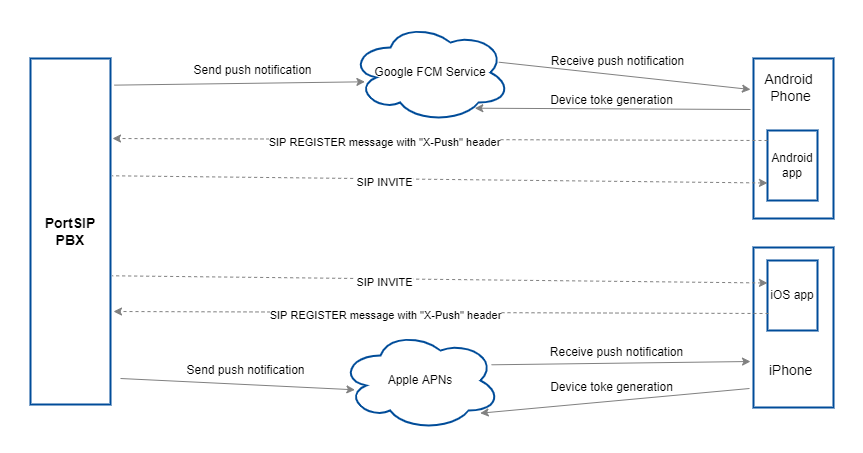

# How Do Push Notifications Work with PortSIP PBX?

### Understanding Push Notifications in VoIP Apps

A **Voice over Internet Protocol (VoIP)** app enables users to make and receive calls via the internet, bypassing traditional cellular services. However, maintaining a **persistent network connection** to receive incoming calls and data can lead to **high power consumption**. This is because the app constantly sends periodic messages to keep the connection alive, even when the app is not actively being used. This process causes frequent device wake-ups, which wastes energy, and can prevent the app from receiving calls when not running.

***

### The Power of Push Notifications for VoIP Apps

With **push notifications**, VoIP apps no longer need to remain active in the foreground or background to receive calls. When a call arrives, the server sends a push notification to the device, waking it up only when necessary. The user then receives an alert, providing them with an option to accept or reject the call.

#### Key Advantages of Push Notifications for VoIP Apps:

* **Energy Efficiency**: Push notifications wake the device only when necessary, conserving battery life.
* **High Priority**: VoIP push notifications are treated as high-priority and are delivered without delay.
* **Extended Data**: VoIP push notifications can carry more data than regular push notifications, making them more efficient for call management.
* **Automatic Relaunch**: If the app is not running, it will automatically relaunch when a VoIP push notification is received.
* **Background Processing**: Your app can process the push message, even if it’s operating in the background or has been forced out of memory.

***

### PortSIP PBX Push Notification Support

PortSIP PBX supports **mobile push notifications** for both **iOS** and **Android** from version **V9.0**. This feature ensures that all **PortSIP users** can benefit from efficient, timely, and reliable notifications for incoming VoIP calls, enhancing both user experience and energy efficiency.

***

### The Architecture of PortSIP PBX Push Notifications

The architecture below illustrates how **PortSIP PBX** delivers **push notifications** for incoming calls and messages when a mobile app is not running.

PortSIP PBX integrates with platform-native push services to ensure reliable call delivery while minimizing battery consumption on mobile devices.

***

### Call Flow for Sending Push Notifications

PortSIP PBX uses:

* **Apple Push Notification Service (APNs)** for iOS devices
* **Firebase Cloud Messaging (FCM)** for Android devices

The following sequence describes the end-to-end call flow for push notifications.

<figure><figcaption></figcaption></figure>

***

#### 1. Requesting a Device Token

When the mobile app is installed and launched for the first time, it requests a **device token** from:

* APNs (iOS)
* Google FCM (Android)

This token uniquely identifies the device and application instance.

***

#### 2. Receiving the Device Token

The push service returns a **device token** to the app.\
This token acts as the destination address for sending push notifications to the device.

***

#### 3. Registering with PortSIP PBX

The app registers with **PortSIP PBX** using a standard **SIP REGISTER** request.

To enable push notifications, the REGISTER request **must include an `X-Push` header**, which provides:

* Device platform (iOS / Android)
* Device token
* Application identifier
* Push notification preferences

This informs PortSIP PBX that the extension (for example, **extension 101**) supports push notifications.

***

#### 4. App Termination

The user **force-terminates** the app (swipes it away or the OS kills it).\
At this point:

* The app is no longer running
* It cannot receive SIP signaling directly

***

#### 5. Incoming Call

A caller dials **extension 101**.

If the SIP registration for extension 101 has not expired:

* PortSIP PBX attempts to send a SIP **INVITE** to the registered contact
* Since the app is terminated, the INVITE cannot be delivered

PortSIP PBX then triggers a **push notification** using the stored device token.

***

#### 6. Push Notification Delivery

APNs or FCM delivers the push notification to the user’s device.

The device:

* Wakes up
* Displays an incoming call alert to the user

***

#### 7. User Accepts the Call

When the user accepts the call:

* The operating system launches the VoIP app automatically
* The app performs a new SIP REGISTER to PortSIP PBX

***

#### 8. Call Establishment

After successful registration:

* PortSIP PBX sends a new SIP **INVITE** to the app’s updated contact address
* The app receives the INVITE and answers the call
* Media negotiation begins and the call is established

***

#### 9. Instant Messaging

The same push notification mechanism applies to **Instant Messaging (IM)**:

* Messages are delivered via push when the app is not running
* The app is launched to process and display the message

***

### Example `X-Push` Header in SIP REGISTER

Below is an example of the `X-Push` header included in a SIP REGISTER request:

```
X-Push:
device-os=ios;
device-uid=fe1b7bef1b4dc68dbfcd18143c8c06c122a25658c7f1d381c33fa626c9ed;
allow-call-push=false;
allow-message-push=false;
app-id=com.portsip.portsip-one
```


