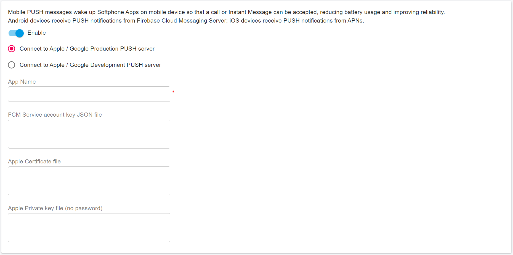

# Integrating the Push Notifications in Android APP

This guide provides step-by-step instructions on how to create an Android app using the PortSIP VoIP SDK to receive VoIP push notifications sent from PortSIP PBX.

## 1. VoIP Notifications

The official documentation can be found here. Some of the advantages include:

* The app is automatically relaunched if it’s not running when a VoIP push is received.
* The device is woken up only when a VoIP push occurs, saving battery life.
* VoIP pushes go straight to your app for processing and are delivered without delay.

## 2. Prerequisite Settings

Since PortSIP PBX uses Google Firebase to send push notifications, we need to configure some settings to get this working.

## 3. Creating an App ID

1. Add a new project to the Firebase console.
2. Set the project name and country. For example, you can name your project `SIPSample`.


3. Select the SIPSample Project


4. Select “Project settings”


5. Select “Android platform”


6. Set a package name for your app. I only set my package name and omit the SHA-1 because I do not use Firebase for my app's authentication.


5. Click the **REGISTER APP** button to download `google-services.json`. This is an important file, and you will need to place it into your app.


Please note that the Android package name is also referred to as the **App ID**. We will use it in future settings.


## 4. Adding `google-services.json` to Your App Folder

1. **Download the PortSIP VoIP SDK Sample Project**: Obtain the sample project and open the `PUSH SIPSample` project using Android Studio.
2. **Replace the `google-services.json` File**: Navigate to the `SIPSample` folder and replace the existing `google-services.json` file with the one you just downloaded.
3. **Load the Google Services Plugin**: The Google services plugin for Gradle will automatically load the new `google-services.json` file.


## 5. Configuring Gradle Files

1. **Open Android Studio**: Launch Android Studio and navigate to your project.
2. **Modify the `build.gradle` Files**: Update your Gradle files to integrate the Google services plugin.
   * **Update the Project-Level `build.gradle`**: Open the `build.gradle` file located in your project folder and add the following line:

```
buildscript {
dependencies {
classpath 'com.google.gms:google-services:3.1.0' // Add this line
}
}
```


* **Update the App-Level `build.gradle`**: Open the `build.gradle` file located in your `project/SIPSample` folder and add the below line at the end of the file.

```
apply plugin: 'com.google.gms.google-services'
```

* **Add Firebase Dependencies**: Include the necessary Firebase dependencies under the `dependencies` section in the same `build.gradle` file.

```
dependencies {
// this line must be included to integrate with Firebase
compile 'com.google.firebase:firebase-core:20.0.0'
// this line must be included to use FCM
compile 'com.google.firebase:firebase-messaging:20.0.0'
}
```

* **Update Google Play Services**: If your project uses any functions from `com.google.android.gms:play-services` (e.g., GPS location), you need to update their versions as well. As of writing this tutorial, version `20.0.0` works well. If you encounter compilation problems, check for the correct version number.

> _compile 'com.google.android.gms:play-services-auth:20.0.0'_\
> &#xNAN;_&#x63;ompile 'com.google.android.gms:play-services-identity:20.0.0'_

* &#x20;**Add `applicationId` to `defaultConfig` Section**: In the `defaultConfig` section of your `build.gradle` file, add the `applicationId`:

```
android {
defaultConfig {
applicationId "com.portsip.SIPSample" // this is the id that your app has
} }
```


## 6. Adding Services to Your App

To use Firebase Cloud Messaging (FCM) in your app, you need to add two services: one for testing if push notifications work, and another for receiving or sending messages according to your app’s design.

1. **Add a Service that Extends `FirebaseMessagingService`**: To receive notifications in your app, create a service that extends `FirebaseMessagingService`. Here’s an example:

```
public class MyFirebaseMessagingService extends FirebaseMessagingService {
	private static final String TAG = "FCM Service";
	@Override
	public void onMessageReceived(RemoteMessage remoteMessage) {
		// TODO: Handle FCM messages here.
		// If the application is in the foreground handle both data and notification messages here.
		// Also if you intend on generating your own notifications as a result of a received FCM
		// message, here is where that should be initiated.
		Map<String, String> data = remoteMessage.getData();
		String type=data.get("msg_type")//”audio” ”video” ”im”
		String content = data.get("msg_content");
		String from = data.get("send_from");
		String to = data.get("send_to");
		String xpushid = data.get("x-push-id");
		//new version (Portsip pbx>12.0)
		String mimeType = data.get("mime_type");
	}
	@Override
	public void onNewToken(String s) {
		sendRegistrationToServer(s);
	}
	private void sendRegistrationToServer(String token) {
		Intent intent = new Intent(this,MyService.class);
		intent.setAction(MyService.ACTION_TOKENREFRESH );
		intent.putExtra(MyService.DEVICE_TOKEN,token);
		startService(intent);
	}
}
```

* **Add the Service to `AndroidManifest.xml`**: To ensure your service is recognized by the system, add it to your `AndroidManifest.xml` file:

```
<service android:name=".MyFirebaseMessagingService">
<intent-filter>
<action android:name="com.google.firebase.MESSAGING_EVENT"/>
</intent-filter>
</service>
```

## 7. Testing and Sending Your First Push Notification

To verify that your setup works, follow these steps to send a test message to your mobile device:

1. Install and run the app on the target device. 

2. Make sure the app is in the background on the device.

3. In the Firebase console, open the Messaging page.

4. If this is your first message, select Create your first campaign.

   a. Select Firebase Notification messages and select Create.
5. Otherwise, on the Campaigns tab, select New campaign and then Notifications.

6. Enter the message text. All other fields are optional.

7. Select Send test message from the right pane.

8. In the field labeled Add an FCM registration token, enter the registration token you obtained in a previous section of this guide.

9. Select Test.

After you select Test, you should receive a push notification on your Android mobile. If your app is running in the background, you will see it in the mobile’s notification center. Otherwise, you can see it in your Android Monitor log (ensure you have code to log incoming messages) like this:

```
Log.d(TAG, "Notification Message Body: " + remoteMessage.getNotification().getBody());
```

If the setup is successful, you should get a notification on your mobile. Sometimes, it may take a couple of minutes for the message to be sent and received, so just be patient and wait for a little while.

## 8. Adding SIP Header `X-Push` to REGISTER Message

To inform PortSIP PBX that this client has enabled push notifications, you need to add the SIP header `X-Push` to the **REGISTER** message. Here’s an example of how to do this:

```
import android.app.Service;
import android.content.Intent;
import android.text.TextUtils;
import android.util.Log;
import com.google.android.gms.tasks.OnCompleteListener;
import com.google.android.gms.tasks.Task;
import com.google.firebase.iid.FirebaseInstanceId;
import com.google.firebase.iid.InstanceIdResult;
import com.portsip.PortSipSdk;
import androidx.annotation.NonNull;
public class MyService extends Service implements OnPortSIPEvent
{
	String pushToken = null ;
	public static final String ACTION_TOKENREFRESH = "token_refresh";
	public static final String DEVICE_TOKEN = "deviceToken";
	public PortSipSdk mSipSdk;
	String appid=”com.portsip.SIPSample”;
	//you app id
	@Override
	public void onCreate() {
		...
		//get device token
		try {
			//
			FirebaseInstanceId.getInstance().getInstanceId()
			.addOnCompleteListener(new OnCompleteListener<InstanceIdResult>() {
				@Override
				public void onComplete(@NonNull Task<InstanceIdResult> task) {
					if (!task.isSuccessful()) {
						return;
					}
					pushToken =task.getResult().getToken();
				}
			}
			);
		}
		catch (IllegalStateException e){
			Log.d("",e.toString());
		}
	}
	@Override
	public int onStartCommand(Intent intent, int flags, int startId) {
		if (intent != null && ACTION_TOKENREFRESH.equals(intent.getAction())) {
			pushToken = intent.getStringExtra(DEVICE_TOKEN);
			Boolean supportPush = true;
			setPushHeader(supportPush);
		}
		return START_REDELIVER_INTENT;
	}
	/**
* @param support true enable Push, false disable Push.
*/
	private void setPushHeader(Boolean support){
		if(TextUtils.isEmpty(pushToken )){
			String pushMessage = "device-os=android;device-uid=" + pushToken +";allow-call-push=”+support+”;allow-message-push=”+support+”;app-id=”+appid;
mSipSdk.addSipMessageHeader(-1,"REGISTER",1,"X-Push",pushMessage);
if(sdk is online){
mSipSdk.refreshRegistration(0);
}
}
}
}
```

## 9. Possible Problems

* **Compilation Issues**: Compilation problems can often be related to incorrect version numbers in your `build.gradle` files. Ensure that all dependencies are using compatible versions.
* **Firebase Crash Analytics Warning**: If you see a message like "com.google.firebase.crash.FirebaseCrash is not linked. Skipping initialization." in your Android Monitor log, it is okay. This message appears because we are not using the Firebase Crash Analytics service.
* [Firebase initialization is not starting](http://stackoverflow.com/questions/37724761/android-firebaseapp-firebase-initialization-is-not-starting)

## 10. Getting Server Key and Sender ID

1. **Access Project Settings**: In the Firebase console, click the **Settings** button and choose the **Project Settings** -> **Cloud Messaging** -> **Mange Service Accounts**.


2. **Srvice Accounts**: click the **Manage keys**. 


3. **Create new key**


Choose Key type “JSON”, and click “CREATE”, you will get a JSON file, e.g: sipsample-c3789-c6a094e0e0e2.json 


## 11. Configuring PortSIP PBX

1. **Sign In**: Log in to the PortSIP PBX Web Portal.
2. **Navigate to Mobile PUSH Settings**: Select the menu **Settings > Mobile push notifications**.
3. **Add a New App**: Click the **Add New App** button. You will see the following screen:

<figure><figcaption></figcaption></figure>

Please set the following items:

* **Enabled**: Check this option to enable push notifications. Uncheck it to disable PUSH notifications.
* **Server Type**: Apple and Google both provide a production PUSH server and a development PUSH server for sending PUSH notifications. The development server is usually used during the development stage. Once your app is released, you can change this setting to the production server.
* **App ID**: Enter the App ID that you created in step 3. Note: This ID is case-sensitive.
* **Google Server Key and Google Sender ID**: Enter the key and ID that you noted in step 10.2.

Click the **Apply** button to enable the push service in PortSIP PBX.

