# Integrating the Push Notifications in Native iOS APP

This guide provides step-by-step instructions on creating a native iOS app using the PortSIP VoIP SDK, enabling it to receive VoIP push notifications from PortSIP PBX.

This manual supports the new [PushKit push notification policy](https://developer.apple.com/documentation/pushkit/pkpushregistrydelegate/2875784-pushregistry?language=objc) introduced in iOS 13 and Xcode 11.

For iOS 13.0 and later, if you fail to report a call to CallKit, the system will terminate your app. Repeatedly failing to report calls may cause the system to stop delivering any more VoIP push notifications to your app. If you want to initiate a VoIP call without using CallKit, register for push notifications using the UserNotifications framework instead of PushKit.


PortSIP PBX uses VoIP PUSH for VoIP calls and APNs PUSH for IM messages.


***

### **1. VoIP Notifications**

The official documentation can be found here. Some of the advantages are:

* The device is woken up only when VoIP pushes occur, which saves energy.
* Unlike standard push notifications, which require user interaction before your app can perform an action, VoIP pushes go straight to your app for processing.
* VoIP pushes are considered high-priority notifications and are delivered without delay.
* VoIP pushes can include more data than standard push notifications.
* Your app is automatically relaunched if it’s not running when a VoIP push is received.
* Your app is given runtime to process a push, even if it is operating in the background.

***

### **2. Prerequisite Settings**

Apple provides a framework called PushKit to support the VoIP push feature. However, additional settings need to be configured to get this working.

***

### **3. Creating an App ID**

If you don’t have an app (and consequently an App ID), you need to create one. First, log in to your  [Apple developer account](https://developer.apple.com/account/) and access **Certificates, Identifiers & Profiles**:

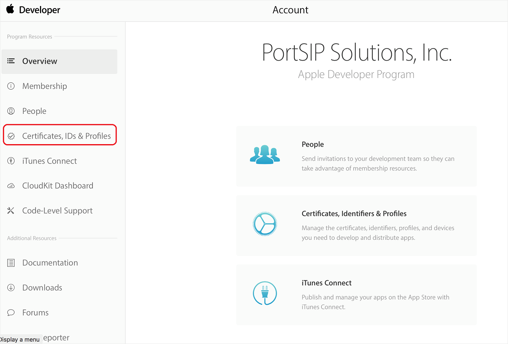

Next, go to **Identifiers** and click on the **+** button.

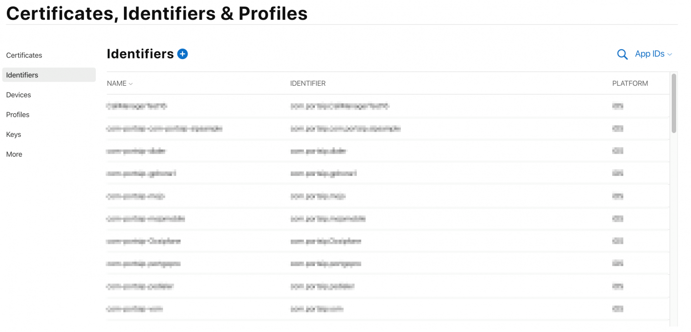

Two important fields to fill out here are:

* **App ID Description**: A brief description of your app.
* **Bundle ID**: This will most likely be something like `com.yourdomain.yourappname`.

.png>)

Select **Push Notifications:**


Although not shown in the screenshots above, I used `com.portsip.portsipvoipdemo` as the Bundle ID. This will be important in the next step.

***

### **4. Generating a VoIP Push Certificate for VoIP Calls**

Click on the **All** button in the Certificates section on the left-hand side, then click the **+** button:

.png>)

On the next page, you need to select the **VoIP Services Certificate**:

.png>)

After this, you need to select the **App ID** for which you’re creating this VoIP certificate:

.png>)

Next, you’ll be presented with instructions to choose a **CSR (Certificate Signing Request) file**:

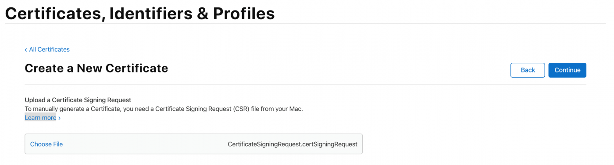

Once the file is created, you’ll select it for upload on the next screen. If everything goes well, you’ll be given the certificate, which you need to download:

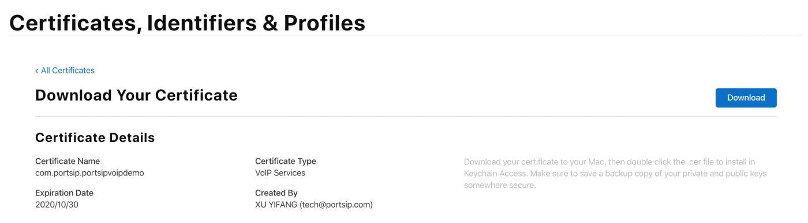

After downloading the certificate, open it. This should launch the Keychain Access application. You should now see the certificate under the **My Certificates** section.

***

### **5. Generating an APNs Push Certificate for Instant Messaging**

Click on the **All** button in the Certificates section of the left navigation tree, then click the **+** button:

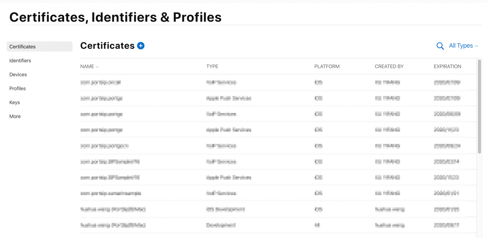

On the next page, you need to select the **Apple Push Notification service SSL (Sandbox & Production)**:

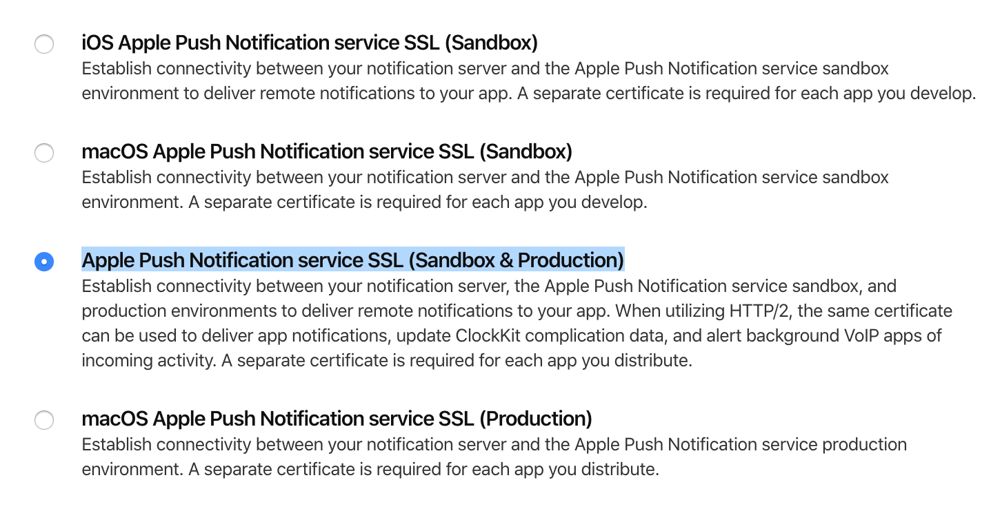

After this, you need to select the **App ID** for which you’re creating this Apple Push Notification certificate:

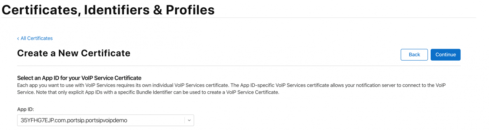

Next, you’ll be presented with instructions to choose CSR (Certificate Signing Request) file:


Once the file is created, you’ll select it for upload on the next screen. If everything goes well, you’ll be given the certificate, which you need to download.

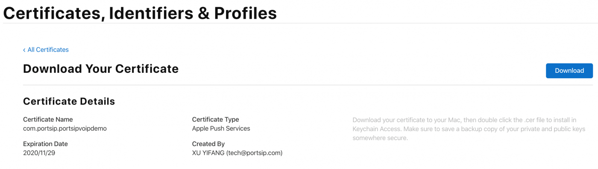

After you download the certificate, open it. This should launch the Keychain Access application. You should now see the certificate under the **My Certificates** section.

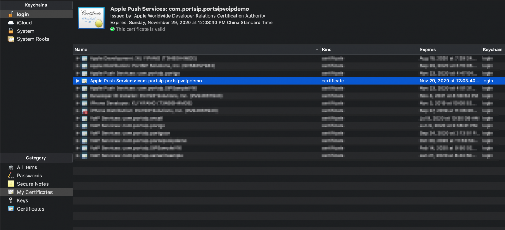

***

### **6. Adding PUSH Support to the Project**

The push notification feature has been implemented in our latest SIPSample, which you can download from our latest SIPSample.

Take special care when setting the **Product Name** as the **Bundle Identifier** is set automatically from it. Ensure that this matches the Bundle Identifier set in the previous steps.


***

### **7. Setting the Appropriate Capabilities**

On the project’s **Signing & Capabilities** tab, add **Push Notifications** and **Background Modes**. Ensure that the **Audio, AirPlay, and Picture in Picture**, **Voice over IP**, and **Remote notifications** options are enabled.

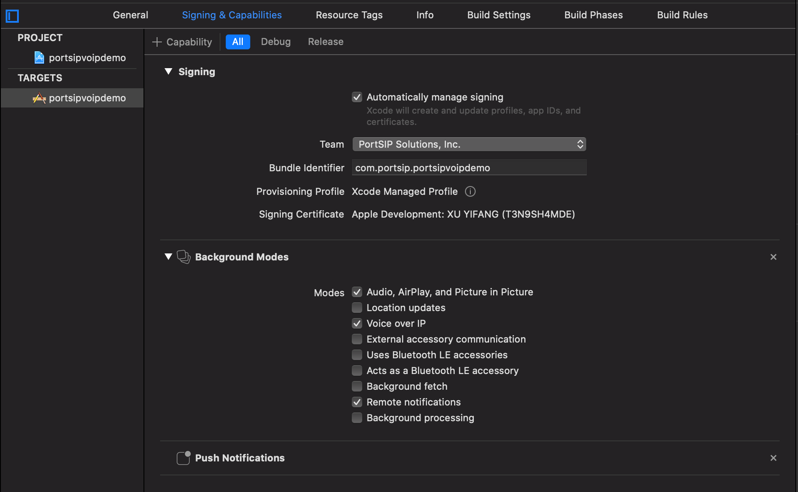

***

### **8. Adding the Code**

Open `AppDelegate.m` and add the `import PushKit` and `import UserNotifications` statements at the top of the file.

> _#import \<PushKit/PushKit.h>_\
> &#xNAN;_#import \<UserNotifications/UserNotifications.h>_\
> &#xNAN;_@interfaceAppDelegate()PKPushRegistryDelegate,UNUserNotificationCenterDelegate>_\
> &#xNAN;_@end_

Next, in the `didFinishLaunchingWithOptions` part of the application function, make sure you register for notifications like this:

```
-(BOOL) application: (UIApplication * ) application didFinishLaunchingWithOptions: (NSDictionary * ) launchOptions
{
    // Register VoIP PUSH
    PKPushRegistry * pushRegistry = [[PKPushRegistry alloc] initWithQueue: nil];
    pushRegistry.delegate = self;
    pushRegistry.desiredPushTypes = [NSSet setWithObject: PKPushTypeVoIP];
    // Register APNs PUSH
    if ([[[UIDevice currentDevice] systemVersion] floatValue] >= 10.0)
    {
        // iOS > 10
        UNUserNotificationCenter * center = [UNUserNotificationCenter currentNotificationCenter];
        center.delegate = self;
        [center requestAuthorizationWithOptions: (UNAuthorizationOptionBadge |
                UNAuthorizationOptionSound |
                UNAuthorizationOptionAlert)
completionHandler: ^ (BOOL granted
                , NSError * _Nullable error)
            {
                if (!error)
                {
                    NSLog(@ "request User Notification succeeded!");
                }
}];
    }
    else
    { // iOS 8-10
        if ([UIApplication instancesRespondToSelector:
@selector(registerUserNotificationSettings: )])
        {
            [[UIApplication sharedApplication] registerUserNotificationSettings: [UIUserNotificationSettings
settingsForTypes: UIUserNotificationTypeAlert |
UIUserNotificationTypeBadge |
UIUserNotificationTypeSound
categories: nil]];
        }
    }
    // Calling this will result in either
    // application:didRegisterForRemoteNotificationsWithDeviceToken: or
    // application:didFailToRegisterForRemoteNotificationsWithError: to be called
    // on the application delegate.[application registerForRemoteNotifications];
    return YES;
}

```

At this point, you will get an error on the `pushRegistry.delegate = self;` line saying “Cannot assign a value of type ‘AppDelegate’ to type ‘PKPushRegistryDelegate!’”.

The delegate for `pushRegistry` is of type `PKPushRegistryDelegate`, which has three methods, two of which are required (`didUpdatePushCredentials` and `didReceiveIncomingPushWithPayload`). We need to define an extension of the `AppDelegate` class. We do that by adding the following code after all the current code in the `AppDelegate.m` file:

```
APNs methods:
#pragma mark - APNs message PUSH
-(NSString * ) stringFromDeviceToken: (NSData * ) deviceToken
    {
        if ([[[UIDevice currentDevice] systemVersion] floatValue] >= 13.0)
        {
            NSUInteger length = deviceToken.length;
            if (length == 0)
            {
                return nil;
            }
            const unsigned char * buffer = deviceToken.bytes;
            NSMutableString * hexString = [NSMutableString stringWithCapacity: (length * 2)];
            for (int i = 0; i < length; ++i)
            {
                [hexString appendFormat: @ "%02x", buffer[i]];
            }
            return [hexString copy];
        }
        else
        {
            NSString * token = [NSString stringWithFormat: @ "%@", deviceToken];
            token = [token stringByTrimmingCharactersInSet: [NSCharacterSet characterSetWithCharactersInString: @ "<>"]];
            return [token stringByReplacingOccurrencesOfString: @ " "
                withString: @ ""];
        }
    } -
    (void) application: (UIApplication * ) application
didRegisterForRemoteNotificationsWithDeviceToken: (NSData * ) deviceToken
    {
        _APNsPushToken = [self stringFromDeviceToken: deviceToken];
        NSLog(@ "_APNsPushToken :%@", deviceToken);
        [self refreshPushStatusToSipServer: YES];
    }
    // 8.0 < iOS version < 10.0
    -
    (void) application: (UIApplication * ) application
didReceiveRemoteNotification: (NSDictionary * ) userInfo
fetchCompletionHandler:
    (void( ^ )(UIBackgroundFetchResult)) completionHandler
    {
        NSLog(@ "didReceiveRemoteNotification %@", userInfo);
        completionHandler(UIBackgroundFetchResultNewData);
    }
    // iOS version > 10.0 Background
    -
    (void) userNotificationCenter: (UNUserNotificationCenter * ) center
didReceiveNotificationResponse: (nonnull UNNotificationResponse * ) response
withCompletionHandler: (nonnull void( ^ )(void)) completionHandler
    {
        NSDictionary * userInfo = response.notification.request.content.userInfo;
        NSLog(@ "Background Notification:%@", userInfo);
        completionHandler();
    }
    // iOS version > 10.0 foreground
    -
    (void) userNotificationCenter: (UNUserNotificationCenter * ) center
willPresentNotification: (UNNotification * ) notification
withCompletionHandler:
    (void( ^ )(UNNotificationPresentationOptions)) completionHandler
    {
        NSDictionary * userInfo = notification.request.content.userInfo;
        NSLog(@ "Foreground Notification:%@", userInfo);
        completionHandler(UNNotificationPresentationOptionBadge);
    }
VoIP PUSH methods:
    -(void) pushRegistry: (PKPushRegistry * ) registry
didUpdatePushCredentials: (PKPushCredentials * ) credentials
forType: (PKPushType) type
    {
        _VoIPPushToken = [self stringFromDeviceToken: credentials.token];
        NSLog(@ "didUpdatePushCredentials:%@", _VoIPPushToken);
        [self refreshPushStatusToSipServer: YES];
    }
    // iOS version > 11.0
    -
    (void) pushRegistry: (PKPushRegistry * ) registry
didReceiveIncomingPushWithPayload: (PKPushPayload * ) payload
forType: (PKPushType) type
withCompletionHandler: (void( ^ )(void)) completion
    {
[self processPushMessageFromPortPBX: payload.dictionaryPayload
withCompletionHandler: completion];
    }
    // 8.0 < iOS version < 11.0
    -
    (void) pushRegistry: (PKPushRegistry * ) registry
didReceiveIncomingPushWithPayload: (PKPushPayload * ) payload
forType: (PKPushType) type
{
    [self processPushMessageFromPortPBX: payload.dictionaryPayload
withCompletionHandler: nil];
};

```

After adding this extension, you will notice that the previously mentioned error disappears.

In the first function, we merely output the device token. We will need this token in the next section when we test our app with sending VoIP push notifications.

In the second function, we ‘act’ on the received VoIP push notification. On iOS 13.0 and later, we must report a call to CallKit.

The third function, `didInvalidatePushTokenForType`is used for handling when the token is invalidated.

We need to notify PortPBX that this client has enabled PUSH by adding the SIP header **X-Push** to the REGISTER message.

```
-(void) addPushSupportWithPortPBX: (BOOL) enablePush
{
    if (_VoIPPushToken == nil || _APNsPushToken == nil ||
        !_enablePushNotification)
        return;
    // This VoIP Push is only work with
    // PortPBX(https://www.portsip.com/portsip-pbx/)
    // if you want work with other PBX, please contact your PBX Provider
    NSString * bundleIdentifier = [[NSBundle mainBundle] bundleIdentifier];
    [portSIPSDK clearAddedSipMessageHeaders];
    NSString * pushMessage;
    NSString * token = [[NSString alloc] initWithFormat: @ "%@|%@", _VoIPPushToken, _APNsPushToken];
    if (enablePush)
    {
        pushMessage = [[NSString alloc] initWithFormat: @ "device-os=ios;device-uid=%@;allow-call-push=true;"
@ "allow-message-push=true;app-id=%@"
, token, bundleIdentifier];
        NSLog(@ "Enable pushMessage:{%@}", pushMessage);
    }
    else
    {
        pushMessage = [[NSString alloc] initWithFormat: @ "device-os=ios;device-uid=%@;allow-call-push=false;"
@ "allow-message-push=false;app-id=%@"
, token, bundleIdentifier];
        NSLog(@ "Disable pushMessage:{%@}", pushMessage);
    } [portSIPSDK addSipMessageHeader: -1
methodName: @ "REGISTER"
msgType: 1
headerName: @ "X-Push"
headerValue: pushMessage];
}

```

When the app receives a PUSH notification or is running, it should automatically register to the server:

```
-(void) doAutoRegister
{
    if ([_textUsername.text length] > 1 && [_textPassword.text length] > 1 && [_textSIPserver.text length] > 1 && [_textSIPPort.text length] > 1 && [_textToken.text length] > 1)
    {
[self onLine];
    }
}

```

***

### **9. Preparing the Certificate Files**

The VoIP certificate file that we’ve downloaded and added to the KeyChain needs to be converted to a different file format so that we can use it with the tools and services listed above.

First, open the KeyChain app on your Mac and export the VoIP Services certificate (right-click and select **Export**):


You will get a `YOUR_CERT.p12` (e.g., `voip_push.p12`) file. Now, export the Apple Push Services certificate file.

Navigate to the folder where you have exported this file and execute the following command to create a Push Credential with your VoIP Service Certificate:

```
$> openssl pkcs12 -in voip_push.p12 -nocerts -out voip_push_key.pem
Enter Import Password: (Enter the password when you export form Keychain)
MAC verified OK
Enter PEM pass phrase: (Must Enter the password, e.g:1234)
Verifying - Enter PEM pass phrase: (Must Enter the above password, e.g:1234)
$> openssl rsa -in voip_push_key.pem -out voip_push_key_nopws.pem
Enter pass phrase for voip_push_key.pem: (Must Enter the above password, e.g:1234)
$> openssl pkcs12 -in voip_push.p12 -clcerts -nokeys -out voip_push.pem
```

Creating a Push credential with your Apple Push Service Certificate:

```
$> openssl pkcs12 -in apns_push.p12 -nocerts -out apns_push_key.pem
Enter Import Password: (Enter the password when you export form Keychain, empty is allowed)
MAC verified OK
Enter PEM pass phrase: (Must Enter the password, e.g:1234)
Verifying - Enter PEM pass phrase: (Must Enter the above password, e.g:1234)
$> openssl rsa -in apns_push_key.pem -out apns_push_key_nopws.pem
Enter pass phrase for apns_push_key.pem: (Must Enter the above password, e.g:1234)
$> openssl pkcs12 -in apns_push.p12 -clcerts -nokeys -out apns_push.pem
```

```
$> openssl pkcs12 -in apns_push.p12 -nocerts -out apns_push_key.pem
Enter Import Password: (Enter the password when you export form Keychain, empty is allowed)
MAC verified OK
Enter PEM pass phrase: (Must Enter the password, e.g:1234)
Verifying - Enter PEM pass phrase: (Must Enter the above password, e.g:1234)
$> openssl rsa -in apns_push_key.pem -out apns_push_key_nopws.pem
Enter pass phrase for apns_push_key.pem: (Must Enter the above password, e.g:1234)
$> openssl pkcs12 -in apns_push.p12 -clcerts -nokeys -out apns_push.pem
```

We need to merge two Push Credentials to one file:

```
$> cat voip_push.pem apns_push.pem > portpbx_push.pem
$> cat voip_push_key_nopws.pem apns_push_key_nopws.pem > portpbx_push_key.pem
```

This process will generate `portpbx_push.pem` and `portpbx_push_key.pem` files, which we will use in the PortSIP PBX.

***

### **10. Houston**

Houston allows us to send PUSH notifications for testing from the terminal window. The VoIP certificate file that we’ve downloaded and added to the KeyChain needs to be converted to a different file format so that we can use it with the tools and services mentioned above.

Although the documentation suggests installing it with `gem install houston`, you will most likely end up using this command after some StackOverflow searching:

```
sudo gem install -n /usr/local/bin houston
```

This way you’ll install it to your local bin directory to which you have full rights.\
Houston installed one more tool that will help us send the notifications like this:\
With Terminal navigate to the folder where you have your certificate:

This way, you’ll install it to your local bin directory, where you have full rights.

Houston also installs an additional tool that helps us send notifications. To use it, follow these steps:

Open Terminal and navigate to the folder where you have your certificate:

#### **Testing VoIP push notifications**

```
$> openssl pkcs12 -in voip_push.p12 -out voippush_onlyone.pem -nodes -clcerts
```

Copy the device token from the `APP didUpdatePushCredentials` method and execute the following command:

```
apn push "<40cc4209 d0f3ac25 95a7e937 3282897b 211231ef ba66764c 6fd2befa b42076cb>" -c voippush_onlyone.pem -m "Testing VoIP notifications!"
```

You should see the following output in your terminal:

> _1 push notification sent successfully_

And, you should see a push message for `APP didReceiveIncomingPushWithPayload` on your phone if it was in the foreground.

#### **Testing APNs push notifications:**

```
$> openssl pkcs12 -in apns_push.p12 -out apnspush_onlyone.pem -nodes -clcerts
```

Copy the device token from the `APP didUpdatePushCredentials` method and execute the following command:

```
apn push "<40cc4209 d0f3ac25 95a7e937 3282897b 211231ef ba66764c 6fd2befa b42076cb>" -c voippush_onlyone.pem -m "Testing VoIP notifications!"
```

You should get the following output in your terminal:

> _1 push notification sent successfully_

And, you should see a push message for `APP didReceiveNotificationResponse` in the background or `willPresentNotification` in the foreground.

If you prefer a UI, you can download **Knuff**, the debug application for Apple Push Notification Service (APNs).

***

### **11. PortSIP PBX**

Now, sign in to the PortSIP PBX Web portal. Navigate to **Advanced > Mobile Push** and click the **Add** button. You will see the following screen:

<figure>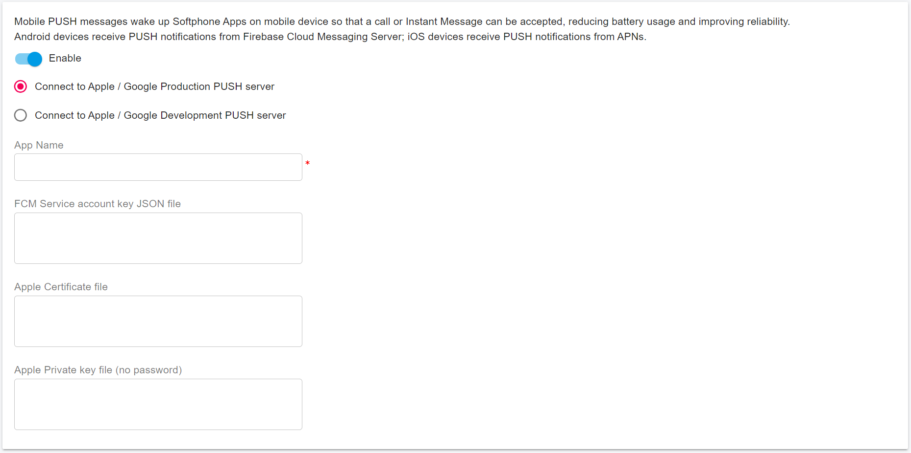<figcaption></figcaption></figure>

Please set the following items:

* **Enabled**: Check this box to enable push notifications and uncheck it to disable them.
* **Apple and Google Servers**: Both Apple and Google provide production and development push servers for sending notifications. The development server is typically used during the development stage. Once your app is released, switch to the production server.
* **App ID**: Enter the ID you created in step 3. Note that this ID is case-sensitive.
* **Apple Certificate File and Private Key File**: Copy and paste the certificate files content you generated in step 9. Ensure that the private key file is without a password (`portpbx_push.pem` and `portpbx_push_key.pem`).

Click the **OK** button to enable the push service in PortSIP PBX.

