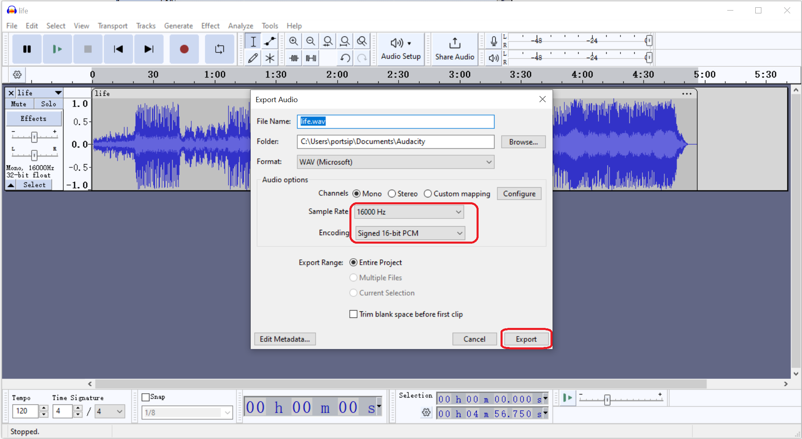

# What File Format Is Required for PortSIP PBX Prompt?

PortSIP PBX accepts the file format as  **WAV file in PCM, 16kHz/32kHz/48 kHz, 16-bit, Mono**. This file format is applicable to the below applications:

* Virtual Receptionist
* Call Queue
* Conference
* Voicemail
* Conference
* MOH
* Call Parking

## Converting Unsupported Audio Files to WAV Format

To convert an unsupported audio file for the PortSIP PBX prompt file, you can follow these steps:

1. Download and install the free [Audacity ](https://www.audacityteam.org/)audio editor software.
2. Launch [Audacity](https://www.audacityteam.org/), navigate to the menu **File >  Open**. Choose the file you wish to convert.
3. Once the file is open, click the menu **File > Export Audio**.
4. In the **Export Audio** window, under the **Audio options** section, select either 16000 Hz, 32000 Hz, or 48000 Hz for the **Sample Rate**.
5. For the **Encoding** option, choose **Signed 16-bit PCM**.
6. Finally, click the **Export** button to save your converted WAV file.

This process will ensure your audio file is compatible with the PortSIP PBX system.

<figure><figcaption></figcaption></figure>

