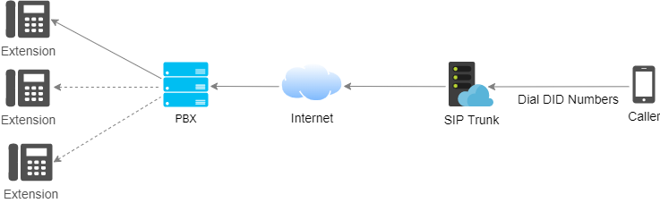

# What is Direct Inward Dialing (DID)

Direct Inward Dialing (DID) is when a telephone service provider connects a block of telephone numbers to your company’s [Private Branch Exchange](https://www.portsip.com/portsip-pbx) (PBX). It allows businesses to set up virtual numbers that can bypass the main reception lines and go directly to a desk extension or group of extensions. DID can be used with local, premium-rate, or toll-free numbers.

Other common names for DID are DDI, direct-dial numbers, direct dial, and direct dial-ins. Essentially, when someone says "**Reach me at my direct number**,” this is what they’re referring to. In summary, a phone number that is used like this is often called a "DID" (and multiple numbers are called "**DIDs**”).&#x20;

In this article, we provide an in-depth look at Direct Inward Dialing, how it works, and its benefits to businesses today.

## What Is a DID number?

&#x20;From the perspective of a customer or client, a direct-dial number looks like any standard telephone number. However, DID is a virtual number that goes directly to an extension or location in your company. Think of it as a shortcut phone line.&#x20;

These direct-dial phone numbers point inbound calls to an organization’s phone system. The function of relaying callers to an individual user makes that number “direct.” This dedicated call routing is managed by the VoIP phone system.

## How Does DID Work?&#x20;

Traditionally, DID works in one of two ways: through [Public Switched Telephone Network](https://en.wikipedia.org/wiki/Public\_switched\_telephone\_network) (PSTN) lines or [Voice over Internet Protocol](https://en.wikipedia.org/wiki/Voice\_over\_IP) (VoIP). Let’s start with PSTN. In this article, we just focus on VoIP.

### Direct Inward Dialing on VoIP

VoIP is the most modern and flexible way to employ virtual direct-dial numbers with the help of SIP trunking. SIP makes the trunk line connections available as-needed. These are not physical lines, but virtual links across broadband only when you require them.&#x20;

These virtual links are configured internally and the numbers are linked to your extensions by a software application. You can do this yourself or you can have your VoIP provider do it for you.&#x20;

DID on VoIP is highly scalable. For example, if you decide you’d like to launch a sales campaign next month that requires you to have 20 new trunk lines, you can easily do it yourself. There’s no need to contact your telephone company, wait for them to allocate a block of numbers, and then send out a technician to physically connect the trunk lines to your business PBX.&#x20;

In the past, you might’ve had to wait weeks to get this set up and the cost would be substantial. Now you can configure it yourself.

VoIP systems have a variety of features that take time to learn. Thankfully, most VoIP providers offer professional onboarding and support. This goes beyond what traditional service providers can offer.

<figure><figcaption></figcaption></figure>

In the above example, calls from the PSTN will be directed to the VoIP user(extension) who holds the corresponding DID number.

## Benefits of Direct-Dialing&#x20;

The benefits of DID apply to every sized business today, including:

1. **Cost savings**: With DID, you can reduce the number of trunk lines required to connect your business. With a VoIP system, you can even forward the DIDs to different continents saving long-distance costs.&#x20;
2. **Time savings**: Routing calls to the person directly, without the need for a receptionist or phone menu, saves time. Follow-up becomes easier for customers when their agent has a single number.&#x20;
3. **Better customer experience**: Customers can reach employees when they need them without hurdles. That can be a remarkable experience from the customer’s perspective.&#x20;
4. **Team communication**: Employees can contact team members via a dedicated extension even if they are in different buildings, cities, or even countries.&#x20;
5. **Local phone numbers**: People prefer to call local phone numbers. A business operating in New York can set up a phone number in Miami or London for customers in that market.&#x20;
6. **Existing equipment**: With VoIP, direct-dial ins occur in the telephone network and virtually, you won’t need to buy all new phones or hardware.&#x20;
7. **Automated call forwarding**: You can have your direct-dial line automatically forward incoming calls to your mobile phone or other temporary numbers without the customer knowing these private numbers.&#x20;
8. **Flexibility**: With DID, you have more control over where and when you receive calls. A mobile workforce demands a flexible solution. Combining the power of VoIP, DID, and SIP with mobile phones, email, and SMS equals a more robust telecommunications system for your business.&#x20;
9. **Time settings**: Automatically forward calls to different numbers at given times. This is great for after-hours support for different time zones, especially for global teams.&#x20;
10. **Marketing attribution**: By assigning different numbers to different marketing campaigns, you can accurately track the performance of each campaign.

## How Do I Get DID?&#x20;

Give your customers and vendors a way to reach people and departments in your company with a Direct Inward Dialing phone number. DID allows inbound callers to skip the phone tree and bypass call queues.&#x20;

The first step is to obtain one or more business phone numbers. It’s likely you already have some business phone numbers. You can transfer these through a method known as porting.

Next, you would assign these to each user in your phone system. This can be done from the administrative dashboard effortlessly.&#x20;

Adding the direct-dial features your team needs is simple when you go with an experienced VoIP provider, like [Twillio](https://www.twilio.com), [Vonage](https://www.vonage.com/), [Wavix](https://www.wavix.com), [Telnyx](https://www.telnyx.com/), [QuestBlue](https://questblue.com/), [VoIP.ms](https://voip.ms/), and [Voxtelesys](https://voxtelesys.com/).

Once your DID service is set up, inbound callers will be able to reach your teams with low friction. In a world where great customer service is a competitive advantage, direct-dial numbers are just another way to provide personalized experiences.

