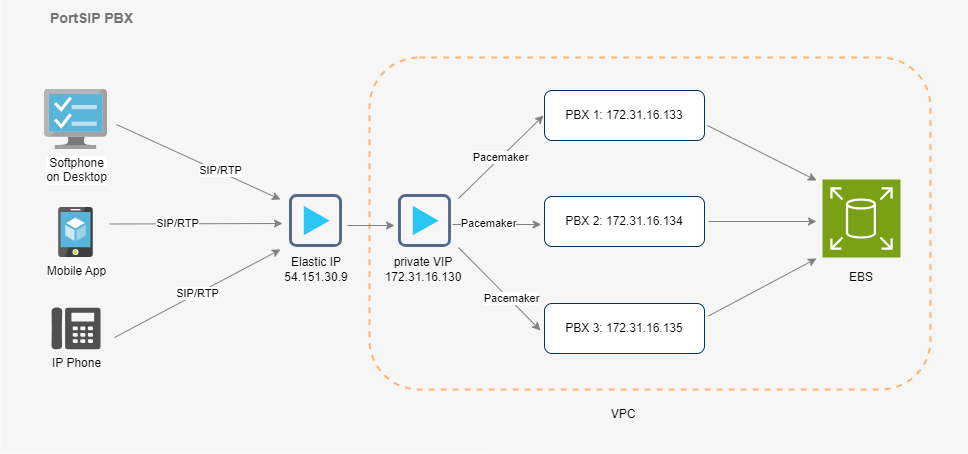

# PortSIP PBX High Availability Architecture

Make a high-availability cluster using three PortSIP PBX servers. PortSIP PBX can detect a variety of faults on one PBX server and automatically transfer control to the other server, the established calls will be recovered automatically.

**Figure 1-1**   PortSIP PBX HA Architecture

<figure><figcaption></figcaption></figure>

## Pacemaker

The [Pacemaker](http://www.clusterlabs.org/) is a high-availability Cluster Resource Manager (CRM) that can be used to manage resources and ensure that they remain available in the event of a node failure.

The PortSIP PBX HA uses the [Pacemaker](http://www.clusterlabs.org/) to do the resource management and monitoring, once the event of PBX node failure, the resources will automatically move to a working node in the cluster.&#x20;

## AWS EBS

Amazon [Elastic Block Store](https://docs.aws.amazon.com/AWSEC2/latest/UserGuide/AmazonEBS.html) (Amazon EBS) is an easy-to-use, scalable, high-performance block-storage service designed for Amazon [Elastic Compute Cloud](https://aws.amazon.com/ec2/) (Amazon EC2).  It provides block-level storage volumes for use with EC2 instances. EBS volumes behave like raw, unformatted block devices.&#x20;

You can mount these volumes as devices on your instances. EBS volumes that are attached to an instance are exposed as storage volumes that persist independently from the life of the instance. You can create a file system on top of these volumes, or use them in any way you would use a block device (such as a hard drive). You can dynamically change the configuration of a volume attached to an instance.

The[ EBS](https://docs.aws.amazon.com/AWSEC2/latest/UserGuide/AmazonEBS.html) is utilized in the PortSIP HA scenario to synchronize data (DB, recording files, log files, and prompt files) between the PBX nodes.

To connect to the PBX service, all SIP clients (IP Phone, Softphone, Mobile App, WebRTC Client) will access the Virtual IP of PortSIP PBX in the HA scenario.

