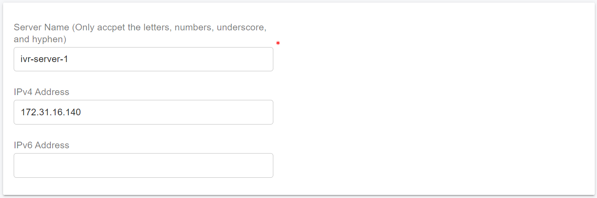

# Scaling Servers on AWS for HA

PortSIP PBX offers application server scaling capabilities to accommodate an increasing number of users and calls, thereby catering to your evolving business needs. For more information, please refer to the [PBX Cluster](../pbx-cluster/) article.&#x20;

This guide provides a detailed, step-by-step process for scaling application servers using PortSIP PBX High Availability (HA) on AWS.

## Prerequisites

* The PortSIP PBX HA must be successfully deployed as the article: [High Availability Installations on AWS](high-availability-installations-on-aws.md).
* Please read the guide [PBX Cluster](../pbx-cluster/) before processing.
* Currently, the PortSIP PBX supports the scale of the following application servers:
  * Media Server
  * Queue Server
  * Meeting Server
  * IVR Server
* Each EC2 instance must have a static private IP, can't use DHCP, and the EC2 for the Media Server must associate an elastic IP


Please don't install multiple application servers on a single EC2 instance.


Preparing the Linux servers(EC2 instances) for installing the application servers, assume we install the following application servers:

* **Meeting Server**: The IP is `172.31.16.137` , the hostname is `ip-172-31-16-137`
* **Queue Server**: The IP is `172.31.16.138` , the hostname is `ip-172-31-16-138`
* **Media Server**: The IP is `172.31.16.139` , the hostname is `ip-172-31-16-139`. The elastic IP is `54.215.234.52`
* **IVR Server**: The IP is  `172.31.16.140` , the hostname is `ip-172-31-16-140`

## **Supported Linux OS**

* Ubuntu 20.04, 22.04, 24.04
* Debian 11.x, 12.x

It only supports 64-bit OS.

## **Preparing the Linux Host Machine for Installation**

Tasks that MUST be completed before installing cluster servers.

* **Ensure the server date-time is synced correctly**.
* Ensure each EC2 instance has assigned a **Static Private IP** address.
* For the **Media Server**, each EC2 instance also needs an **Elastic Public IP** address.
* Install all available updates and service packs before installing the application server.
* Do not install PostgreSQL on the Server.
* Do not install TeamViewer, VPN, or similar software on the host machine.
* The server must not be installed as a DNS or DHCP server.
* Must execute all Linux commands as the root user. please `su root` first.

## **Create EC2 Instances**

Please follow the below steps to create the EC2 instances for the application servers. The steps are almost the same as the [High Availability Installation on AWS](high-availability-installations-on-aws.md#create-ec2-instances), but please pay attention to the below points。

### Meeting Server

* Section **Network settings：**
  * Select the same VPC and Subnet used in PBX HA nodes.
  * Select the same security group used in PBX HA nodes.
  * The **Auto-assign public IP** option must be selected to **Enable**.
* &#x20;In the **Advanced network configuration** > **Network interface 1** section, enter the IP **172.31.16.137** for the **Primary IP** field.

### Queue Server

* Section **Network settings：**
  * Select the same VPC and Subnet used in PBX HA nodes.
  * Select the same security group used in PBX HA nodes.
  * The **Auto-assign public IP** option must be selected to **Enable**.
* &#x20;In the **Advanced network configuration** > **Network interface 1** section, enter the IP **172.31.16.138** for the **Primary IP** field.

### Media Server

* Section **Network settings：**
  * Select the same VPC and Subnet used in PBX HA nodes.
  * Select the same security group used in PBX HA nodes.
  * The **Auto-assign public IP** option must be selected to **Enable**.
* &#x20;In the **Advanced network configuration** > **Network interface 1** section, enter the IP **172.31.16.139** for the **Primary IP** field.
* Allocate an Elastic IP and associate this Elastic IP address to this EC2 instance for this media server. In this example, it's  **54.215.234.52**.

### IVR Server

* Section **Network settings：**
  * Select the same VPC and Subnet used in PBX HA nodes.
  * Select the same security group used in PBX HA nodes.
  * The **Auto-assign public IP** option must be selected to **Enable**.
* &#x20;In the **Advanced network configuration** > **Network interface 1** section, enter the IP **172.31.16.140** for the **Primary IP** field.

## Deploying Meeting Server

Please follow the steps below to deploy the Meeting Server.

1. Sign in to the PortSIP BPX web portal as the system administrator.
2. Select the menu **Servers > Meeting Servers**.
3. click the **Add** button, enter the server information as shown in the screenshot then click the **OK** button to save it. Please remember the server name **meeting-server-1**, we will use it in a later step.

<figure><figcaption></figcaption></figure>

4. Perform the below commands on the PBX HA node **ip-172-31-16-133** only. The execution may take some time, so patience is required. Please do not interrupt, restart, or shut down while the process is in progress.

* \-s: Specify the service that will be installed. For the meeting server, it should be **meeting-server-only**.
* \-n: Specify the server name that you entered in the above step 3; In case is **meeting-server-1**.
* \-a: Specify the server's private IP address, in case it's **172.31.16.137**.

```
cd /opt/portsip-pbx-ha-guide/ && \
/bin/bash extend.sh run -s meeting-server-only \
-n meeting-server-1 \
-a 172.31.16.137
```

This server status will be **Online** in the PBX Web Portal after it's successfully installed.

## Deploying Queue Server

Please follow the steps below to deploy the Queue Server.

1. Sign in to the PortSIP BPX web portal as the system administrator.
2. Select the menu **Servers > Queue Servers**.
3. click the **Add** button, enter the server information as shown in the screenshot then click the **OK** button to save it. Please remember the server name **queue-server-1**, we will use it in a later step.

<figure><figcaption></figcaption></figure>

4. Perform the below commands on the PBX HA node **ip-172-31-16-133** only. The execution may take some time, so patience is required. Please do not interrupt, restart, or shut down while the process is in progress.

* \-s: Specify the service that will be installed. For the meeting server, it should be **queue-server-only**.
* \-n: Specify the server name that you entered in the above step 3; In case is **queue-server-1**.
* \-a: Specify the server's private IP address, in case it's **172.31.16.138**.

```
cd /opt/portsip-pbx-ha-guide/ && \
/bin/bash extend.sh run -s queue-server-only \
-n queue-server-1 \
-a 172.31.16.138
```

This server status will be **Online** in the PBX Web Portal after it's successfully installed.

## Deploying Media Server

Please follow the steps below to deploy the Media Server.

1. Sign in to the PortSIP BPX web portal as the system administrator.
2. Select the menu **Servers > Media Servers**.
3. click the **Add** button, enter the server information as shown in the screenshot then click the **OK** button to save it. Please remember the server name **media-server-1**, we will use it in a later step.

<figure><figcaption></figcaption></figure>

4. Perform the below commands on the PBX HA node **ip-172-31-16-133** only. The execution may take some time, so patience is required. Please do not interrupt, restart, or shut down while the process is in progress.

* \-s: Specify the service that will be installed. For the meeting server, it should be **media-server-only**.
* \-n: Specify the server name that you entered in the above step 3; In case is **media-server-1**.
* \-a: Specify the server's private IP address, in case it's **172.31.16.139**.

```
cd /opt/portsip-pbx-ha-guide/ && \
/bin/bash extend.sh run -s media-server-only \
-n media-server-1 \
-a 172.31.16.139
```

This server status will be **Online** in the PBX Web Portal after it's successfully installed.

## Deploying IVR Server

Please follow the steps below to deploy the IVR Server (Virtual Receptionist).

1. Sign in to the PortSIP BPX web portal as the system administrator.
2. Select the menu **Servers > IVR Servers**.
3. click the **Add** button, enter the server information as shown in the screenshot then click the **OK** button to save it. Please remember the server name **ivr-server-1**, we will use it in a later step.

<figure><figcaption></figcaption></figure>

4. Perform the below commands on the PBX HA node **ip-172-31-16-133** only. The execution may take some time, so patience is required. Please do not interrupt, restart, or shut down while the process is in progress.

* \-s: Specify the service that will be installed. For the meeting server, it should be **vr-server-only**.
* \-n: Specify the server name that you entered in the above step 3; In case is **vr-server-1**.
* \-a: Specify the server's private IP address, in case it's **172.31.16.140**.

```
cd /opt/portsip-pbx-ha-guide/ && \
/bin/bash extend.sh run -s vr-server-only \
-n vr-server-1 \
-a 172.31.16.140
```

This server status will be **Online** in the PBX Web Portal after it's successfully installed.

## Configuring the IP Address Whitelist


This step is mandatory; without it, the service will not work.


To prevent the PBX from limiting the cluster servers' request rate, we need to add the cluster servers' IPs to the whitelist in the PBX.&#x20;

To do this, please follow the below steps:

1. Sign in as the System Administrator
2. Select the menu **IP Blacklist** > **Add**.&#x20;
3. Enter the cluster server IP as shown in the screenshot below and choose a long **expiration date.**
4. Repeat the above steps for each cluster server.

<figure><figcaption></figcaption></figure>

## Managing Servers

Perform the below commands on the PBX HA node **ip-172-31-16-133** only.&#x20;

In the commands, use the parameter **-s** to specify the service name, PortSIP PBX supports these services:

* media-server-only
* queue-server-only
* meeting-server-only
* vr-server-only

You can replace the **media-server-only** with another service name such as mentioned above, and also need to replace the **-a 172.31.16.139** with a corresponding server IP address.

### Start Server

```
 cd /opt/portsip-pbx-ha-guide/ && \
 /bin/bash extend.sh start -s media-server-only -a 172.31.16.139
```

### Restart Server

```
 cd /opt/portsip-pbx-ha-guide/ && \
 /bin/bash extend.sh restart -s media-server-only -a 172.31.16.139
```

### Stop Server

```
 cd /opt/portsip-pbx-ha-guide/ && \
  /bin/bash extend.sh stop -s media-server-only -a 172.31.16.139
```

### Upgrade Server

First, please ensure you have upgraded the PBX HA as this guide: [Upgrade the PBX HA](../high-availability-for-on-premise/high-availability-installations-on-ubuntu.md#upgrade-the-pbx-ha). After that, perform the below command to upgrade the server:

```
cd /opt/portsip-pbx-ha-guide/ && \
/bin/bash extend.sh run -s media-server-only \
-n media-server-1 \
-a 172.31.16.139
```

### Remove Server

```
 cd /opt/portsip-pbx-ha-guide/ && \
 /bin/bash extend.sh rm -s media-server-only -a 172.31.16.139
```

