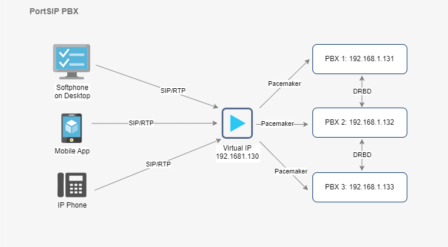

# PortSIP PBX High Availability Architecture

Make a high-availability cluster using three PortSIP PBX servers. PortSIP PBX can detect a variety of faults on one PBX server and automatically transfer control to the other server, the established calls will be recovered automatically.

**Figure 1-1**   PortSIP PBX HA Architecture

<figure><figcaption></figcaption></figure>

## Pacemaker

The [Pacemaker](http://www.clusterlabs.org/) is a high-availability Cluster Resource Manager (CRM) that can be used to manage resources and ensure that they remain available in the event of a node failure.

The PortSIP PBX HA uses the [Pacemaker](http://www.clusterlabs.org/) to do the resource management and monitoring, once the event of PBX node failure, the resources will automatically move to a working node in the cluster.&#x20;

## DRBD

[DRBD ](https://linbit.com/drbd/)is used for High Availability purposes. It is a software product used to replicate data in real time from one server to another. This ensures business continuity even in the event of hardware failure.

The [DRBD ](https://linbit.com/drbd/)is utilized in the PortSIP HA scenario to synchronize data (DB, recording files, log files, and prompt files) between the PBX nodes.

To connect to the PBX service, all SIP clients (IP Phone, Softphone, Mobile App, WebRTC Client) will access the Virtual IP of PortSIP PBX in the HA scenario.

