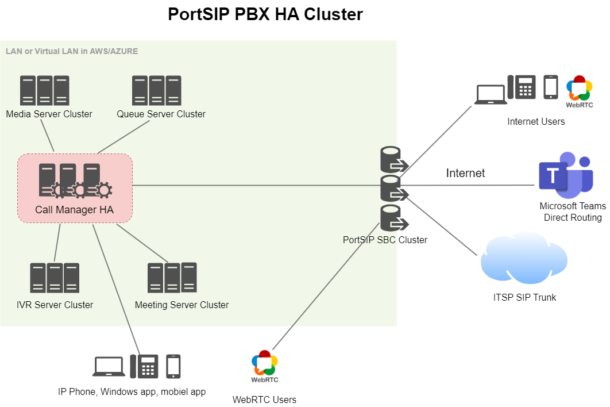

# Configuring Cluster Servers for High Availability

Once a PBX is deployed as the High Availability for On-Premise, it can also add additional servers for the cluster. Please reference the below architecture.

<figure><figcaption></figcaption></figure>

## Configuring Cluster Servers for High Availability

To set up the cluster servers for a PortSIP PBX HA, follow the same steps as you would when configuring the cluster servers for a standalone PortSIP PBX. The only difference is that you should use the **Virtual IP** of the PBX HA instead of the PBX’s IP in the subsequent steps of the guide.

* [Preparing Cluster Servers](preparing-cluster-servers.md)
* [Configuring Cluster Servers](configuring-cluster-servers.md)

