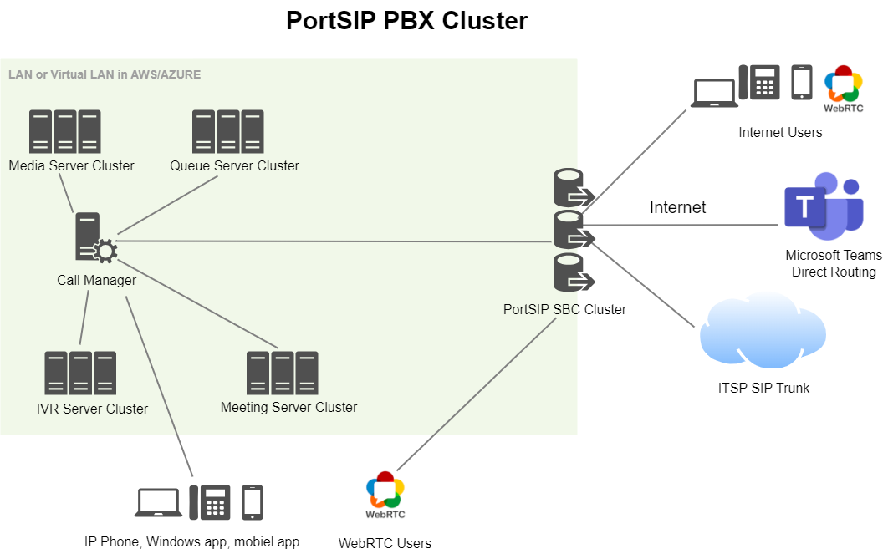

# Topology

Usually, for a PBX, if there are many simultaneous calls, meetings, queue calls, or IVR calls, the PBX will consume massive hardware resources such as CPU, Memory, and bandwidth, therefore, we need to deploy the PBX as a cluster to handle this scenario.

PortSIP makes it easy to do so by allowing a central PBX server to process only the SIP signaling while media servers, meeting servers, queue servers, and IVR servers are deployed as a cluster to handle media, recording, ACD, and other call processing tasks.

The below topology of the PortSIP PBX Cluster can support up to 1M+ users, \~50,000 online users(registered users/signed-in users), and \~10,000 simultaneous calls. If you are a large service provider that needs to handle more than 50,000 online users, please consider our [PortSIP UCaaS](../portsip-ucaas.md) solution.

Below is the architecture for the PBX cluster.

<figure><figcaption></figcaption></figure>

